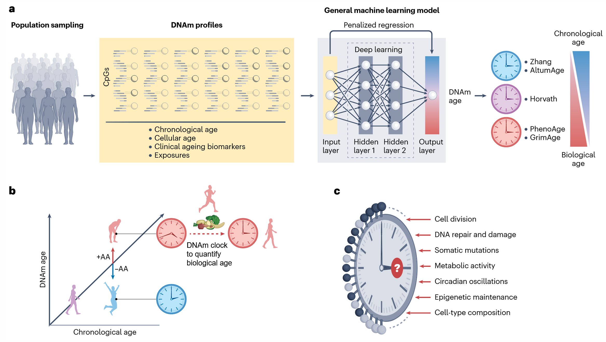

::: {.callout-note collapse="true"}
## 🎯 Learning objectives

By the end of this chapter you should be able to:

-   Name the four layers of the epigenome and the assay that measures each
-   ⚠️ Explain why there is no linear molecular order among those layers
-   Say why ATAC-seq needs accessibility but ChIP-seq does not
-   Say what H3K4me3, H3K27ac, H3K4me1, and H3K27me3 each indicate — and why combinations matter more than any single mark
-   Judge whether an ATAC or ChIP experiment worked, from its QC numbers
-   Read a genome browser track panel and infer what kind of element you are looking at
-   ⚠️ Recognize cell-type composition as the dominant confounder in tissue methylation studies
-   Explain why epigenomics is the bridge from a non-coding GWAS hit to a mechanism
:::

> 🤔 **Motivating question**
>
> Every cell in your body carries the same genome. So why is a neuron not a hepatocyte — and why does that matter for interpreting the 90% of GWAS hits that fall outside genes?


------------------------------------------------------------------------

# 1. What the Epigenome Is 🎛️ {#w3-s1}

## 1) Four layers, four assays {#w3-s1-1}

-   **Genome** — a fixed text
-   **Epigenome** — everything determining which parts of that text are read, in this cell, right now

{fig-align="center"}

| Layer | What it is | Standard assay | Section |
|------------------|------------------|------------------|------------------|
| **Chromatin accessibility** | How physically open the DNA is | ATAC-seq | [§2](#w3-s2) |
| **Histone modification** | Chemical marks on histone tails | ChIP-seq, CUT&RUN | [§3](#w3-s3) |
| **3D organization** | Which regions physically contact which | Hi-C, Micro-C | [§4](#w3-s4) |
| **DNA methylation** | Methyl group on cytosine, usually at CpG | Bisulfite sequencing, EPIC array | [§5](#w3-s5) |

## 2) Same genome, different cell {#w3-s1-2}

A neuron and a hepatocyte differ in essentially every one of these layers — and those differences *are* what make them different cells.

::: {.callout-important collapse="true"}
## One epigenome per cell type, not one per person

-   A **genome sequence** — the same whichever tissue you take
-   An **epigenome** — different in every cell type

→ Every epigenomic measurement is specific to the cells you happened to assay.\
→ Assay a tissue, and you measured an **average over whatever mixture it contained**.

This single fact generates [§5.3②](#w3-s5-3-2) and most of the field's reproducibility problems.
:::

## 3) ⚠️ There is no linear molecular order {#w3-s1-3}

A natural question: which layer comes first? Does methylation close the chromatin, or does closed chromatin get methylated?

**The honest answer — the layers reinforce each other. Causality runs both ways.**

```         
   CpG methylation → MeCP2 / MBD proteins → NuRD, HDAC → compaction
   H3K9me3 → HP1 → recruits DNMTs → methylation
   H3K36me3 → recruits DNMT3B
        ↑↓  the same loop, read in either direction
   TF binding → recruits TET → demethylation → more TF binding
   Pioneer factors (FOXA1, GATA, OCT4/SOX2)
        → bind nucleosomal / closed DNA first
        → recruit remodelers → open it
```

-   "Is TF binding a cause or a consequence of accessibility?" is an **open question in the field**, not a settled fact
-   ⚠️ Any linear ordering — including this chapter's — is a **teaching choice**, not a molecular claim

**This chapter's ordering principle: regulatory logic.** Accessibility as the gate → what kind of element sits there → which promoter it reaches → and finally the DNA-level layer, which has its own distinct measurement problems.

## 4) What is and is not heritable {#w3-s1-4}

"Epigenetic" carries baggage. Two very different claims get conflated:

-   ✅ **Mitotic heritability** — a methylation pattern copied to daughter cells at division. Well established; the basis of cell identity
-   ⚠️ **Transgenerational epigenetic inheritance** — a mark acquired by a parent passed to offspring and grandchildren
    -   Real in plants and *C. elegans*
    -   In mammals: contested, mechanism unclear — the germline undergoes near-complete epigenetic reprogramming **twice**

💡 When you read "epigenetic inheritance", check which claim is being made.

------------------------------------------------------------------------

# 2. Chromatin Accessibility: ATAC-seq 🔓 {#w3-s2}

## 1) The principle {#w3-s2-1}

**ATAC-seq** — a hyperactive Tn5 transposase, preloaded with sequencing adapters.

-   Tn5 inserts preferentially where DNA is **not wrapped in nucleosomes** — i.e. where regulatory proteins are actively holding chromatin open
-   Fragmentation and adapter ligation happen in **one step** → fast protocol, works from few cells

::: {.callout-important collapse="true"}
## Accessibility is a genuine prerequisite — for this assay only

-   ATAC is performed on **intact nuclei**. Tn5 must physically reach the DNA *in situ*
-   → closed chromatin is invisible to ATAC by construction

Compare with ChIP ([§3.2](#w3-s3-2)), where chromatin is **fragmented before** the antibody ever meets it. This distinction is worth holding onto: it is the reason ATAC and ChIP see different things, and it is often stated backwards.
:::

## 2) Why it is the natural first assay {#w3-s2-2}

-   **No antibody** → no antibody-quality problem, no target chosen in advance
-   One experiment → a first-pass regulatory map of a cell type, with no prior hypothesis about which factor to pull down
-   Promoters, active enhancers, and TF-bound sites, all at once

⚠️ What it does **not** tell you: *which kind* of element you found. An open region could be a promoter, an enhancer, an insulator, or a repressed-but-primed element. That is [§3](#w3-s3).

## 3) QC — the two figures to demand {#w3-s2-3}

{fig-align="center"}

-   **Fragment size distribution**
    -   ✅ A nucleosome-free peak below \~100 bp, then \~200 bp periodicity from mono-, di-, tri-nucleosomes
    -   ❌ A smooth, featureless curve → the transposition failed
-   **TSS enrichment**
    -   Promoters are open in essentially every cell type → a sharp peak at TSSs is a **floor expectation**, not a finding
    -   ❌ A flat TSS profile → the assay failed. Not unusual biology
-   **Mitochondrial fraction**
    -   mtDNA has no nucleosomes → Tn5 attacks it enthusiastically
    -   Untreated protocols can waste well over half the reads on chrM; Omni-ATAC and similar improvements reduce this

## 4) Footprinting, and its limits {#w3-s2-4}

-   A bound transcription factor protects its own site from Tn5 → a small dip inside a larger accessible region
-   In principle: locate specific factors without ChIP

⚠️ In practice, unreliable for many factors:

-   Tn5 has its own **sequence insertion bias** that mimics footprints
-   Factors with short residence times leave no protection at all

→ Treat footprint-based factor calls as hypotheses.

------------------------------------------------------------------------

# 3. Histone Modifications: ChIP-seq and CUT&RUN 🧵 {#w3-s3}

You have an open region. What kind of element is it? The histone marks answer that.

## 1) What the marks mean {#w3-s3-1}

Dozens exist. Five do most of the work in genomics.

| Mark | Indicates | Shape of signal |
|------------------------|------------------------|------------------------|
| **H3K4me3** | Active promoter | Sharp, at TSS |
| **H3K27ac** | Active promoter **or** enhancer | Sharp-ish, flanking the element |
| **H3K4me1** | Enhancer — primed or active | Broad |
| **H3K27me3** | Polycomb-repressed | Broad domains |
| **H3K9me3** | Constitutive heterochromatin | Very broad, repeats |

**The key interpretive move — no single mark identifies an element. Combinations do.**

-   H3K4me3 + H3K27ac → **active promoter**
-   H3K4me1 + H3K27ac → **active enhancer**
-   H3K4me1 alone → **primed enhancer** — poised, not firing
-   H3K4me3 + H3K27me3 → **bivalent** — developmental genes held ready in stem cells

## 2) ⚠️ ChIP does not require accessibility {#w3-s3-2}

A common misconception, worth stating explicitly.

```         
ATAC   nuclei intact → Tn5 must reach the DNA in situ
                     → accessibility IS required

ChIP   crosslink (formaldehyde)
       → shear / MNase-digest the chromatin
       → antibody meets FRAGMENTS in solution
                     → accessibility is NOT required
```

→ This is exactly why ChIP can map **H3K9me3 and H3K27me3** — marks that define the most tightly closed chromatin in the nucleus, which ATAC cannot see at all.

The two assays are complementary, not redundant.

## 3) The assay, and the control you must have {#w3-s3-3}

Two failure points dominate:

-   ⚠️ **Antibody quality** — ChIP-seq is an antibody experiment. Specificity for histone modifications is variable and **lot-dependent**. A wet-lab problem no analysis can repair
-   ⚠️ **The input control** — chromatin does not fragment uniformly:
    -   open regions shear more easily
    -   copy number varies
    -   → without a matched **input** (sonicated chromatin, no antibody) or **IgG** control, you cannot tell enrichment from artifact

## 4) Peak calling and QC {#w3-s3-4}

**Peak calling** — compare signal to control, identify regions of significant enrichment. MACS2 and successors are standard.

-   Parameters matter: **narrow** mode for point-source marks (H3K4me3), **broad** mode for domains (H3K27me3)

Useful QC numbers:

-   **FRiP** (fraction of reads in peaks) — how much sequencing went into signal rather than background. Low FRiP → weak IP
-   **Cross-correlation** (NSC / RSC) — whether strand-shifted signal shows the expected structure
-   **Library complexity** — distinct fragments vs. PCR duplicates

## 5) CUT&RUN and CUT&Tag {#w3-s3-5}

The problem with ChIP: many cells needed, lots of background.

**The fix** — tether the cleaving enzyme (MNase, or Tn5) directly to the antibody → only the targeted region is released or tagged.

-   Far higher signal-to-noise, from **thousands** of cells rather than millions
-   This is what made single-cell chromatin profiling practical (🔗 W5)

## 6) Reading the tracks together {#w3-s3-6}

{fig-align="center"}

The single most common figure in the epigenomics literature. Reading it is a concrete skill — work top to bottom, then across:

1.  **ATAC peak?** → something is open here ([§2](#w3-s2))
2.  **H3K4me3 dominant?** → promoter. **H3K4me1 dominant?** → enhancer
3.  **H3K27ac on top?** → the element is **active in this cell type**, not merely present
4.  **H3K27me3 domain?** → repressed, regardless of what else is there
5.  **Compare to input** — if the "peak" is also in input, it is not a peak

------------------------------------------------------------------------

# 4. The 3D Genome: Hi-C 🔗 {#w3-s4}

You have an active enhancer. Which promoter does it actually regulate?

## 1) The assay {#w3-s4-1}

**Hi-C** — crosslink chromatin → digest → ligate whatever ends are physically close → sequence the junctions.

Output: a matrix of contact frequencies between every pair of genomic bins.

{fig-align="center"}

## 2) What the matrix shows {#w3-s4-2}

-   **A/B compartments** — megabase-scale segregation into active (A) and inactive (B) chromatin
-   **TADs** (topologically associating domains) — sub-megabase blocks, frequent internal contacts, sharp CTCF-bound boundaries
    -   Boundaries are **largely conserved across cell types**
-   **Loops** — specific enhancer–promoter contacts
    -   **Not** conserved across cell types
    -   → these are what you actually want for variant interpretation

## 3) ⚠️ Contact is not function {#w3-s4-3}

-   A loop says two regions are near each other
-   It does not say the enhancer regulates that promoter

→ Perturbation experiments (CRISPRi on the element) are what establish function.

------------------------------------------------------------------------

# 5. DNA Methylation 🔵 {#w3-s5}

The DNA-level layer — and the one that dominates clinical and epidemiological work.

-   Methyl group on the 5-carbon of cytosine, overwhelmingly at **CpG** dinucleotides
-   \~70–80% of genomic CpGs are methylated
-   Exceptions cluster in **CpG islands** — at most promoters, usually unmethylated when the gene is active

## 1) Measurement {#w3-s5-1}

### ① Bisulfite sequencing {#w3-s5-1-1}

Sodium bisulfite converts unmethylated C → U (read as T); methylated C is protected and still reads as C. Sequence, compare to reference: a C that stayed C was methylated.

-   **WGBS** — every CpG, single-base resolution. Expensive; needs deep coverage because sequence complexity drops after conversion
-   **RRBS** — enzymatic digestion enriches CpG-dense regions. Far cheaper, biased subset

⚠️ Two limitations of bisulfite:

-   It **degrades DNA**
-   It **cannot distinguish 5mC from 5-hydroxymethylcytosine (5hmC)** — abundant in brain, different biology

Alternatives: **EM-seq** (enzymatic conversion, no degradation); **long-read platforms** call modifications directly from raw signal, with no conversion at all (🔗 [W1 §2.1③](w1_intro.qmd#w1-s2-1-3)).

### ② Arrays {#w3-s5-1-2}

Illumina **EPIC** — a fixed panel of CpG sites, on the order of 850,000 for v1 (\~3% of all CpGs), enriched for promoters, enhancers, and known disease loci.

Same trade-off as genotyping arrays (🔗 [W2 §2.3](w2_genomics.qmd#w2-s2-3)):

-   ❌ Cannot discover anything outside the panel
-   ✅ Cheap enough to run on thousands of samples → almost all large epidemiological methylation studies use them

## 2) β values and M values {#w3-s5-2}

{fig-align="center"}

-   **β value** — the intuitive quantity: proportion of DNA molecules methylated at a site, 0 to 1

$$
\beta = \frac{M}{M + U + \alpha}
$$

-   **M value** — its logit transform, $\log_2(\beta / (1-\beta))$

Why bother:

-   β is **bounded** at 0 and 1 → variance compressed at both extremes → exactly where most CpGs sit
-   → violates linear model assumptions
-   M is unbounded and roughly homoscedastic

💡 **The convention — test on M values, report and plot β values.**\
⚠️ A paper running t-tests directly on β at CpGs with β ≈ 0.02 is doing something statistically dubious.

## 3) Differential methylation {#w3-s5-3}

### ① DMP vs. DMR {#w3-s5-3-1}

-   **DMP** (differentially methylated position) — a single CpG differing between groups
-   **DMR** (differentially methylated region) — a run of adjacent CpGs changing together

DMRs are more believable — neighbouring CpGs are biologically correlated, so a consistent regional shift is harder to produce by chance or by one bad probe.

⚠️ A lone significant CpG in an otherwise flat region deserves suspicion.

### ② ⚠️ Cell-type composition {#w3-s5-3-2}

The most important subsection in the chapter.

{fig-align="center"}

::: {.callout-warning collapse="true"}
## Cell composition is the dominant confounder

**The mechanism:**

-   Methylation differs enormously **between cell types** — far more than between individuals or disease states within one cell type
-   → cases and controls with even slightly different cell mixtures
-   → thousands of CpGs appear "differentially methylated"
-   → **without a single cell having changed anything**

Not hypothetical. Disease, infection, medication, age, and smoking all shift blood cell proportions.

→ A blood methylation study that does not adjust for cell composition is, to a first approximation, **a study of cell counts.**

**What to do:**

-   ✅ Measure cell counts directly if possible (CBC, flow cytometry) → include as covariates
-   ✅ Otherwise **reference-based deconvolution** (Houseman method and successors) → estimate proportions from the methylation data itself, then adjust
-   ✅ Reference-free methods (RefFreeEWAS, ReFACTor, SVA) for tissues without reference panels — at the cost of possibly removing real signal too
-   ✅ **State exactly what you did.** "We adjusted for cell composition" with no detail is not enough

🔗 The chapter-spanning version of [W1 §4.3](w1_intro.qmd#w1-s4-3)'s confounding thread. It returns in [W4 §7.2](w4_transcriptomics.qmd#w4-s7-2) as bulk tissue deconvolution, and in [W5 §6.3](w5_singlecell.qmd#w5-s6-3) as differential abundance.
:::

## 4) Epigenetic clocks ⏳ {#w3-s5-4}

{fig-align="center"}

Take a few hundred CpGs whose methylation changes with age → fit a penalised regression against chronological age → a predictor accurate to within a few years.

{fig-align="center"}

**Age acceleration** — the residual. How much older or younger someone looks epigenetically than their birth certificate says.

-   Associated with mortality, cardiovascular disease, and a long list of exposures

::: {.callout-warning collapse="true"}
## Three things to check before believing a clock result

**① Which clock?**

-   **1st generation** (Horvath, Hannum) — trained to predict *chronological* age → by construction, **penalised** for detecting biological ageing
-   **2nd generation** (PhenoAge, GrimAge) — trained against clinical biomarkers and mortality → predict health outcomes considerably better
-   → not interchangeable; results do not transfer between them

**② Cell composition again.** Blood clock signals are partly driven by immune cell proportions shifting with age. Adjusted or not?

**③ Association, not mechanism.** Age acceleration is a biomarker. Nothing about a clock says whether methylation *causes* ageing or merely records it.
:::

------------------------------------------------------------------------

# 6. Putting It Together 🏥 {#w3-s6}

## 1) Transcription factor motif analysis {#w3-s6-1}

Given a set of peaks: which TF binding motifs are over-represented relative to a background set? Tools: HOMER, MEME suite, chromVAR (single-cell).

⚠️ Two chronic problems:

-   **Background choice determines the answer.** GC-matched, accessibility-matched background is essential. Random genomic regions inflate everything
-   **Motif similarity.** Family members are indistinguishable — "the AP-1 motif" does not tell you FOS vs. JUN vs. a dozen relatives

## 2) Chromatin states and reference atlases {#w3-s6-2}

**ChromHMM** — learns recurring combinations of marks, labels every genomic segment with a state ("active TSS", "weak enhancer", "heterochromatin"). Converts five noisy tracks into one interpretable annotation.

| Resource | What it holds |
|------------------------------------|------------------------------------|
| [**ENCODE**](https://www.encodeproject.org/) | Uniformly processed ChIP, ATAC, RNA across hundreds of cell types; candidate cis-regulatory elements (cCREs) |
| [**Roadmap Epigenomics**](http://www.roadmapepigenomics.org/) | Chromatin states across 127 primary tissues and cell types |
| [**UCSC**](https://genome.ucsc.edu/) / [**WashU**](https://epigenomegateway.wustl.edu/) browsers | Where you look at all of the above over your locus |

🗺️ These atlases are also a **reference bias** problem (🔗 [W1 §2.3③](w1_intro.qmd#w1-s2-3-3)):

-   Your cell type not in ENCODE? → the annotations you inherit come from something else
-   → elements active only in your cells are **invisible**

## 3) From a non-coding GWAS hit to a mechanism {#w3-s6-3}

Recall: \~90% of GWAS associations are non-coding (🔗 [W2 §4.3](w2_genomics.qmd#w2-s4-3)). A variant in intergenic space is uninterpretable alone. Epigenomics supplies the missing annotation.

```         
① GWAS signal, fine-mapped to a credible set        (W2 §4.2)
② Overlap credible-set variants with ATAC / H3K27ac
   peaks — in the disease-relevant cell type         (§2, §3)
③ Which TF motif does the risk allele disrupt?       (§6.1)
④ Which promoter does that enhancer contact?         (§4)
⑤ Does the target gene's expression change?          (eQTL, W4)
⑥ Does deleting or editing the element do anything?  (CRISPR)
```

**Partitioned heritability** (LDSC-SEG, stratified LD score regression) runs the same logic in aggregate rather than locus by locus:

-   Which cell types' regulatory annotations are enriched for a trait's heritability?
-   → often the strongest available evidence about which tissue a disease lives in — microglia for Alzheimer disease, specific T cell subsets for autoimmune disease

## 4) ⚠️ The central problem: which cells? {#w3-s6-4}

::: {.callout-warning collapse="true"}
## The right annotation in the wrong cell type is worthless

-   An enhancer active in hepatocytes → invisible in a lymphoblastoid cell line
-   Overlap your credible set with the wrong cell type's peaks → you find nothing
-   → **"no overlap" is indistinguishable from "wrong reference"**

This is why the field pushed so hard toward single-cell chromatin profiling (🔗 W5), and why choosing which ENCODE cell types to use is a **scientific decision, not a technical default**.
:::

## 5) Where epigenetics is already clinical {#w3-s6-5}

-   **Methylation-based tumour classification** — CNS tumour classifiers on methylation arrays now outperform histopathology for some entities; in routine diagnostic use
-   **Cell-free DNA** — plasma DNA methylation carries a tissue-of-origin signal → the basis of multi-cancer early detection assays
-   **Epigenetic drugs** — DNMT inhibitors (azacitidine, decitabine) and HDAC inhibitors approved in haematological malignancy; EZH2 inhibitors in specific lymphomas and sarcoma
-   **Imprinting disorders** — Prader-Willi and Angelman syndromes diagnosed by methylation testing

{fig-align="center"}

------------------------------------------------------------------------

# 📝 Summary

-   Four measurable layers — and unlike the genome, the epigenome is **different in every cell type**
-   ⚠️ **No linear molecular order.** The layers reinforce each other; this chapter's ordering is regulatory logic, not causality
-   **ATAC-seq** — Tn5 in intact nuclei → accessibility is a genuine prerequisite. No antibody. The natural first assay
-   ⚠️ **ChIP-seq works on sheared chromatin** → accessibility is *not* required, which is why it can map closed-chromatin marks
-   No single histone mark identifies an element. **Combinations do** — H3K4me3 + H3K27ac = active promoter; H3K4me1 + H3K27ac = active enhancer
-   ChIP needs an input control and a validated antibody; ATAC's QC is the fragment ladder and TSS enrichment
-   Hi-C gives compartments, TADs, loops. Boundaries are shared across cell types; loops are not. ⚠️ Contact ≠ function
-   Report β values, test on M values
-   ⚠️ **Cell-type composition is the dominant confounder** in tissue methylation studies. Measure or estimate it, and adjust
-   Epigenetic clocks: the residual is the finding, and 1st- and 2nd-generation clocks measure different things
-   Epigenomics turns a non-coding GWAS hit into a mechanism — **provided you have data from the right cell type**

------------------------------------------------------------------------

# 🔑 Key terms

| Term | One-line meaning |
|------------------------------------|------------------------------------|
| ATAC-seq | Tn5-based map of open chromatin |
| TSS enrichment | Signal at transcription start sites; core ATAC QC |
| Footprint | Protection from cleavage by a bound protein |
| ChIP-seq | Mapping where a protein or mark sits on DNA |
| Input control | Sonicated chromatin without antibody |
| Peak calling | Finding regions enriched over control |
| FRiP | Fraction of reads falling in peaks |
| CUT&RUN / CUT&Tag | Antibody-tethered enzyme; less background, fewer cells |
| Bivalent domain | H3K4me3 + H3K27me3; poised developmental gene |
| ChromHMM | Segments the genome into chromatin states |
| TAD | Self-interacting genomic block with sharp boundaries |
| CpG island | CpG-dense region, usually at promoters |
| Bisulfite conversion | Chemistry that reads unmethylated C as T |
| β value | Proportion of molecules methylated at a site |
| M value | Logit of β, used for statistical testing |
| DMP / DMR | Single CpG / region differing between groups |
| Deconvolution | Estimating cell type proportions from bulk data |
| Epigenetic clock | Methylation-based age predictor |
| Age acceleration | Predicted age minus chronological age |
| Partitioned heritability | Which annotations carry a trait's genetic signal |

------------------------------------------------------------------------

# ➕ References

### Overviews

Stricker SH, Köferle A, Beck S. [*From profiles to function in epigenomics.*](https://pubmed.ncbi.nlm.nih.gov/?term=From+profiles+to+function+in+epigenomics) Nat Rev Genet. 2017.\
Klemm SL, Shipony Z, Greenleaf WJ. [*Chromatin accessibility and the regulatory epigenome.*](https://doi.org/10.1038/s41576-018-0089-8) Nat Rev Genet. 2019.\
Zhu H, Wang G, Qian J. [*Transcription factors as readers and effectors of DNA methylation.*](https://pubmed.ncbi.nlm.nih.gov/?term=Transcription+factors+as+readers+and+effectors+of+DNA+methylation) Nat Rev Genet. 2016.

### Chromatin accessibility

Buenrostro JD, et al. [*Transposition of native chromatin for fast and sensitive epigenomic profiling.*](https://doi.org/10.1038/nmeth.2688) Nat Methods. 2013.\
Corces MR, et al. [*An improved ATAC-seq protocol reduces background and enables interrogation of frozen tissues.*](https://doi.org/10.1038/nmeth.4396) Nat Methods. 2017. (Omni-ATAC)\
Grandi FC, et al. [*Chromatin accessibility profiling by ATAC-seq.*](https://doi.org/10.1038/s41596-022-00692-9) Nat Protoc. 2022.

### Histone modifications

Park PJ. [*ChIP-seq: advantages and challenges of a maturing technology.*](https://doi.org/10.1038/nrg2641) Nat Rev Genet. 2009.\
Landt SG, et al. [*ChIP-seq guidelines and practices of the ENCODE and modENCODE consortia.*](https://doi.org/10.1101/gr.136184.111) Genome Res. 2012.\
Skene PJ, Henikoff S. [*An efficient targeted nuclease strategy for high-resolution mapping of DNA binding sites.*](https://pubmed.ncbi.nlm.nih.gov/?term=An+efficient+targeted+nuclease+strategy+for+high-resolution+mapping+of+DNA+binding+sites) eLife. 2017. (CUT&RUN)

### 3D genome

Rao SSP, et al. [*A 3D map of the human genome at kilobase resolution reveals principles of chromatin looping.*](https://pubmed.ncbi.nlm.nih.gov/?term=A+3D+map+of+the+human+genome+at+kilobase+resolution+reveals+principles+of+chromatin+looping) Cell. 2014.\
Dekker J, Mirny L. [*The 3D genome as moderator of chromosomal communication.*](https://pubmed.ncbi.nlm.nih.gov/?term=The+3D+genome+as+moderator+of+chromosomal+communication) Cell. 2016.

### DNA methylation

Michels KB, et al. [*Recommendations for the design and analysis of epigenome-wide association studies.*](https://pubmed.ncbi.nlm.nih.gov/?term=Recommendations+for+the+design+and+analysis+of+epigenome-wide+association+studies) Nat Methods. 2013.\
Houseman EA, et al. [*DNA methylation arrays as surrogate measures of cell mixture distribution.*](https://pubmed.ncbi.nlm.nih.gov/?term=DNA+methylation+arrays+as+surrogate+measures+of+cell+mixture+distribution) BMC Bioinformatics. 2012.\
Horvath S, Raj K. [*DNA methylation-based biomarkers and the epigenetic clock theory of ageing.*](https://doi.org/10.1038/s41576-018-0004-3) Nat Rev Genet. 2018.\
Capper D, et al. [*DNA methylation-based classification of central nervous system tumours.*](https://pubmed.ncbi.nlm.nih.gov/?term=DNA+methylation-based+classification+of+central+nervous+system+tumours) Nature. 2018.

### Atlases and integration

[ENCODE](https://www.encodeproject.org/) · [Roadmap Epigenomics](http://www.roadmapepigenomics.org/) · [WashU Epigenome Browser](https://epigenomegateway.wustl.edu/)\
ENCODE Project Consortium. [*Perspectives on ENCODE.*](https://pubmed.ncbi.nlm.nih.gov/?term=Perspectives+on+ENCODE) Nature. 2020.\
Finucane HK, et al. [*Heritability enrichment of specifically expressed genes identifies disease-relevant tissues and cell types.*](https://pubmed.ncbi.nlm.nih.gov/?term=Heritability+enrichment+of+specifically+expressed+genes+identifies+disease-relevant+tissues+and+cell+types) Nat Genet. 2018.
