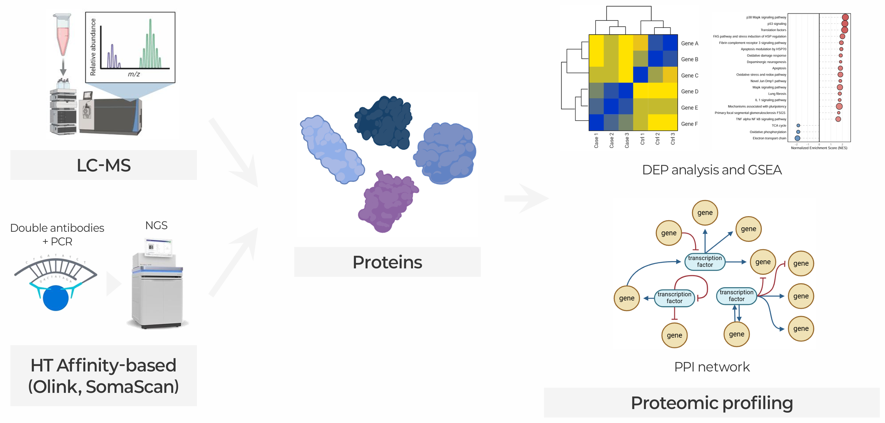

::: {.callout-note collapse="true"}
## 🎯 Learning objectives

By the end of this chapter you should be able to:

-   Explain why mRNA is not a proxy for protein, and name the mechanisms responsible
-   Describe the bottom-up MS workflow and read an annotated MS2 spectrum
-   Choose between DDA, DIA, and targeted acquisition for a given question
-   ⚠️ Explain the protein inference problem and what a "protein group" means
-   Distinguish LFQ, TMT, and SILAC, and explain TMT ratio compression
-   ⚠️ Explain why proteomics data has missing values and why naive imputation is dangerous
-   Say when to use mass spectrometry and when to use an affinity platform
:::

> 🤔 **Motivating question**
>
> Transcript and protein levels correlate at roughly r ≈ 0.4. So what, exactly, did your RNA-seq tell you?



------------------------------------------------------------------------

# 1. Why Measure Proteins 💪 {#w6-s1}

## 1) The correlation problem {#w6-s1-1}

{fig-align="center"}

{fig-align="center"}

-   **Proteins do the work** — drug targets, biomarkers, enzymes
-   RNA-seq measures **none of them directly**

**r ≈ 0.4 — read it carefully:**

-   An **across-genes** correlation: gene A's mRNA vs. gene A's protein, over thousands of genes
-   Within one gene, across conditions → often better
-   ⚠️ For the common question "gene X's transcript went up — did the protein?" the honest answer from RNA-seq alone is *probably, maybe*

## 2) Where the other 80% goes {#w6-s1-2}

-   **Translation efficiency** — varies more than a hundred-fold between transcripts
-   **Protein half-life** — minutes to days. A stable protein accumulates from a modest transcript
-   **Post-translational modification** — changes activity with no change in abundance at all
-   **Localisation** — the same quantity of protein in the nucleus vs. cytoplasm is different biology
-   **Complex stoichiometry** — unassembled subunits are degraded → abundance set by the limiting partner

::: {.callout-important collapse="true"}
## The practical rule

Whenever a conclusion is *about protein* — a drug target, a biomarker, a signalling event —

**mRNA evidence is a hypothesis, not a result.**
:::

------------------------------------------------------------------------

# 2. Mass Spectrometry Basics ⚗️ {#w6-s2}

## 1) The bottom-up workflow {#w6-s2-1}

{fig-align="center"}

Intact proteins are too large and heterogeneous to measure well → **bottom-up** proteomics digests them (almost always with trypsin, which cuts after lysine and arginine) and measures the peptides.

1.  **Digest** the protein mixture into peptides
2.  **Separate** by liquid chromatography over 30–120 minutes
3.  **MS1 survey scan** — measure the m/z of everything eluting at this moment
4.  **Fragment** selected peptides by collision (HCD/CID)
5.  **MS2 spectrum** — measure the fragment masses
6.  **Database search** — match the spectrum to a peptide sequence
7.  **Infer** which proteins those peptides came from

::: {.callout-warning collapse="true"}
## You never observe a protein

Every step from ④ onwards is **inference**.

-   You observe peptide fragment masses
-   The protein identity is a **conclusion drawn from them**
-   → [§3.2](#w6-s3-2) explains why that conclusion is sometimes ambiguous
:::

## 2) Reading an MS2 spectrum {#w6-s2-2}

Fragmentation breaks the peptide backbone at different positions → a ladder.

-   **b ions** — retain the N-terminus
-   **y ions** — retain the C-terminus
-   **The mass difference between consecutive ions in a series = one amino acid** → this is how the sequence is read

💡 In practice a search engine does this by generating theoretical spectra for every peptide in a database and scoring the match, rather than reading sequences *de novo*.

## 3) Acquisition strategies {#w6-s2-3}

{fig-align="center"}

|   | **DDA** | **DIA** | **Targeted (PRM/MRM)** |
|------------------|------------------|------------------|------------------|
| What is fragmented | Top-N most intense precursors | Everything, in fixed m/z windows | A predefined list only |
| Proteins per run | Thousands | Thousands, more consistently | Tens |
| Missing values across runs | ⚠️ High | Low | Very low |
| Spectra | Clean, one peptide each | Complex, must be deconvoluted | Clean |
| Quantitative precision | Moderate | Good | Excellent |
| Best for | Discovery, established workflows | Large cohorts, biomarker studies | Validating a specific panel |

**DDA's weakness — the selection is stochastic:**

-   a low-abundance peptide picked in run 1 may be skipped in run 2, simply because something else was momentarily more intense
-   → across 100 clinical samples, a matrix full of holes ([§4](#w6-s4))

**DIA's fix** — fragment everything. Cost: far more complex spectra.

-   DIA-NN and Spectronaut — increasingly using machine-learning-predicted spectral libraries rather than experimental ones
-   → what made DIA practical, and now the default for large cohort studies

------------------------------------------------------------------------

# 3. Identification and Quantification 🏷️ {#w6-s3}

## 1) Target–decoy FDR {#w6-s3-1}

**The question** — how do you know a peptide–spectrum match is real?

**The trick:**

-   Search the same spectra against a **decoy** database of reversed or shuffled sequences
-   Any decoy match is by definition false
-   → the rate of decoy hits above a score threshold estimates the FDR among target hits

Convention: **1% FDR**.

⚠️ 1% FDR at the *peptide* level does **not** give 1% FDR at the *protein* level — protein-level error accumulates, and single-peptide identifications are the least reliable.

## 2) ⚠️ The protein inference problem {#w6-s3-2}

{fig-align="center"}

::: {.callout-warning collapse="true"}
## Shared peptides and protein groups

**The problem:**

-   Trypsin cuts proteins into peptides
-   Many peptides are **shared** between related proteins — paralogues, isoforms, family members
-   → detect only a shared peptide, and several proteins are equally consistent with the data

**How software resolves it** — reports a **protein group**: a set of indistinguishable proteins with one representative accession.

⚠️ That representative is often the only name that reaches your results table, your figure, and your abstract.

**What to check on any protein of interest:**

-   How many **unique** (protein-specific) peptides support it? One is weak; two is a common minimum
-   Is it reported as part of a group? If so, which members?
-   Would the biological story change if a different group member were the real one?
:::

## 3) Quantification strategies {#w6-s3-3}

{fig-align="center"}

|   | **LFQ** | **TMT / iTRAQ** | **SILAC** |
|------------------|------------------|------------------|------------------|
| How | Separate runs, compare intensities | Isobaric chemical tags, one run | Heavy amino acids fed to cells |
| Samples per run | 1 | Up to 18 | 2–3 |
| Samples combined at | Never | After digestion | In culture |
| Applicable to | Anything, including tissue and plasma | Anything | Cultured cells only |
| Main weakness | Run-to-run drift, more missing values | ⚠️ Ratio compression, batch structure | Not usable in humans |

### ⚠️ Ratio compression

**The mechanism:**

-   In TMT, all samples are measured in one MS2 spectrum via reporter ions
-   The instrument's isolation window is not perfectly selective
-   → **co-eluting background peptides get co-isolated** and contribute their own reporter ions
-   → the background is roughly equal across channels → it pulls every ratio toward 1

**The magnitude** — a genuine 8-fold change can be reported as 3-fold.

**The fix** — SPS-MS3 acquisition largely corrects it, at the cost of speed and sensitivity.

### ⚠️ TMT batch structure

-   An 18-plex TMT experiment analysing 90 samples requires **5 batches**
-   Cases and controls unevenly distributed across batches → 🔗 [W1 §4.3](w1_intro.qmd#w1-s4-3)'s confounding problem, reproduced exactly

→ Randomise, and include a **common reference channel** in every batch so batches can be aligned.

------------------------------------------------------------------------

# 4. The Missing Value Problem 🕳️ {#w6-s4}

{fig-align="center"}

A proteomics matrix commonly has **20–50% missing entries**.

-   RNA-seq analysts find this shocking; proteomics analysts find it normal
-   **The difference** — sequencing counts a zero; MS simply fails to record anything

## 1) Two kinds of missing {#w6-s4-1}

-   **MNAR** — missing not at random. The protein was below the limit of detection. The missingness is **informative**: it tells you the abundance was low
-   **MAR / MCAR** — missing at random. DDA happened not to select it, or the peptide had a poor retention time that run. Uninformative

⚠️ Real data is a mixture, and the proportion depends heavily on abundance — exactly what the left panel shows.

## 2) ⚠️ Why imputation is dangerous {#w6-s4-2}

::: {.callout-warning collapse="true"}
## The commonest way to manufacture a proteomics false positive

**The recipe:**

-   Replace missing values with a small constant, or the minimum observed value
-   → a protein detected in all controls and none of the cases now has a large, extremely significant fold change
-   → **for every protein sitting near the detection limit**

**The signature** — a volcano plot with a suspicious cloud of "highly significant" hits, all at large fold changes, all driven by imputed values rather than measurements.

**Better practice:**

-   ✅ **Filter first** — require detection in, say, ≥70% of samples in at least one group before testing
-   ✅ **Match the method to the mechanism** — MNAR needs left-censored imputation (QRILC, MinProb); MAR needs something like kNN. Perseus's "replace missing from normal distribution" is a **MNAR** method and should not be applied indiscriminately
-   ✅ **Or do not impute** — MSstats and `limma` handle missingness in the model rather than filling it in
-   ✅ **Always report** how much was missing, how you filtered, what you imputed — then check whether your top hits survive **without** imputation
:::

------------------------------------------------------------------------

# 5. Statistical Analysis 📊 {#w6-s5}

Much of 🔗 [W4 §5](w4_transcriptomics.qmd#w4-s5) transfers. Three differences worth knowing:

**① Normalisation.**

-   Proteomics intensities are continuous, not counts → the negative binomial machinery does not apply
-   Median or quantile normalisation on log intensities is standard
-   ⚠️ Same composition caveat holds — one dominant protein distorts everything (🔗 [W4 §4.2](w4_transcriptomics.qmd#w4-s4-2))

**② Fewer features.**

-   A proteomics experiment typically quantifies **3,000–9,000 proteins**, not 20,000 genes
-   FDR correction is still essential, but the burden is lighter

**③ Small n, high variability.**

-   Proteomics experiments are usually smaller than RNA-seq experiments, and technical variability is larger
-   `limma`'s **moderated t-statistic** — the same borrowing-across-features idea as DESeq2's dispersion shrinkage (🔗 [W4 §5.2](w4_transcriptomics.qmd#w4-s5-2)) — is the standard tool
-   **MSstats** models the peptide-to-protein structure explicitly

::: {.callout-tip collapse="true"}
## What to look for when reading a proteomics paper

-   How many proteins were quantified — and **in what fraction of samples**?
-   How were missing values handled?
-   DDA or DIA? If TMT — how many batches, and how were samples allocated?
-   How many **unique peptides** support the headline protein?
-   Was anything validated orthogonally — western blot, ELISA, targeted MS?
:::

------------------------------------------------------------------------

# 6. Affinity-Based and Population Proteomics 🩸 {#w6-s6}

## 1) The dynamic range problem {#w6-s6-1}

{fig-align="center"}

Plasma — the most clinically desirable sample, and the hardest to analyse.

-   Albumin and immunoglobulins alone ≈ half the protein mass
-   The top 20 proteins ≈ **99%** of it
-   The biomarkers you want — cytokines, tissue leakage proteins, tumour-derived proteins — sit **ten orders of magnitude below**

→ Unfractionated MS covers perhaps five to six orders.

→ Hence depletion of abundant proteins, extensive fractionation, or enrichment — all of which add variability and cost.

## 2) Affinity platforms {#w6-s6-2}

Two technologies dominate large-cohort plasma proteomics. **Neither uses mass spectrometry.**

-   **Olink (PEA)** — a pair of antibodies binds the target; when both bind, attached DNA oligos hybridise, are amplified, and read out by sequencing or qPCR. Requiring **two** binding events gives high specificity
-   **SomaScan** — modified DNA aptamers (SOMAmers) bind targets; abundance read from aptamer quantity on an array

|   | Mass spectrometry | Affinity (Olink / SomaScan) |
|------------------------|------------------------|------------------------|
| Targets | Unbiased — whatever is there | Predefined panel only |
| Proteins measured | \~3,000 (plasma, with effort) | Thousands, up to \~11,000 |
| Sensitivity | Limited by dynamic range | Reaches pg/mL |
| Sample volume | µL–mL | A few µL |
| Throughput | Moderate | Very high — biobank scale |
| What is measured | Peptide sequence | **Binding** to a reagent |
| Isoforms and PTMs | Detectable | Generally not distinguished |

::: {.callout-warning collapse="true"}
## Affinity assays measure binding, not identity

An Olink or SomaScan readout is a **binding signal** — and binding can be affected by things other than concentration:

-   **Cross-reactivity** — the reagent binds something else
-   **Epitope-altering variants** — a missense variant in the epitope reduces binding → appears as reduced protein level
    -   ⚠️ In pQTL studies this produces spurious *cis*-signals. A known confounder requiring explicit checking
-   **Platform disagreement** — Olink and SomaScan measurements of the same protein correlate only moderately for many targets. Which one is "right" is often unresolved
:::

## 3) 💊 Proteogenomics and pQTLs {#w6-s6-3}

{fig-align="center"}

**pQTL** — a genetic variant associated with a protein's abundance. The protein analogue of an eQTL (🔗 [W2 §4.4](w2_genomics.qmd#w2-s4-4), 🔗 [W4 §7.4](w4_transcriptomics.qmd#w4-s7-4)).

Population-scale plasma proteomics on tens of thousands of biobank participants has made these available at scale.

**This closes a loop that runs through the whole course:**

```         
GWAS hit (W2)        → points to a locus
pQTL (W6)            → which protein's level that locus controls
Colocalization       → do the two signals share a causal variant?
Mendelian rand. (W2) → does that protein causally affect disease?
        ↓
a genetically validated, druggable target (🔗 W2 §6.3)
```

⚠️ Distinguish:

-   ***cis*****-pQTL** — variant near the protein's own gene. Strong evidence, **but check for epitope effects**
-   ***trans*****-pQTL** — variant elsewhere. Biologically interesting (a regulator, a clearance mechanism), harder to interpret

------------------------------------------------------------------------

# 7. Frontiers and Pitfalls 🚧 {#w6-s7}

## 1) Post-translational modifications {#w6-s7-1}

**Phosphoproteomics** — the main clinical example. Signalling is regulated by phosphorylation, and total protein abundance says nothing about it.

The workflow adds an **enrichment step** (TiO₂, IMAC), because phosphopeptides are a small fraction of the total.

Two analysis-specific issues:

-   ⚠️ **Site localisation** — a peptide may contain several possible sites, and the spectrum may not distinguish them. Search engines report a localisation probability → treat sites below \~0.75 as uncertain
-   ⚠️ **Normalisation to total protein** — a phosphopeptide can rise simply because the protein rose. Interpreting phosphorylation as *signalling* requires knowing the protein level too

## 2) Structure in the AlphaFold era {#w6-s7-2}

Accurate structure prediction has changed what a protein list can support — variant effect interpretation, docking, cross-linking MS interpretation.

⚠️ A prediction is a **model**:

-   confidence scores (pLDDT) matter
-   disordered regions are predicted poorly
-   a predicted structure is not evidence of a conformation *in vivo*

## 3) ⚠️ Common pitfalls {#w6-s7-3}

-   **Keratin contamination** — skin and hair keratins are the classic proteomics contaminant. Keratins in your top hits → the problem is at the bench
-   **Dynamic range** — failing to deplete or fractionate plasma means **you measured albumin**
-   **Digestion efficiency** — incomplete tryptic digestion varies between samples. A real source of quantitative noise
-   **Storage and freeze–thaw** — plasma proteomes are sensitive to pre-analytical handling: collection tube, time to freezing, freeze–thaw cycles. ⚠️ In biobank studies this is a **systematic confounder** if collection protocols differed between groups

------------------------------------------------------------------------

# 📝 Summary

-   mRNA explains roughly a fifth of protein abundance across genes. **If the claim is about protein, measure protein**
-   Bottom-up MS measures **peptides** and infers proteins; the MS2 fragment ladder is what encodes the sequence
-   DDA selects the most intense precursors → misses things stochastically. DIA fragments everything → far less missingness. Targeted MS is for validation
-   ⚠️ **Protein inference is genuinely ambiguous.** Check unique peptide counts and whether your protein is a group
-   LFQ, TMT, and SILAC differ in *when* samples are combined. ⚠️ TMT compresses ratios (SPS-MS3 largely fixes it) and its batches must be randomised
-   ⚠️ Missing values are mostly MNAR. Filter before you impute, match the method to the mechanism, and check that hits survive without imputation
-   Plasma spans \>10 orders of magnitude; the top 20 proteins are \~99% of the mass
-   ⚠️ Affinity platforms measure **binding** → cross-reactivity and epitope-altering variants matter
-   pQTLs complete the chain from GWAS hit to genetically validated drug target

------------------------------------------------------------------------

# 🔑 Key terms

| Term                 | One-line meaning                                  |
|----------------------|---------------------------------------------------|
| Bottom-up proteomics | Digest to peptides, then measure                  |
| Tryptic peptide      | Fragment produced by cutting after K/R            |
| MS1 / MS2            | Precursor survey scan / fragment scan             |
| b ion / y ion        | N-terminal / C-terminal fragment series           |
| Target–decoy         | FDR estimation using a reversed database          |
| Protein inference    | Deciding which proteins the peptides came from    |
| Protein group        | Indistinguishable proteins reported together      |
| DDA / DIA            | Data-dependent / data-independent acquisition     |
| PRM / MRM            | Targeted acquisition of a predefined list         |
| LFQ                  | Label-free quantification                         |
| TMT / iTRAQ          | Isobaric chemical labels, multiplexed in one run  |
| SILAC                | Metabolic labelling with heavy amino acids        |
| Ratio compression    | Co-isolation pulling TMT ratios toward 1          |
| MNAR / MAR           | Missing because low abundance / missing by chance |
| Dynamic range        | Span between most and least abundant protein      |
| PEA                  | Olink's dual-antibody DNA readout                 |
| pQTL                 | Variant associated with a protein's level         |
| Phosphoproteomics    | Enrichment and measurement of phosphopeptides     |

------------------------------------------------------------------------

# ➕ References

### Overviews

Aebersold R, Mann M. [*Mass-spectrometric exploration of proteome structure and function.*](https://pubmed.ncbi.nlm.nih.gov/?term=Mass-spectrometric+exploration+of+proteome+structure+and+function) Nature. 2016.\
Sinitcyn P, Rudolph JD, Cox J. [*Computational methods for understanding mass spectrometry-based shotgun proteomics data.*](https://pubmed.ncbi.nlm.nih.gov/?term=Computational+methods+for+understanding+mass+spectrometry-based+shotgun+proteomics+data) Annu Rev Biomed Data Sci. 2018.\
Liu Y, Beyer A, Aebersold R. [*On the dependency of cellular protein levels on mRNA abundance.*](https://pubmed.ncbi.nlm.nih.gov/?term=On+the+dependency+of+cellular+protein+levels+on+mRNA+abundance) Cell. 2016.

### Acquisition and quantification

Ludwig C, et al. [*Data-independent acquisition-based SWATH-MS for quantitative proteomics: a tutorial.*](https://pubmed.ncbi.nlm.nih.gov/?term=Data-independent+acquisition-based+SWATH-MS+for+quantitative+proteomics%3A+a+tutorial) Mol Syst Biol. 2018.\
Demichev V, et al. [*DIA-NN: neural networks and interference correction enable deep proteome coverage in high throughput.*](https://doi.org/10.1038/s41592-019-0638-x) Nat Methods. 2020.\
Ting L, et al. [*MS3 eliminates ratio distortion in isobaric multiplexed quantitative proteomics.*](https://pubmed.ncbi.nlm.nih.gov/?term=MS3+eliminates+ratio+distortion+in+isobaric+multiplexed+quantitative+proteomics) Nat Methods. 2011.

### Statistics and missing values

Choi M, et al. [*MSstats: an R package for statistical analysis of quantitative mass spectrometry-based proteomic experiments.*](https://doi.org/10.1093/bioinformatics/btu305) Bioinformatics. 2014.\
Lazar C, et al. [*Accounting for the multiple natures of missing values in label-free quantitative proteomics data sets.*](https://pubmed.ncbi.nlm.nih.gov/?term=Accounting+for+the+multiple+natures+of+missing+values+in+label-free+quantitative+proteomics+data+sets) J Proteome Res. 2016.\
Nesvizhskii AI, Aebersold R. [*Interpretation of shotgun proteomic data: the protein inference problem.*](https://pubmed.ncbi.nlm.nih.gov/?term=Interpretation+of+shotgun+proteomic+data%3A+the+protein+inference+problem) Mol Cell Proteomics. 2005.

### Plasma and affinity proteomics

Geyer PE, et al. [*Revisiting biomarker discovery by plasma proteomics.*](https://pubmed.ncbi.nlm.nih.gov/?term=Revisiting+biomarker+discovery+by+plasma+proteomics) Mol Syst Biol. 2017.\
Sun BB, et al. [*Plasma proteomic associations with genetics and health in the UK Biobank.*](https://doi.org/10.1038/s41586-023-06592-6) Nature. 2023.\
Katz DH, et al. [*Proteomic profiling platforms head to head: comparison of Olink and SomaScan.*](https://pubmed.ncbi.nlm.nih.gov/?term=Proteomic+profiling+platforms+head+to+head%3A+comparison+of+Olink+and+SomaScan) Cell Rep Med. 2022.

### Resources

[PRIDE](https://www.ebi.ac.uk/pride/) · [Human Protein Atlas](https://www.proteinatlas.org/) · [AlphaFold DB](https://alphafold.ebi.ac.uk/) · [PeptideAtlas](http://www.peptideatlas.org/)
