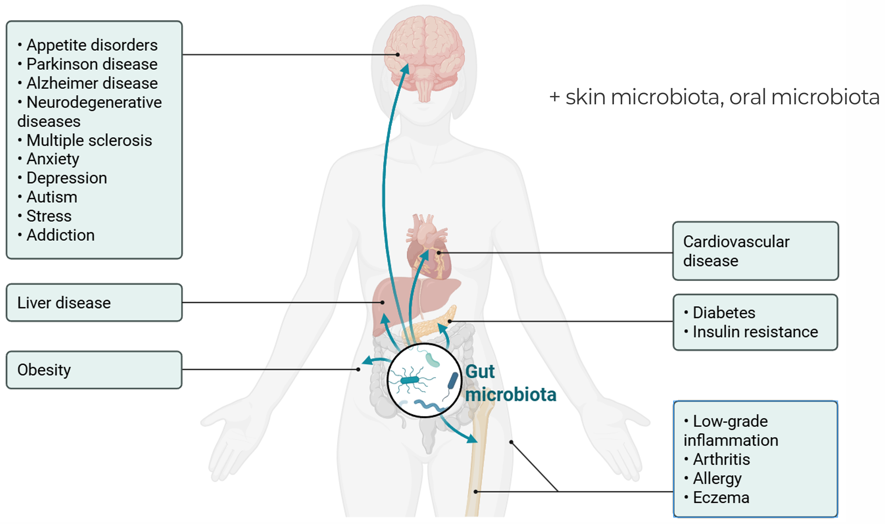
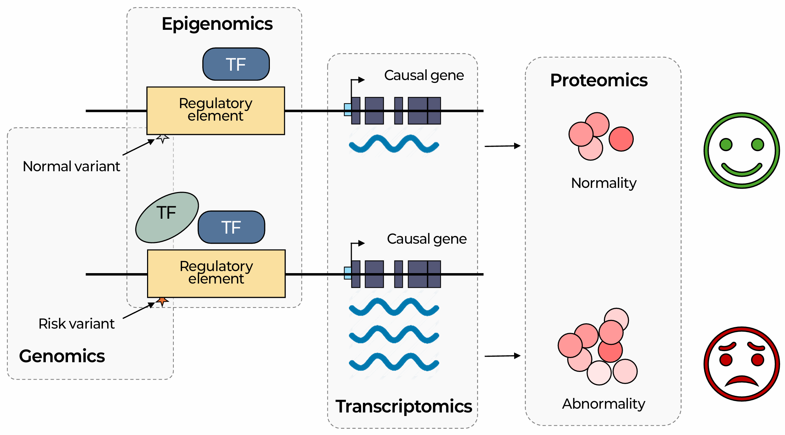

::: {.callout-note collapse="true"}
## 🎯 Learning objectives

By the end of this chapter you should be able to:

-   Explain why microbiome study design is dominated by confounders and contamination
-   Choose between 16S amplicon and shotgun sequencing for a given question
-   Distinguish alpha from beta diversity and interpret a PCoA with PERMANOVA
-   ⚠️ Explain why compositional data breaks standard statistics, and what CLR does about it
-   ⚠️ Explain why differential abundance methods disagree, and how to report results honestly
-   Judge whether a microbiome–disease association is cause, consequence, or artifact
-   Read any omics paper critically — the closing skill of the course
:::

> 🤔 **Motivating question**
>
> Patients have less *Faecalibacterium* than controls. Is that a cause, a consequence, or an artifact?


------------------------------------------------------------------------

# 1. The Human Microbiome 🦠 {#w7-s1}

## 1) What lives where {#w7-s1-1}

The human body carries **roughly as many bacterial cells as human cells** — the once-quoted 10:1 ratio was an overestimate; current best estimate ≈ 1:1

-   Almost all of them are in the colon

{fig-align="center"}

Two facts from this figure shape every microbiome study:

-   **Body sites are not comparable** — gut, oral, skin, vaginal, and airway communities differ from each other more than most disease states differ from health
-   ⚠️ **Between-person variation is enormous** — two healthy adults can share a minority of their gut species
    -   → detecting a disease effect requires large samples
    -   → and most published microbiome studies are small

## 2) Disease associations, honestly {#w7-s1-2}



Microbiome differences have been reported for nearly every disease studied. **The strength of evidence varies enormously** — be explicit about the tier:

| Evidence level | Examples |
|------------------------------------|------------------------------------|
| **Causal, mechanistically established** | *C. difficile* infection (and FMT as treatment); *H. pylori* and gastric cancer |
| **Strong, with animal-model support** | Diet–microbiome–metabolite axes; bile acid metabolism; some drug metabolism (e.g. digoxin, irinotecan) |
| **Reproducible association, causality unclear** | IBD, colorectal cancer, type 2 diabetes, obesity |
| **Widely reported, poorly replicated** | Most neuropsychiatric and behavioural "gut–brain" associations |

{fig-align="center"}

💡 Reading a microbiome paper → **place it on this ladder before evaluating anything else.**

------------------------------------------------------------------------

# 2. Study Design and Sample Handling 🧊 {#w7-s2}

## 1) Pre-analytical variation {#w7-s2-1}

Microbiome measurements are unusually sensitive to what happened **before** sequencing:

-   **Collection and storage** — time at room temperature changes composition; freeze–thaw cycles matter; preservative buffers differ in their effects
-   ⚠️ **DNA extraction — the single largest technical source of variation**
    -   Gram-positive bacteria have tough cell walls
    -   → bead-beating protocols recover them; gentle protocols do not
    -   → **two labs using different kits report different communities from the same stool**
-   **Primer choice** ([§3.1①](#w7-s3-1-1)) and sequencing platform

**The practical consequence:**

-   ✅ comparisons *within* a study — reasonable
-   ⚠️ comparisons *between* studies — treacherous. Meta-analyses must model study as a batch variable

## 2) ⚠️ Confounders {#w7-s2-2}

-   **Diet** — the dominant environmental determinant of gut composition, and almost never measured adequately
-   **Medications** — proton pump inhibitors, metformin, antibiotics, and laxatives all have large, well-documented microbiome effects

::: {.callout-warning collapse="true"}
## The metformin lesson

-   Early studies → a distinctive gut microbiome signature in type 2 diabetes
-   Much of that signature turned out to be an effect of **metformin**, not of diabetes
-   Treatment-naive patients analysed separately → the picture changed substantially

**Ask of any case–control microbiome study: were the cases on different drugs?**

Almost always they were.
:::

Also collect and adjust for: age · sex · BMI · bowel movement frequency and stool consistency (Bristol scale — a surprisingly strong covariate) · transit time · geography.

## 3) ⚠️ The kit-ome {#w7-s2-3}

{fig-align="center"}

**The mechanism** — extraction kits and PCR reagents contain bacterial DNA.

-   **Stool** → negligible
-   **Blood, tissue biopsy, placenta** → the sample may contain **fewer bacterial cells than the kit does**
-   → **most of what you sequence came out of the kit**

⚠️ Several high-profile low-biomass findings — including a healthy placental microbiome and some tumour-microbiome results — were subsequently attributed largely to contamination.

::: {.callout-important collapse="true"}
## What a credible low-biomass study does

-   ✅ Sequences **extraction blanks and no-template controls** in every batch
-   ✅ **Uses** them — `decontam` and similar tools identify contaminants by (i) prevalence in blanks and (ii) inverse correlation with DNA concentration
-   ✅ Records **DNA concentration** as a covariate
-   ✅ Reports results **with and without** decontamination

⚠️ A low-biomass paper that does not mention negative controls → that is the first thing to note.
:::

------------------------------------------------------------------------

# 3. Two Ways to Sequence a Community 🧬 {#w7-s3}

{fig-align="center"}

## 1) 16S rRNA amplicon sequencing {#w7-s3-1}

**The logic** — the 16S rRNA gene is present in all bacteria and archaea, and alternates:

-   **conserved regions** — where universal primers bind
-   **variable regions** — which differ between taxa

→ amplify one or two variable regions, sequence, classify.

### ① ⚠️ Primer and copy-number bias {#w7-s3-1-1}

-   **Different variable regions** (V3–V4, V4, V1–V2) give different answers → studies using different regions are **not directly comparable**
-   **"Universal" primers are not universal** — some taxa are amplified poorly or not at all
-   **16S copy number varies** from 1 to \~15 per genome → **read proportions are not cell proportions**

### ② OTUs vs. ASVs {#w7-s3-1-2}

-   **OTU** — reads clustered at 97% similarity. The threshold was chosen to absorb sequencing error
-   **ASV** — amplicon sequence variant (DADA2, Deblur). Models the error process and resolves **exact sequences**

ASVs are now standard, with one large practical advantage: **comparable across studies**, because an ASV is a sequence rather than a cluster defined by one dataset.

### ③ Resolution limit {#w7-s3-1-3}

-   16S generally reaches **genus** level
-   Species-level assignment → unreliable
-   Strain-level → impossible

⚠️ Papers reporting species-level 16S results are over-claiming — and the difference matters: *E. coli* strains range from commensal to lethal.

## 2) Shotgun metagenomics {#w7-s3-2}

Sequence all DNA in the sample.

-   **Taxonomic profiling** at species and often strain level (MetaPhlAn, Kraken2/Bracken, StrainPhlAn)
-   **Functional profiling** — which genes and pathways are present (HUMAnN)
    -   💡 The crucial addition: distantly related organisms often carry the same functional capacity → **function may matter more than identity**
-   **Non-bacterial members** — viruses, fungi, plasmids
-   **Assembly into MAGs** — recovering genomes of uncultured organisms

The costs:

-   ⚠️ \~an order of magnitude more expensive
-   ⚠️ needs high microbial biomass and low host DNA — a tissue biopsy may be \>99% human reads
-   ⚠️ much heavier computation

## 3) ✅ Choosing {#w7-s3-3}

| Your question                                     | Use     |
|---------------------------------------------------|---------|
| Broad survey, hundreds of samples, limited budget | 16S     |
| Low biomass where PCR amplification is needed     | 16S     |
| Species or strain resolution                      | Shotgun |
| What the community *does*, not just who is there  | Shotgun |
| Viruses, fungi, or mobile elements                | Shotgun |

------------------------------------------------------------------------

# 4. Reference Databases and Their Limits 📚 {#w7-s4}

| Database | Used for |
|------------------------------------|------------------------------------|
| **SILVA**, **Greengenes2** | 16S taxonomy assignment |
| **GTDB** | Genome-based taxonomy; increasingly the standard, and its names differ from older schemes |
| **Kraken2 / Bracken** databases | Shotgun read classification — results depend heavily on which database was built |
| **UHGG**, gene catalogues | Reference genomes and genes from uncultured gut organisms |

🗺️ **Reference bias** once more (🔗 [W1 §2.3③](w1_intro.qmd#w1-s2-3-3)):

-   A large fraction of reads in a typical gut metagenome cannot be confidently assigned to anything → **microbial dark matter**
-   Non-Western populations are under-represented in reference collections → their microbiomes are characterised worse
-   ⚠️ Taxonomies are actively being revised → **the same organism can carry different names in two papers**

→ Comparing across studies: check which database, and which version. Genus names have moved.

------------------------------------------------------------------------

# 5. Diversity 🌿 {#w7-s5}

{fig-align="center"}

## 1) Alpha diversity — within a sample {#w7-s5-1}

-   **Richness** — how many taxa. ⚠️ Strongly dependent on sequencing depth
-   **Shannon, Simpson** — combine richness and **evenness**. Two samples with identical richness can have very different Shannon values
-   **Faith's PD** — richness weighted by phylogenetic distance

💡 Report at least one **richness**-type and one **evenness**-type index. They can disagree, and the disagreement is informative.

## 2) ⚠️ The rarefaction debate {#w7-s5-2}

**The problem** — sequencing depth varies between samples, and richness rises with depth. Something must be done.

```         
Rarefaction (subsample all to equal depth)
   → was standard
   → criticised as statistically wasteful ("waste not, want not") — it discards data
   → model-based normalisation proposed instead
   → more recent work argues rarefaction is robust in practice
                                        for diversity and ordination
   → the debate is not settled
```

✅ **The defensible position** — do something explicit, say what you did, and check whether the conclusion survives the alternative.

## 3) Beta diversity — between samples {#w7-s5-3}

-   **Bray–Curtis** — abundance-weighted dissimilarity. The default
-   **Jaccard** — presence/absence only
-   **UniFrac** (weighted / unweighted) — incorporates phylogenetic relatedness

Visualised by **PCoA**, tested with **PERMANOVA**.

::: {.callout-warning collapse="true"}
## Report R², not only p

-   PERMANOVA on a few hundred samples will detect **almost anything**
-   **p** tells you the groups differ
-   **R²** tells you **how much of the variation the grouping explains** — in microbiome studies typically **1–8%**

→ "Significantly different community composition (p = 0.001)" with R² = 0.02 means the disease explains **2%** of the variation, and 98% is something else.

**Both numbers belong in the abstract.**
:::

------------------------------------------------------------------------

# 6. Statistics for Compositional Data ⚠️ {#w7-s6}

## 1) The problem {#w7-s6-1}

{fig-align="center"}

**Sequencing measures proportions.** The total is fixed by how many reads you bought, not by how many bacteria were in the sample.

-   → one taxon expands
-   → **every other taxon's proportion falls, by arithmetic**
-   → with no biological change at all

🔗 You have now met this three times:

-   RNA-seq composition effects ([W4 §4.2](w4_transcriptomics.qmd#w4-s4-2))
-   single-cell differential abundance ([W5 §6.3](w5_singlecell.qmd#w5-s6-3))
-   here

⚠️ Microbiome data is the most extreme case — the changes are large and the taxa are few.

::: {.callout-tip collapse="true"}
## The fix that actually solves it

Compositional problems arise because you only measured **proportions**.

**Quantitative microbiome profiling** recovers absolute abundances:

-   spike in a known standard, **or**
-   measure total microbial load by flow cytometry or qPCR

→ dissolves the problem entirely. Not yet routine — and it should be more so.
:::

## 2) The CLR transformation {#w7-s6-2}

Without absolute measurements, work with **ratios** rather than proportions.

**CLR (centred log-ratio)** — divide each taxon by the geometric mean of all taxa in that sample, take the log.

-   ✅ Ratios between taxa within a sample are unaffected by the total → CLR-based analyses are not distorted by the fixed sum
-   ⚠️ Undefined for zeros → a pseudocount must be added, and microbiome matrices are extremely sparse

## 3) ⚠️ Differential abundance methods disagree {#w7-s6-3}

{fig-align="center"}

::: {.callout-warning collapse="true"}
## A well-documented, unresolved problem

A large benchmark across dozens of real datasets found:

-   methods produce **substantially different results on the same data**
-   some widely used methods — **LEfSe and edgeR** among them — call far more taxa than others
-   → poor agreement overall

**Why they differ** — normalisation, whether compositionality is modelled, zero handling, and how conservative they are:

| Method | Approach |
|------------------------------------|------------------------------------|
| **ALDEx2** | CLR + Monte Carlo sampling from the Dirichlet posterior. Conservative |
| **ANCOM-BC** | Estimates and corrects a sampling-fraction bias per sample |
| **LinDA** | Linear model on CLR data with bias correction. Fast, handles complex designs |
| **MaAsLin2** | Flexible general linear models, multiple normalisation options |
| **DESeq2 / edgeR** | Borrowed from RNA-seq. ⚠️ Their normalisations assume most features are unchanged — often false here |
| **LEfSe** | Widely used. ⚠️ Known to be liberal |

**How to report honestly:**

-   ✅ Run **at least two** methods with different assumptions
-   ✅ Report the **intersection** as the confident set, the **union** as exploratory
-   ✅ Treat a taxon called by only one method as **unconfirmed**
-   ✅ State which method produced the headline result — and show it is not the only one that would have
:::

🔗 The same lesson as [W4 §5.3](w4_transcriptomics.qmd#w4-s5-3) — **if your conclusion depends on which tool you ran, you do not yet have a conclusion.** Simply far more acute here.

------------------------------------------------------------------------

# 7. From Association to Causation 🔀 {#w7-s7}

Return to the motivating question. Patients have less *Faecalibacterium*. Work through the possibilities **in order**:

## 1) Artifact {#w7-s7-1}

-   Different extraction batch
-   Different collection protocol
-   Different sequencing run
-   Contamination
-   Unequal depth

→ [§2](#w7-s2) covers this, and it should be excluded **first**.

## 2) Confounding {#w7-s7-2}

Diet · medication · BMI · transit time · age · geography.

→ Cases differ from controls in many ways besides disease, and the microbiome responds to most of them.

## 3) Reverse causation {#w7-s7-3}

Disease changes the gut environment:

-   inflammation → altered oxygen tension → favours facultative anaerobes such as Enterobacteriaceae
-   diarrhoea → shortened transit time
-   reduced appetite → changed substrate availability

⚠️ **A disease-associated microbiome is at least as likely to be a consequence as a cause** — and cross-sectional designs cannot distinguish them.

## 4) Causation {#w7-s7-4}

What would actually establish it:

-   **Longitudinal sampling** — does the microbiome change *before* disease onset?
-   **Gnotobiotic transfer** — does colonising a germ-free mouse with patient microbiota transfer the phenotype? Strong evidence, ⚠️ with the caveat that mouse and human gut environments differ substantially
-   **Intervention** — FMT, defined consortia, targeted antibiotics
    -   ✅ FMT for recurrent *C. difficile* — the clear success
    -   ⚠️ Other indications — far more mixed
-   **Mendelian randomization** — human genetic variants associated with microbial abundance as instruments. ⚠️ Attractive in principle, but host genetic effects on the microbiome are weak → few and weak instruments (🔗 [W2 §6.2](w2_genomics.qmd#w2-s6-2))

::: {.callout-important collapse="true"}
## The honest default

For most microbiome–disease associations in the current literature, **the direction of causality is unknown.**

→ A paper that describes an association and then discusses mechanism as though causality were established is doing something you should notice.
:::

------------------------------------------------------------------------

# 8. Beyond Bacteria, Beyond DNA 🔭 {#w7-s8}

-   **Virome** — mostly bacteriophage, largely unclassifiable because reference databases are so incomplete. 💡 crAssphage is among the most abundant human gut viruses and was discovered **computationally, from data**, years before it was cultured
-   **Mycobiome** — fungi. Low biomass relative to bacteria, contamination-prone, methodologically difficult
-   **Metatranscriptomics** — which genes are *expressed*, not merely present. ⚠️ A gene's presence in a metagenome says nothing about its activity — exactly as in 🔗 [W4 §1.1](w4_transcriptomics.qmd#w4-s1-1)
-   **Metabolomics** — the small molecules through which the microbiome actually reaches the host: short-chain fatty acids, secondary bile acids, tryptophan derivatives, TMAO. 💡 For mechanism, often the more informative layer

------------------------------------------------------------------------

# 9. 🎓 Reading Any Omics Paper Critically {#w7-s9}

The course closes here, because everything in this chapter generalises. **Whatever the assay, ask the same questions.**

::: {.callout-note collapse="true"}
## The checklist

**Design**

-   What exactly is being compared, and what is the **unit of replication**? ([W1 §5.3](w1_intro.qmd#w1-s5-3), [W5 §6.2](w5_singlecell.qmd#w5-s6-2))
-   How many biological replicates? Is that plausibly enough? ([W4 §5.4](w4_transcriptomics.qmd#w4-s5-4))
-   Are **batch and condition confounded**? Was randomisation described? ([W1 §4.3](w1_intro.qmd#w1-s4-3))
-   What covariates were collected — and which obvious ones were **not**? ([W3 §5.3②](w3_epigenomics.qmd#w3-s5-3-2), [W7 §2.2](#w7-s2-2))

**Measurement**

-   What does this assay actually measure, and what is it **blind to**? ([W2 §1.1](w2_genomics.qmd#w2-s1-1), [W6 §1](w6_proteomics.qmd#w6-s1))
-   Which reference, which annotation, **which version**? ([W1 §2.3](w1_intro.qmd#w1-s2-3))
-   What are the QC numbers — and are they shown? ([W3 §2.3](w3_epigenomics.qmd#w3-s2-3), [W5 §3.3](w5_singlecell.qmd#w5-s3-3))

**Analysis**

-   How was the data normalised, and does that method's **assumption hold**? ([W4 §4](w4_transcriptomics.qmd#w4-s4), [W7 §6](#w7-s6))
-   Multiple testing: corrected how, at what threshold? ([W1 §4.2](w1_intro.qmd#w1-s4-2))
-   Would a **different reasonable tool** give the same answer? ([W4 §5.3](w4_transcriptomics.qmd#w4-s5-3), [W7 §6.3](#w7-s6-3))
-   How were missing values or zeros handled? ([W5 §3.2](w5_singlecell.qmd#w5-s3-2), [W6 §4](w6_proteomics.qmd#w6-s4))

**Interpretation**

-   Is the **effect size** reported alongside the p-value? ([W1 §4.1](w1_intro.qmd#w1-s4-1))
-   Does the conclusion require **causality the design cannot support**? ([W2 §6.2](w2_genomics.qmd#w2-s6-2), [W7 §7](#w7-s7))
-   Was anything validated independently — another cohort, another assay?
-   Are data and code available? ([W1 §5.2](w1_intro.qmd#w1-s5-2))
:::

Work through that list on a paper in your own field, and this course has done its job.

-   **Next semester's practical course** — teaches you to run the analyses
-   **This one** — so you know what you are running, and why it might be wrong

------------------------------------------------------------------------

# 📝 Summary

-   Body sites are separate ecosystems, and between-person variation among healthy people is enormous → small studies are underpowered
-   ⚠️ **Extraction protocol** is the largest technical variable; **diet and medication** the largest biological confounders. Metformin is the cautionary tale
-   ⚠️ In low-biomass samples the reagent kit may supply most of the DNA. **Negative controls are mandatory**
-   16S is cheap and reaches genus level; shotgun reaches species/strain and gives gene function, at \~10× the cost
-   ASVs have replaced OTUs, and are comparable across studies
-   Report both a richness and an evenness index. The rarefaction question is unsettled → be explicit
-   ⚠️ Report PERMANOVA **R²** alongside p — microbiome effects typically explain a few percent
-   ⚠️ Sequencing measures **proportions**. CLR works on ratios; measuring total microbial load solves the problem properly
-   ⚠️ **Differential abundance methods disagree substantially** on the same data. Run more than one, report the intersection
-   For most microbiome–disease associations, causality is unknown. Artifact, confounding, and reverse causation must all be excluded first
-   🎓 The critical-reading checklist in [§9](#w7-s9) applies to **every chapter of this course**
-   You've now seen the major omics layers one by one. What really matters is [integrating]{.underline} them — **multi-omics**.



------------------------------------------------------------------------

# 🔑 Key terms

| Term | One-line meaning |
|--------------------------|----------------------------------------------|
| Microbiome / microbiota | The community, and its collective genomes |
| 16S rRNA gene | Universal bacterial marker gene with variable regions |
| OTU / ASV | 97%-similarity cluster / exact resolved sequence |
| Shotgun metagenomics | Sequencing all DNA in a sample |
| Functional profiling | Cataloguing genes and pathways, not just taxa |
| MAG | Genome assembled from metagenomic reads |
| Kit-ome | Bacterial DNA contaminating reagents |
| Alpha diversity | Diversity within one sample |
| Beta diversity | Dissimilarity between samples |
| Rarefaction | Subsampling all samples to equal depth |
| Bray–Curtis / UniFrac | Abundance-based / phylogeny-aware distances |
| PCoA | Ordination of a distance matrix |
| PERMANOVA | Permutation test on community distances |
| Compositional data | Data constrained to a fixed total |
| CLR | Log of each taxon divided by the sample geometric mean |
| Differential abundance | Testing which taxa differ between groups |
| Gnotobiotic | Germ-free animals colonised with a defined community |
| FMT | Faecal microbiota transplantation |

------------------------------------------------------------------------

# ➕ References

### Overviews

Knight R, et al. [*Best practices for analysing microbiomes.*](https://pubmed.ncbi.nlm.nih.gov/?term=Best+practices+for+analysing+microbiomes) Nat Rev Microbiol. 2018.\
Sender R, Fuchs S, Milo R. [*Revised estimates for the number of human and bacteria cells in the body.*](https://pubmed.ncbi.nlm.nih.gov/?term=Revised+estimates+for+the+number+of+human+and+bacteria+cells+in+the+body) PLoS Biol. 2016.\
Fischbach MA. [*Microbiome: focus on causation and mechanism.*](https://pubmed.ncbi.nlm.nih.gov/?term=Microbiome%3A+focus+on+causation+and+mechanism) Cell. 2018.

### Methods and pitfalls

Callahan BJ, et al. [*DADA2: high-resolution sample inference from Illumina amplicon data.*](https://doi.org/10.1038/nmeth.3869) Nat Methods. 2016.\
Salter SJ, et al. [*Reagent and laboratory contamination can critically impact sequence-based microbiome analyses.*](https://pubmed.ncbi.nlm.nih.gov/?term=Reagent+and+laboratory+contamination+can+critically+impact+sequence-based+microbiome+analyses) BMC Biol. 2014.\
Davis NM, et al. [*Simple statistical identification and removal of contaminant sequences.*](https://pubmed.ncbi.nlm.nih.gov/?term=Simple+statistical+identification+and+removal+of+contaminant+sequences) Microbiome. 2018. (decontam)\
Gloor GB, et al. [*Microbiome datasets are compositional: and this is not optional.*](https://pubmed.ncbi.nlm.nih.gov/?term=Microbiome+datasets+are+compositional%3A+and+this+is+not+optional) Front Microbiol. 2017.\
Nearing JT, et al. [*Microbiome differential abundance methods produce different results across 38 datasets.*](https://doi.org/10.1038/s41467-022-28034-z) Nat Commun. 2022.\
Lin H, Peddada SD. [*Analysis of compositions of microbiomes with bias correction.*](https://doi.org/10.1038/s41467-020-17041-7) Nat Commun. 2020. (ANCOM-BC)

### Confounding and causation

Forslund K, et al. [*Disentangling type 2 diabetes and metformin treatment signatures in the human gut microbiota.*](https://pubmed.ncbi.nlm.nih.gov/?term=Disentangling+type+2+diabetes+and+metformin+treatment+signatures+in+the+human+gut+microbiota) Nature. 2015.\
Vandeputte D, et al. [*Quantitative microbiome profiling links gut community variation to microbial load.*](https://pubmed.ncbi.nlm.nih.gov/?term=Quantitative+microbiome+profiling+links+gut+community+variation+to+microbial+load) Nature. 2017.\
Vujkovic-Cvijin I, et al. [*Host variables confound gut microbiota studies of human disease.*](https://pubmed.ncbi.nlm.nih.gov/?term=Host+variables+confound+gut+microbiota+studies+of+human+disease) Nature. 2020.\
Walter J, et al. [*Establishing or exaggerating causality for the gut microbiome: lessons from human microbiota-associated rodents.*](https://pubmed.ncbi.nlm.nih.gov/?term=Establishing+or+exaggerating+causality+for+the+gut+microbiome%3A+lessons+from+human+microbiota-associated+rodents) Cell. 2019.

### Resources

[Human Microbiome Project](https://portal.hmpdacc.org/) · [curatedMetagenomicData](https://waldronlab.io/curatedMetagenomicData/) · [GTDB](https://gtdb.ecogenomic.org/) · [MGnify](https://www.ebi.ac.uk/metagenomics/) · [QIIME 2](https://qiime2.org/)
