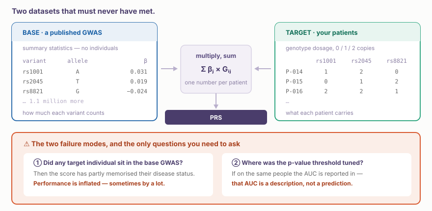
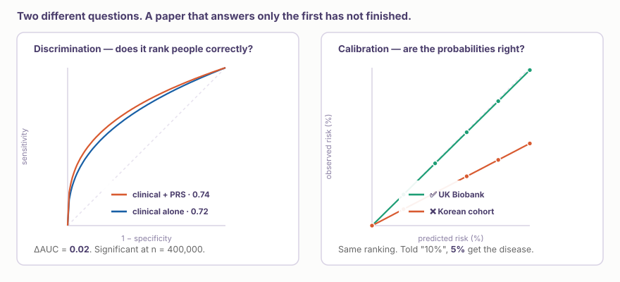
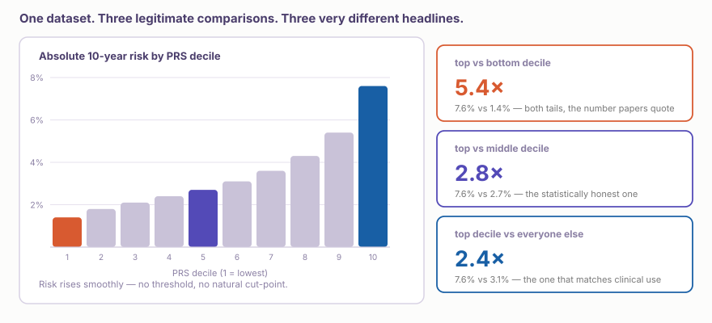
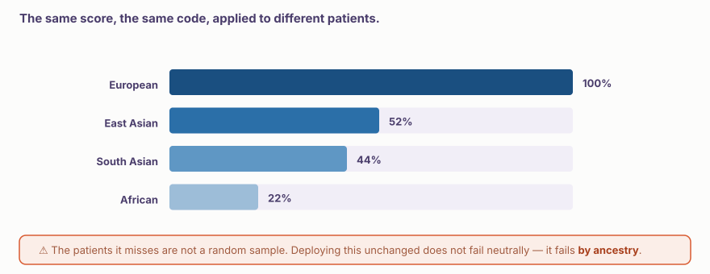

::: {.callout-note collapse="true"}
## 🎯 학습목표

이 장을 마치면 다음을 할 수 있어야 합니다.

-   다유전자 위험 점수(polygenic risk score, PRS)가 무엇이며 눈앞의 환자에게 어떤 변화를 만드는지 설명한다
-   직접 구현하지 않더라도 methods section에 나오는 네 가지 방법의 이름을 알아본다
-   ⚠️ **Base GWAS**와 **target cohort**를 구분하고, 이 차이가 모든 것을 결정하는 이유를 설명한다
-   PRS 성능 주장에 등장하는 incremental R², ΔAUC, calibration과 decile trick을 읽는다
-   ⚠️ 유럽인에서 만든 PRS를 한국 환자에게 그대로 적용해서는 안 되는 이유를 설명한다
-   AUC가 아니라 ACCE를 이용해 임상 적용 준비도를 판단한다
-   환자가 행동으로 옮길 수 있는 framing으로 유전적 위험 결과를 전달한다
:::

> 🤔 **동기 질문**
>
> 가족력이 없는 42세 남성이 소비자 직접 의뢰 검사 보고서를 가져왔습니다. *“관상동맥질환 — 92 percentile.”* LDL은 130 mg/dL입니다. Statin을 시작해야 할까요?

------------------------------------------------------------------------

# 1. PRS란 무엇인가 🧬 {#w4-s1}

## 1) Variant 하나는 쓸모없지만, 백만 개는 그렇지 않다 {#w4-s1-1}

🔗 [W3](w3_gwas.qmd)에서 보았듯 GWAS는 *p* \< 5×10⁻⁸인 variant를 보고하며 각각의 odds ratio는 대략 **1.02–1.15**입니다. 하나만으로 임상적 행동을 결정할 가치는 없습니다.

PRS는 이를 모두 더합니다. 각 GWAS effect size $\hat\beta_j$에 개인의 allele dosage $G_{ij}$를 곱합니다.

$$\text{PRS}_i = \sum_{j=1}^{M} \hat\beta_j \, G_{ij}$$

💡 각각은 noise이지만 모두 합치면 실제 signal을 가집니다. ... omnigenic model (🔗 [W3 §1.3](w3_gwas.qmd#w3-s1-3)).

## 2) PRS의 의미 {#w4-s1-2}

PRS는 질환이 있는지를 알려주지 않습니다. Family history와 마찬가지로 **pre-test probability**(확률!)일 뿐

| PRS의 의미                                         | PRS로 할 수 없는 것  |
|------------------------------------------------|----------------------|
| LDL이나 Framingham score 같은 **위험 지표**        | **진단**             |
| 태어날 때부터 가진 genetic variants.. 한 번만 측정 | Monitoring biomarker |

::: {.callout-tip collapse="true"}
## 임상에서 PRS의 유용성

High CAD PRS → ↑ CAD risk → ↑ absolute benefit from statin → ↓ Number needed to treat\
*Mega et al., Lancet 2015; Natarajan et al.,*
:::

------------------------------------------------------------------------

# 2. PRS를 만드는 방법 🏗️ {#w4-s2}

PRS를 직접 계산할 일은 많지 않을 것 같고, 관련 논문을 읽을 때 주의하면 좋을 것들..

## 1) ⚠️ GWAS 데이터와 PRS를 계산할 데이터는 달라야 함 {#w4-s2-1}

{fig-align="center"}

::: {.callout-important collapse="true"}
## ⚠️Overfitting

GWAS에 사용된 sample의 PRS를 계산하는 건 아무 의미가 없음..

✅ 신뢰할 수 있는 논문은 base와 target을 명시하고, **둘의 독립성**을 확인하며, **held-out** cohort에서 평가함
:::

## 2) 많이 쓰는 PRS 계산 방식 {#w4-s2-2}

| 방법 | 한 줄 아이디어 | 주로 보이는 곳 |
|-------------------|---------------------------|--------------------------|
| **C+T** (clumping + thresholding) | LD block마다 variant 하나를 남기고 *p* cutoff보다 큰 것을 제거 | 오래된 논문; 여전히 합리적인 baseline |
| **PRSice-2** | Threshold를 자동 tuning하는 C+T와 표준 plot | 임상 논문에서 매우 흔함 |
| **LDpred2** | Bayesian 방식으로 LD를 model하고 hard cutoff 없이 *모든* variant의 weight를 다시 계산 | 정확도를 위한 현재의 기본 방법 |
| **PRS-CSx** | **여러 ancestry**에 동시에 continuous shrinkage 적용 | 비유럽 cohort에서 중요한 방법 |

::: {.callout-note collapse="true"}
## 방법 선택이 논문 읽기에 영향을 주는가?

대체로 x. 방법 간 차이 \<\< ancestry와 cohort 때문에 생기는 차이

-   ⚠️ **Threshold 기반** 방법(C+T, PRSice-2): check the parameters for tuning
-   ✅ **multi-ancestry** 방법: for non European samples (including Koreans)
:::

------------------------------------------------------------------------

# 3. ⚠️ PRS 논문 읽기 🔍 {#w4-s3}

{fig-align="center"}

## 1) PRS 단독이 아니라 추가 가치 {#w4-s3-1}

PRS **단독**으로 AUC 0.64 –\> good? ... 사실 많은 질환에서 나이와 성별만으로 그 정도는 가능

```         
Model A (clinical) : age + sex + BMI + family history + labs
Model B (clinical + PRS)

           ΔAUC  =  AUC(B) − AUC(A)
  incremental R²  =  R²(B)  − R²(A)      (Nagelkerke, for binary outcomes)
```

-   ❌ “PRS AUC = 0.64” — 이것만으로는 해석 불가
-   ✅ “PRS를 추가하자 AUC가 0.72에서 0.74로 증가했다(*p* = 0.003)” — 이제 판단 가능

💡 좋은 PRS에서 일반적인 ΔAUC는 0.01–0.03 정도. 40만 명의 biobank에서는 충분히 유의하지만 환자 한 명에게는 흔히 무시할 정도..

## 2) Calibration — 아무도 보여주지 않는 metric {#w4-s3-2}

**Discrimination**은 model이 사람들의 순서를 올바르게 매기는가?\
**Calibration**은 예측한 probability가 *맞는가*? (prob = PRS + clinical data...)

“10년 동안 위험 10%”라고 들은 사람 중 실제로 약 10%가 질환에 걸립니까?

::: {.callout-warning collapse="true"}
## Discrimination은 좋지만 calibration은 형편없는 결과를 만들기 쉽다

위 그림의 오른쪽 panel을 보세요. 두 선 모두 환자의 순위를 똑같이 매깁니다. 그중 하나는 환자에게 실제의 두 배인 숫자를 말합니다.

-   ⚠️ UK Biobank에서 calibration한 PRS는 한국 병원 population에서 calibration (x) ... Baseline incidence, age structure, competing risk가 다름
-   ✅ Recalibration(intercept 또는 baseline hazard 업데이트)로 해결. 다만 population을 대표하는 cohort에서 실제로 *수행...*
-   ⚠️ Biobank volunteer는 일반 population보다 건강하므로 여기에서 계산한 absolute risk는 그냥 낮음

→ 논문이 AUC만 보고하고 calibration plot을 보여주지 않는다면 제시된 absolute risk를 신뢰할 수 없음!
:::

## 3) PRS 표현은 조심스럽게 {#w4-s3-3}

| Framing | 예 | ⚠️ 주의점 |
|----------------|--------------------|----------------------------------|
| **Percentile** | “PRS 상위 5%” | 위험이 얼마나 큰지는 말하지 않음 |
| **Relative risk / OR** | “Population 평균의 2.3배” | Baseline이 0.4%이면 2.3배도 0.9%에 불과함 |
| **Absolute risk** ✅ | “10년 동안 18%” | *환자가 속한* population의 incidence data가 필요함 |

## 4) ⚠️ 어느 decile을 비교했는가? {#w4-s3-4}

{fig-align="center"}

⚠️ “**위험 5배 증가**”라는 headline은 거의 언제나 top decile과 bottom decile의 비교. Middle과 비교하면 같은 score가 2.8배, 실제 사용 방식인 나머지 전체와 비교하면 2.4배

💡 위험이 decile에 따라 **매끄럽게** 증가하는지, extreme tail에서만 증가하는지도 확인해야함. 상위 1%만 구분하는 score는 극소수만을 위한 screening tool (효용성 x)

## 5) 누구의 genome으로 만들었는가? {#w4-s3-5}

다른 무엇보다 먼저 **base** GWAS의 ancestry 확인!! §5 전체가 그 이유를 설명합니다.

------------------------------------------------------------------------

# 4. 임상에서 사용할 준비가 되었는가? 🏥 {#w4-s4}

## 1) AUC가 아니라 ACCE {#w4-s4-1}

Genomic test를 판단하는 표준 framework

-   **A**nalytical validity — pipeline이 score를 정확하고 재현 가능하게 계산하는가?
-   **C**linical validity — score가 **target population**의 질환과 연관되는가?
-   **C**linical utility — 이를 *사용하는 것*이 outcome을 개선하는가?
-   **E**LSI — 형평성, consent, insurance, communication 같은 ethical, legal and social implication

💡 PRS 논문 대부분은 앞의 두 기준은 통과함. **utility**와 **ELSI**가 문제임. GWAS가 20년이 됐지만 PRS가 아직 routine care가 아닌 이유..

## 2) 임상시험에서 효용성을 보인 경우? {#w4-s4-2}

| Trial | Setting | 발견 또는 검정 중인 내용 |
|-----------------|-------------------|------------------------------------|
| **MI-GENES** | CHD | PRS를 통합한 risk disclosure → 더 이르고 오래 지속된 statin 사용을 통해 **6개월 뒤 LDL 감소** |
| **GenoVA** | 6개 질환(CHD, T2D, AF, 유방암/대장암/전립선암) | PRS 결과가 진단까지 걸리는 시간에 미치는 영향 |
| **WISDOM / PERSPECTIVE** | 유방암 | PRS에 따라 mammography 강도를 정하는 전략 |
| **eMERGE**, **Our Future Health** | 10개 질환 / 참여자 500만 명 | Efficacy가 아니라 대규모 implementation |

::: {.callout-note collapse="true"}
## MI-GENES를 주의 깊게 읽기

효과의 mechanism은 **행동 변화**. 고위험이라는 결과를 들은 환자가 statin을 더 일찍 시작하고 계속 복용.

실제 임상 효과가 있었음. 그러나 지금까지 입증된 PRS의 효용성은 상당 부분이 생물학적으로 다른 집단을 찾아내는 것이 아니라 **이미 있던 치료의 adherence를 높이는 것**!
:::

## 3) PRS가 이미 임상 equation에 포함된 영역 {#w4-s4-3}

-   ✅ **유방암 — BOADICEA / CanRisk**: PRS를 가족력, rare variant(BRCA1/2), clinical factor와 **함께** 사용하는 널리 쓰이는 유일한 케이스. ER-positive disease의 lifetime risk는 bottom centile과 top centile 사이에서 대략 **2%에서 31%**까지 차이 남
-   ✅ **CHD — Pooled Cohort Equations**: PRS는 clinical factor와 거의 orthogonal하므로 log-additive하게 추가 가능
-   ⚠️ **그 밖의 모든 영역**: 검증된 absolute-risk equation (x). Population incidence로 absolute risk를 재구성해야 하며 바로 여기에서 calibration 문제 발생

## 4) The human barriers {#w4-s4-4}

::: {.callout-warning collapse="true"}
-   ⚠️ **환자는 유전 정보를 운명으로 받아들입니다.** 위험은 probabilistic하고 수정 가능함. MI-GENES가 성공한 이유 중 하나는 이를 명확히 framing했음
-   ⚠️ **PRS를 20개 실행하면 거의 모두가 무언가의 top decile에 속합니다.** Alarm fatigue가 생기며, 목적 없는 panel 검사를 피해야 함!
-   ⚠️ **대부분의 의사는 genomics training을 받지 않았습니다.** 적용하려면 PDF report가 아니라 EHR의 decision support와 진료과 안의 숙련된 의사가 필요함
:::

------------------------------------------------------------------------

# 5. ⚠️ Portability: 한국의 문제 🌏 {#w4-s5}

## 1) PRS는 ancestry가 다르면 그대로 적용할 수 없음 {#w4-s5-1}

{fig-align="center"}

이유는 다양하고 서로 연결되어 있어서 같은 population의 사람을 더 모으는 것으로 해결 불가

-   **Allele frequency가 다름** — 유럽인에서 흔한 variant가 드물거나 없을 수 있음
-   **LD pattern이 다름** — tag SNP가 더는 causal variant를 tag하지 않음(🔗 [W3 §3.1](w3_gwas.qmd#w3-s3-1))
-   **Effect size가 다름** — gene–environment 및 genetic-background interaction

## 2) 대신 무엇을 해야 하는가 {#w4-s5-2}

-   ✅ 한국인 또는 동아시아인의 **ancestry-matched base GWAS**를 우선적으로 사용
-   ✅ Matching된 base가 너무 작다면 **PRS-CSx** 또는 multi-ancestry meta-analysis를 사용
-   ✅ 자체 population에서 **recalibration**하고 ancestry별 성능을 보고
-   ✅ Korean resource: **KoGES**, Korea Biobank Array(**KCHIP**), **National Biobank of Korea**\
    EAS resource로 **Biobank Japan**, **China Kadoorie** 등

------------------------------------------------------------------------

# 6. PRS의 한계 🚫 {#w4-s6}

-   ❌ **진단 아님** — 높은 PRS != 발병
-   ❌ **Rare high-penetrance variant를 놓침** — BRCA1/2, Lynch syndrome에는 별도 검사 필요
-   ❌ **Non-SNP variation을 놓침** — CNV, structural variant, repeat expansion(🔗 [W3 §4](w3_gwas.qmd#w3-s4))
-   ❌ **Gene × environment를 무시함** — 같은 score도 흡연자와 비흡연자의 probability 다름
-   ⚠️ **계속 바뀔 수 있음** — Score를 다시 계산할 수 있도록 raw genotype 확보

::: {.callout-tip collapse="true"}
## 동기 질문으로 돌아가기

42세 남성, CAD PRS 92 percentile, LDL 130, 가족력 없음.

답하기 전에 알고 싶은 내용은 다음과 같습니다.

-   ① **어떤 base GWAS인가?** 유럽인 대상이고 환자가 한국인이라면 제시된 percentile은 해석 불가
-   ② **92 percentile은 어떤 absolute risk인가?** 42세 남성은 낮은 baseline의 세 배여도 treatment 정도는 아닐 수 있음
-   ③ **Guideline 기준을 넘는가?** 10-year risk가 4%에서 7%로 바뀌면 생각해 봐야함. 1.2%에서 2.1% 바뀌는 거면 그닥..
-   ④ **무엇이 달라지는가?** 답이 “statin과 생활 습관을 논의한다”라면 사실 검사 없이도 가능함

→ PRS 그 자체만으로 충분하지 않다. 해석이 중요하다
:::

------------------------------------------------------------------------

# 7. 실습 💻 {#w4-s7}

## 1) 코딩 없이 PGS Catalog의 실제 score 읽기 {#w4-s7-1}

**PGS Catalog**([pgscatalog.org](https://www.pgscatalog.org))는 출판된 score의 weight, metadata, 평가 성능을 모은 공개 DB

전문 분야와 관련된 질환 하나를 고른 뒤 다음에 답하세요.

-   ① Score는 몇 개 variant를 사용합니까? 출판된 score는 6개부터 100만 개 이상까지 다양합니다
-   ② Development cohort의 **ancestry**는 무엇입니까?
-   ③ **동아시아 sample에서 평가**되었습니까? Effect size가 어떻게 변했습니까?
-   ④ Calibration이 보고되어 있습니까, 아니면 discrimination만 있습니까?
-   ⑤ 같은 질환에 여러 score가 있습니까? 어떤 개인이 고위험인지 서로 일치합니까?

## 2) 최소한의 코드: score를 임상 그림으로 바꾸기 {#w4-s7-2}

`prs_scores.tsv` : 미리 계산한 4만명 PRS + 임상정보 `IID`, `PRS`, `disease`, `age`, `sex`⚠️ 개인 genotype은 공유할 수 없으므로 시뮬레이션 데이터임!

```{r}
library(tidyverse)
library(here)

prs <- read_tsv(here("rawdata", "prs_scores.tsv"))

# Standardise so the score reads as SD units — always do this before reporting
prs <- prs |> mutate(PRS_z = as.numeric(scale(PRS)))
```

**Clinical model을 넘어서는 incremental value:**

```{r}
library(pROC)

m_clin <- glm(disease ~ age + sex,         data = prs, family = binomial)
m_prs  <- glm(disease ~ age + sex + PRS_z, data = prs, family = binomial)

roc_clin <- roc(prs$disease, predict(m_clin, type = "response"))
roc_prs  <- roc(prs$disease, predict(m_prs,  type = "response"))

roc.test(roc_clin, roc_prs)   # ← the number that belongs in the abstract
```

**정직한 reference와 비교한 decile별 risk:**

```{r}
by_decile <- prs |>
  mutate(decile = ntile(PRS_z, 10)) |>
  group_by(decile) |>
  summarise(n = n(), cases = sum(disease), .groups = "drop") |>
  mutate(risk = cases / n,
         OR_vs_middle = (risk / (1 - risk)) /
                        (risk[decile == 5] / (1 - risk[decile == 5])))

ggplot(by_decile, aes(decile, OR_vs_middle)) +
  geom_col(fill = "#185FA5") +
  geom_hline(yintercept = 1, linetype = "dashed") +
  scale_x_continuous(breaks = 1:10) +
  labs(x = "PRS decile", y = "OR vs middle decile",
       title = "Risk by PRS decile — referenced to the middle, not the bottom") +
  theme_minimal()
```

✅ **이제 한 가지만 바꿔보기.** Reference를 `decile == 1`로 바꾸어 다시 실행하고 top bar를 비교

::: {.callout-tip collapse="true"}
## 직접 만들어보고 싶다면

이 수업의 필수 내용은 아니지만 참고.

-   `bigsnpr`(R) — C+T와 LDpred2 구현; [privefl.github.io/bigsnpr](https://privefl.github.io/bigsnpr)
-   `PRSice-2` — command-line에서 threshold 자동 tuning; [prsice.info](https://www.prsice.info)
-   `PRS-CSx` — Python 기반 multi-ancestry 방법; [github.com/getian107/PRScsx](https://github.com/getian107/PRScsx)

⚠️ 각 방법에는 target ancestry와 일치하는 LD reference panel이 필요함. 임상 project가 어려운 이유...
:::

## 3) 다음 주 전까지 {#w4-s7-3}

**W5 — single-cell RNA-seq: technology, QC, clustering.** 미리 설치하기!

```{r}
install.packages("Seurat")
BiocManager::install(c("SingleR", "celldex"))
renv::snapshot()
```

------------------------------------------------------------------------

# 📝 요약

-   PRS는 수천에서 수백만 개의 작은 effect를 하나의 숫자로 합칩니다. **Risk indicator**이지 진단이 아닙니다
-   ⚠️ **Base와 target은 독립적이어야 합니다.** 같은 데이터에서 tuning하고 평가하면 보고되는 모든 숫자가 부풀려집니다
-   방법 이름(C+T, PRSice-2, LDpred2, PRS-CSx)은 ancestry와 cohort보다 덜 중요합니다. 구현할 필요 없이 알아보면 됩니다
-   ❌ PRS AUC 단독은 의미가 없습니다. ✅ 주장은 clinical model을 넘어선 **ΔAUC와 incremental R²**입니다
-   ⚠️ **Calibration은 대개 누락**되지만 absolute risk를 신뢰하게 만드는 요소입니다
-   ⚠️ “위험 5배”는 거의 언제나 top-vs-bottom decile입니다. Middle 또는 나머지 전체와 비교한 값을 요구하세요
-   Percentile → relative risk → **guideline action과 연결된 absolute risk**: 진료 현장에서 사용할 수 있는 것은 마지막뿐입니다
-   임상 적용 준비도는 AUC가 아니라 **ACCE**로 판단합니다. Utility evidence는 부족하며 상당 부분 adherence를 통해 작동합니다
-   ⚠️ **유럽인에서 만든 PRS는 수정 없이 한국 환자에게 유효하지 않습니다.** Matching 또는 multi-ancestry score를 사용하고 recalibration하세요
-   어려운 부분은 수학이 아니라 portability, communication, EHR integration입니다

------------------------------------------------------------------------

# 🔑 핵심 용어

| 용어 | 한 줄 뜻 |
|----------------------------|--------------------------------------------|
| PRS / PGS | 많은 변이의 위험 대립유전자를 가중 합산한 값 |
| Base GWAS | 효과크기를 제공하는 출판된 연구 |
| Target cohort | 점수를 계산할 대상자 집단 |
| C+T | 연관 변이를 서로 독립적인 신호로 추리고 *p*-value 기준을 적용하는 방법 |
| LDpred2 | LD 참조 자료를 이용해 모든 변이의 가중치를 다시 계산하는 베이지안 방법 |
| PRS-CSx | 여러 조상 집단에 적용하는 연속 수축 방법 |
| Incremental R² | 임상 모형을 **넘어** 추가로 설명하는 분산의 비율 |
| ΔAUC | PRS를 추가했을 때 증가한 판별 성능 |
| Calibration | 예측 확률과 실제 관측 빈도의 일치 정도 |
| Recalibration | 새로운 집단에 맞춰 기저 위험도를 조정하는 것 |
| Portability | PRS가 다른 조상 집단에서도 작동하는 정도 |
| ACCE | 분석적 타당성, 임상적 타당성, 임상적 유용성, 윤리·법·사회적 쟁점 |
| PGS Catalog | 출판된 점수와 가중치를 모은 공개 저장소 |
| BOADICEA / CanRisk | PRS, 가족력, 희귀 변이를 결합한 유방암 위험 예측 모형 |

------------------------------------------------------------------------

# ➕ 참고문헌

### 임상 활용과 준비도

Kullo IJ, et al. [*Polygenic scores in biomedical research.*](https://doi.org/10.1038/s41576-022-00470-z) Nat Rev Genet. 2022.\
Khera AV, et al. [*Genome-wide polygenic scores for common diseases identify individuals with risk equivalent to monogenic mutations.*](https://doi.org/10.1038/s41588-018-0183-z) Nat Genet. 2018.\
Wand H, et al. [*Improving reporting standards for polygenic scores in risk prediction studies.*](https://doi.org/10.1038/s41586-021-03243-6) Nature. 2021. **← Review에 활용할 PRS-RS checklist**

### 알아볼 수 있어야 할 방법

Choi SW, Mak TS, O'Reilly PF. [*Tutorial: a guide to performing polygenic risk score analyses.*](https://doi.org/10.1038/s41596-020-0353-1) Nat Protoc. 2020.\
Privé F, Arbel J, Vilhjálmsson BJ. [*LDpred2: better, faster, stronger.*](https://doi.org/10.1093/bioinformatics/btaa1029) Bioinformatics. 2020.\
Ruan Y, et al. [*Improving polygenic prediction in ancestrally diverse populations.*](https://doi.org/10.1038/s41588-022-01054-7) Nat Genet. 2022. (PRS-CSx)

### Portability와 diversity

Martin AR, et al. [*Clinical use of current polygenic risk scores may exacerbate health disparities.*](https://doi.org/10.1038/s41588-019-0379-x) Nat Genet. 2019.\
Wojcik GL, et al. [*Genetic analyses of diverse populations improves discovery for complex traits.*](https://doi.org/10.1038/s41586-019-1310-4) Nature. 2019.

### 도입과 의사소통

Lambert SA, et al. [*The Polygenic Score Catalog as an open database for reproducibility and systematic evaluation.*](https://doi.org/10.1038/s41588-021-00783-5) Nat Genet. 2021.\
Li R, Chen Y, Ritchie MD, Moore JH. [*Electronic health records and polygenic risk scores for predicting disease risk.*](https://doi.org/10.1038/s41576-020-0224-1) Nat Rev Genet. 2020.\
Lee A, et al. [*BOADICEA: a comprehensive breast cancer risk prediction model incorporating genetic and nongenetic risk factors.*](https://doi.org/10.1038/s41436-018-0406-9) Genet Med. 2019.

### 리소스

[PGS Catalog](https://www.pgscatalog.org) · [CanRisk (BOADICEA)](https://www.canrisk.org) · [Korea Biobank](https://biobank.nih.go.kr) · [PRSice-2](https://www.prsice.info)
