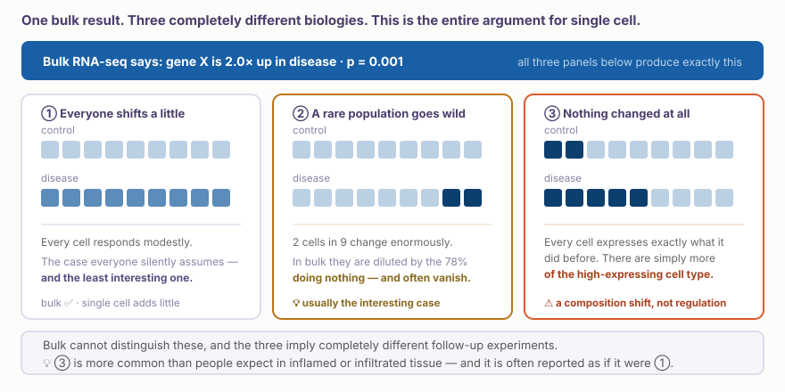
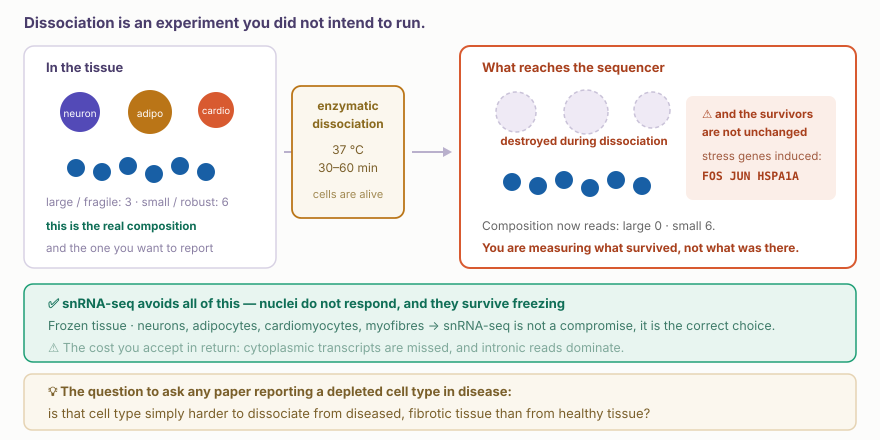
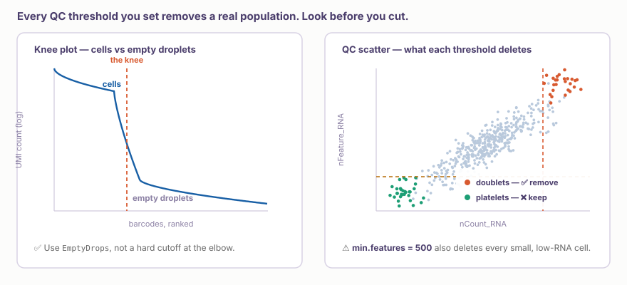
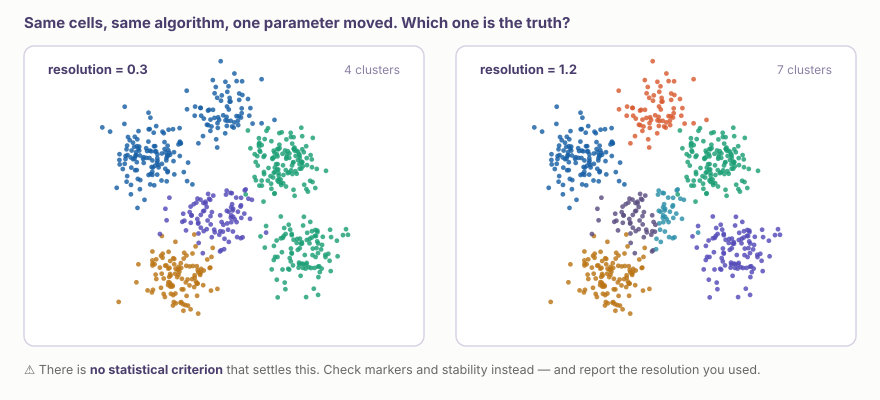
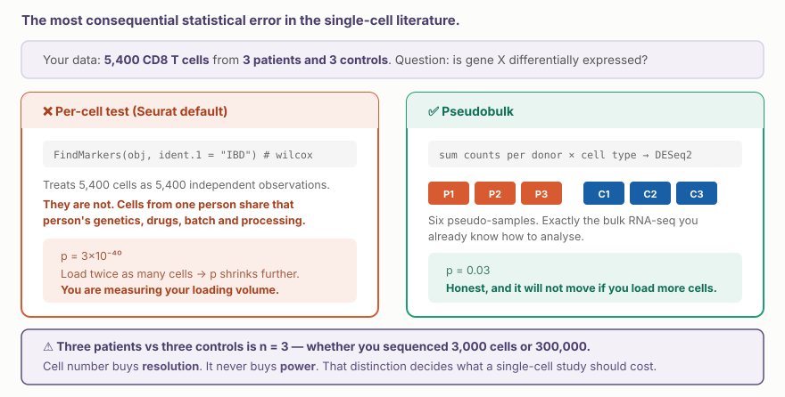

::: {.callout-note collapse="true"}
## 🎯 학습목표

이 장을 마치면 다음을 할 수 있어야 합니다.

-   Bulk가 구조적으로 답할 수 없는 질문에 single cell이 어떻게 답하는지, 그리고 bulk가 여전히 더 나은 선택인 경우를 설명한다
-   Droplet과 plate-based protocol, 그리고 ⚠️ cell과 nucleus 중 하나를 선택한다
-   ⚠️ Dissociation이 측정되는 세포 조성을 바꾸는 이유를 설명한다
-   UMI가 무엇이며 count matrix의 대부분이 0인 이유를 설명한다
-   ⚠️ Knee plot과 QC scatter를 읽고 각 threshold가 어떤 population을 삭제하는지 말한다
-   ⚠️ UMAP을 책임 있게 읽고, UMAP 거리의 의미와 한계를 설명한다
-   ⚠️ 조건 간 per-cell differential expression이 잘못된 이유와 pseudobulk가 이를 해결하는 방법을 설명한다
:::

> 🤔 **동기 질문**
>
> Bulk RNA-seq에서 두 배의 뚜렷한 증가가 나타났고 *p* = 0.001입니다. 모든 세포가 조금씩 변한 것일까요, 세포의 5%가 크게 변한 것일까요, 아니면 어떤 세포도 변하지 않은 것일까요?

------------------------------------------------------------------------

# 1. Bulk가 볼 수 없는 것 🔬 {#w5-s1}

## 1) 하나의 숫자, 세 가지 생물학 {#w5-s1-1}

{fig-align="center"}

-   **① 전반적으로 완만한 반응** — 모두가 암묵적으로 가정하는 경우이며 가장 흥미롭지 않습니다
-   **② 반응하는 드문 subpopulation** — 대개 가장 흥미로운 경우입니다. Bulk에서는 변화하지 않는 세포 때문에 희석되어 유의성 자체가 사라지기도 합니다
-   **③ 조성의 변화** — 어떤 세포도 transcriptome을 바꾸지 않았습니다. 특정 cell type이 더 많아졌을 뿐입니다

⚠️ ③은 염증·섬유화·침윤 조직처럼 임상의가 연구하는 바로 그 조직에서 흔하고, 일상적으로 ①인 것처럼 논문에 기술되므로 주의해야 합니다.

## 2) Single cell이 가치 있는 경우 {#w5-s1-2}

구체적으로 판단해야 합니다. Single cell은 비싸며 bulk가 더 잘 답할 질문에 사용되는 경우가 많습니다.

**✅ Single cell이 적합한 질문:**

-   드문 population을 포함한 **population 발견 또는 특성화**
-   **조성** — 질환에서 어떤 cell type이 달라졌는가
-   **Cell-type-specific effect** — 한 cell type에서는 증가하고 다른 cell type에서는 감소해 bulk에서 보이지 않는 gene
-   **연속적인 state** — activation, exhaustion, differentiation처럼 discrete label이 실패하는 경우

**✅ Bulk가 여전히 적합한 질문:**

-   균질한 system(cell line, sorted population)의 명확한 비교
-   Isoform, splicing, low-expression gene 같은 깊은 transcript-level 분석
-   **대규모 cohort** — 환자 n = 200이며 200회의 single-cell run을 감당할 수 없는 경우

::: {.callout-tip collapse="true"}
## 먼저 sorting하는 전략은 지나치게 과소평가되어 있다

관심 있는 cell type을 이미 알고 있습니까?

→ FACS로 sorting한 뒤 deep bulk RNA-seq을 수행하세요. 전체 조직 single-cell experiment보다 흔히 **더 저렴하고, 더 깊으며, 통계적으로 더 깨끗합니다.** 더 많은 환자를 포함할 수 있고, 실제 power는 바로 그 지점(§5)에서 나옵니다.

💡 “Single cell을 했다”는 사실 자체가 더 강한 설계를 뜻하지 않습니다. 때로는 검정력이 부족한 연구를 더 비싸게 수행한 것뿐입니다.
:::

------------------------------------------------------------------------

# 2. ⚠️ 장비에 넣기 전에 내리는 결정 🧫 {#w5-s2}

## 1) Platform의 trade-off {#w5-s2-1}

모든 platform은 cell 수를 위해 depth를 포기하거나, depth를 위해 cell 수를 포기합니다.

| Platform | Cell 수 | Depth | 사용 시점 |
|--------------------|--------------|--------------|--------------------------|
| **Droplet (10x)** | 10³–10⁵ | cell당 gene 수천 개, 3′ end만 측정 | 현재의 기본 선택 |
| **Plate (Smart-seq3)** | 10² | full-length, deep | isoform, 매우 민감한 detection |
| **Combinatorial (sci-, SPLiT-seq)** | 10⁶ | 매우 shallow | whole-organism atlas |

## 2) ⚠️ Cell인가 nucleus인가 — 수집할 때 결정되는 이유 {#w5-s2-2}

{fig-align="center"}

| | scRNA-seq | snRNA-seq |
|-------------------------|:--------------------:|:--------------------:|
| Frozen / archived tissue | ❌ fresh tissue 필요 | ✅ |
| 크거나 약한 세포(neuron, adipocyte, myofibre, cardiomyocyte) | ❌ dissociation에서 소실 | ✅ |
| Dissociation stress response | ⚠️ 있음 — protocol이 *FOS*, *JUN*, heat-shock gene을 유도 | ✅ 최소 |
| Cytoplasmic transcript | ✅ 포착 | ❌ 놓침 |
| Intronic read | 낮음 | 높음 — nucleus에는 unspliced pre-mRNA가 많음 |

::: {.callout-warning collapse="true"}
## 연구 설계 회의에 가져갈 두 가지 결과

-   ⚠️ **Immediate-early gene은 대표적인 false positive입니다.** *FOS*, *JUN*, *EGR1*로 정의된 cluster는 “activated” state가 아니라 dissociation artifact인 경우가 매우 많습니다. 한 condition이 bench에 더 오래 있었다면 더 활성화된 것처럼 보입니다
-   ⚠️ **Depletion 주장은 자세히 살펴봐야 합니다.** “질환에서 cell type X가 감소했다”와 “질환 조직에서 cell type X를 분리하기 더 어렵다”는 완전히 같은 데이터를 만듭니다

→ ✅ 완화 방법: cold-active protease로 낮은 온도에서 dissociation하고, condition 간 protocol을 동일하게 유지하며, 가능하다면 nucleus를 사용합니다.
:::

## 3) 일찍 명시해야 하는 설계상의 결과 {#w5-s2-3}

⚠️ **반복 단위는 donor입니다.** §5의 모든 내용은 여기에서 시작하며, 분석보다 먼저 예산에 반영해야 합니다.

💡 예산이 고정되어 있다면 condition을 비교하는 거의 모든 질문에서 **donor는 더 많이, 각 donor의 cell은 더 적게** 확보하는 편이 **donor는 더 적게, 각 donor의 cell은 더 많이** 확보하는 것보다 낫습니다.

------------------------------------------------------------------------

# 3. Droplet에서 matrix까지 🧮 {#w5-s3}

## 1) Barcode와 UMI {#w5-s3-1}

포착된 모든 transcript에는 두 개의 tag가 붙습니다.

-   **Cell barcode** — droplet, 따라서 cell을 식별합니다
-   **UMI**(unique molecular identifier) — 각 original mRNA molecule에 고유한 random sequence입니다

**UMI가 중요한 이유:** PCR 뒤에는 original molecule 하나가 수백 개 read로 나타날 수 있습니다. 같은 UMI를 공유하는 read를 하나로 합치면 read 수가 아니라 **molecule 수**를 복원하여 amplification bias를 제거합니다.

## 2) Matrix에서 0이 90%가 넘는 이유 {#w5-s3-2}

Droplet experiment는 약 20,000개 gene 중 cell 하나에서 대략 1,000–5,000개를 검출합니다. 0에는 매우 다른 두 가지 의미가 있습니다.

-   **Biological zero** — 해당 cell에서 gene이 실제로 발현되지 않음
-   **Technical zero(dropout)** — transcript가 있었지만 포착되지 않음. Droplet capture efficiency는 약 10–30%입니다

💡 이 분야에서는 이를 “zero inflation”이라고 부르는 관행에서 대부분 벗어났습니다. UMI data의 0은 별도 과정이 아니라 low count에 대한 단순한 sampling model이 예측하는 경우가 많기 때문입니다.

⚠️ 실무적인 결과는 같습니다. **Cell 하나에서 0이 나왔다고 gene이 꺼졌다고 결론 내릴 수 없습니다.**

## 3) ⚠️ QC는 cleaning이 아니라 분석 결정이다 {#w5-s3-3}

{fig-align="center"}

| 문제 | 관찰되는 모습 | 대응 방법 |
|--------------------|--------------------------|--------------------------|
| **Empty droplet** | Knee 아래의 low-UMI barcode | Hard cutoff가 아니라 `EmptyDrops` |
| **Ambient RNA** | 풍부한 cell type의 marker가 모든 곳에서 나타남 | `SoupX`, `CellBender`, `DecontX` |
| **Doublet** | 높은 UMI **및** 높은 gene count; 양립할 수 없는 두 marker set | `scDblFinder`, `DoubletFinder`; loading cell 1,000개당 약 1% |
| **Dying cell** | 높은 mitochondrial fraction, 낮은 gene count | 조직에 맞는 mito % threshold |

::: {.callout-important collapse="true"}
## 모든 threshold는 실제 population을 삭제한다

-   Mito cutoff 5%는 관례적이지만 mitochondria가 실제로 많은 **cardiomyocyte에는 틀린 기준**입니다. 심장 조직에 적용하면 관심 있는 cell type을 제거합니다
-   `min.features = 500`은 debris뿐 아니라 **platelet, 일부 granulocyte, 작고 RNA가 적은 cell**도 제거합니다
-   `nFeature` upper cutoff는 doublet뿐 아니라 **실제로 크고 transcription activity가 높은 cell**도 제거합니다

→ ✅ 분포를 그리고, 제안한 cutoff 밖에 무엇이 있는지 확인한 **뒤에** 결정하세요. Threshold를 보고해야 합니다. Analyst의 console history가 아니라 methods에 들어갈 내용입니다.
:::

------------------------------------------------------------------------

# 4. Cell type 찾기 🗺️ {#w5-s4}

## 1) 표준 pipeline {#w5-s4-1}

```
normalise → select highly variable genes → PCA
          → build a k-nearest-neighbour graph
          → cluster (Leiden)
          → UMAP, for display only
          → annotate
```

⚠️ 순서를 확인하세요. **UMAP은 시각화를 위해 계산합니다.** Clustering은 2차원 그림이 아니라 PCA/graph에서 수행됩니다.

## 2) ⚠️ UMAP을 책임 있게 읽는 방법 {#w5-s4-2}

UMAP은 수십 개 차원을 2차원으로 옮기는 non-linear projection입니다. Local neighbourhood는 비교적 잘 보존하지만 global structure는 잘 보존하지 못합니다.

::: {.callout-warning collapse="true"}
## UMAP이 알려주지 않는 것

-   ❌ **Cluster 사이 거리는 의미가 없습니다.** 멀리 떨어진 두 cluster가 가까운 두 cluster보다 반드시 더 다른 것은 아닙니다
-   ❌ **Cluster 면적은 의미가 없습니다.** 크기는 cell 수가 아니라 embedding을 반영합니다
-   ❌ **눈에 보이는 bridge는 trajectory가 아닙니다.** 가는 연결은 doublet, ambient RNA 또는 parameter artifact일 수 있습니다
-   ⚠️ **Parameter와 random seed에 따라 배치가 바뀝니다.** `n_neighbors`와 `min_dist`는 눈에 보이는 형태를 바꿉니다

→ UMAP은 데이터의 **그림**이지 **측정값**이 아닙니다. 중요한 주장은 high-dimensional space에서 계산한 숫자로 뒷받침해야 합니다.

💡 Journal club에서 유용한 질문: *“이 results section에서 UMAP만으로 뒷받침되는 문장은 어느 것입니까?”*
:::

## 3) Clustering resolution은 임의적이다 {#w5-s4-3}

{fig-align="center"}

Leiden clustering에는 **resolution** parameter가 있습니다. 높이면 cluster가 늘고 낮추면 줄어듭니다.

⚠️ **정답인 값도, 결론을 내려줄 통계적 기준도 없습니다.** Algorithm은 요청하는 대로 모든 cluster를 나눕니다.

고민만 하는 대신 다음을 수행하세요.

-   Score가 아니라 **marker gene**과 알려진 biology에 비추어 cluster를 확인합니다
-   **Stability**를 확인합니다. 다른 resolution, 다른 seed, subsampled dataset에서도 cluster가 유지됩니까?
-   높은 resolution에서 생긴 “새” cluster가 실제로 고유한 marker를 가지는지, 아니면 같은 marker의 정도만 다른지 묻습니다
-   **사용한 resolution을 보고합니다**

::: {.callout-warning collapse="true"}
## Cluster는 cell type이 아니다

Cluster는 다음을 모두 반영할 수 있습니다.

-   Cell **state**(activated vs resting)
-   Cell-cycle phase
-   Stress response(§2.2)
-   Ambient contamination
-   **Donor identity**

→ Cluster의 top marker gene을 이름으로 붙이고 cell type으로 취급하면 문헌에 존재하지 않는 cell type이 쌓이게 됩니다.
:::

## 4) Annotation {#w5-s4-4}

-   **Marker 기반** — cluster별로 알려진 marker를 확인합니다. ✅ 투명합니다. ⚠️ 순환적입니다. 찾으려고 한 cell type만 찾습니다
-   **Reference 기반** — annotated atlas(Azimuth, SingleR, scANVI)에 mapping합니다. ✅ 빠르고 일관됩니다. ⚠️ Reference의 vocabulary를 물려받고 reference에 없는 것은 이름 붙일 수 없습니다

💡 두 방법을 모두 사용하세요. **두 방법이 불일치하는 지점이 유익한 정보**입니다. 실제로 새로운 population이거나 실제로 artifactual한 population이 그곳에 있습니다.

------------------------------------------------------------------------

# 5. ⚠️ 통계 📊 {#w5-s5}

## 1) Per-cell test가 틀린 이유 {#w5-s5-1}

{fig-align="center"}

::: {.callout-important collapse="true"}
## Donor 한 명에서 나온 cell은 독립적인 sample이 아니다

Donor 6명에서 나온 cell 5,400개에 Wilcoxon test를 적용하면 cell을 5,400개의 독립 관측치로 취급합니다. 실제로는 같은 사람의 cell이 그 사람의 genetics, environment, medication, batch, processing을 공유하므로 독립적이지 않습니다.

그 결과는 다음과 같습니다.

-   p-value가 여러 order of magnitude만큼 부풀려짐
-   Cell을 추가할수록 p-value가 끝없이 작아짐
-   → 연구한 사람이 몇 명인지가 아니라 **loading한 cell이 몇 개인지** 측정하게 됨

⚠️ Seurat의 기본 `FindMarkers`가 이런 방식으로 작동합니다.

-   ✅ 한 dataset 안에서 *cluster marker를 찾는* 기술적 작업에는 적절합니다
-   ❌ **Condition 비교**에는 적절하지 않습니다
:::

## 2) Pseudobulk {#w5-s5-2}

**해결책:** 각 **donor × cell type**에서 cell의 count를 합합니다. 이제 pseudo-sample의 작은 matrix를 얻었으므로 지난 학기 bulk workflow와 정확히 같은 방식으로 DESeq2 또는 edgeR을 사용합니다.

```{r}
library(Seurat); library(DESeq2); library(tidyverse)

pb <- AggregateExpression(seurat,
                          group.by = c("cell_type", "sample_id"),
                          assays   = "RNA")$RNA

# then, per cell type, a completely ordinary DESeq2 run
```

-   Benchmark에서 pseudobulk는 per-cell test보다 false positive를 훨씬 잘 통제합니다
-   Donor random effect를 사용하는 **mixed model**도 합리적인 대안입니다. Power를 더 유지하지만 계산량이 많습니다

## 3) Differential abundance는 compositional하다 {#w5-s5-3}

흥미로운 결과는 cell type의 expression 변화가 아니라 **양의 증가 또는 감소**인 경우가 많습니다.

⚠️ Proportion은 **compositional**입니다. Cell type 하나가 늘면 생물학적 변화가 없어도 단순한 산술 때문에 나머지 모든 proportion이 줄어듭니다.

-   ✅ 이를 다루는 방법: `scCODA`, `miloR`, `propeller`, Dirichlet-multinomial model
-   ❌ Cell count에 대한 χ² test는 **유효하지 않습니다**
-   ⚠️ Abundance 결과를 믿기 전에 §2.2로 돌아가세요. 이것은 실제 composition입니까, 아니면 dissociation의 결과입니까?

------------------------------------------------------------------------

# 6. 실습 💻 {#w5-s6}

## 1) 코딩 없이: atlas가 이미 답하고 있는가? {#w5-s6-1}

[**CELLxGENE**](https://cellxgene.cziscience.com) → 전문 분야와 관련된 gene을 검색합니다.

-   ① 어떤 tissue의 어떤 cell type에서 발현됩니까?
-   ② Expression이 넓게 나타납니까, 아니면 하나의 population에 국한됩니까?
-   ③ 관심 질환의 dataset을 찾으세요. Cell 수가 아니라 **donor가 몇 명**입니까?
-   ④ 💡 Atlas가 “내 gene을 어떤 cell type이 발현하는가?”에 이미 답한다면 연구비를 아낀 것입니다

## 2) 처음부터 끝까지 실행하는 pipeline {#w5-s6-2}

```{r}
library(Seurat); library(SeuratData); library(tidyverse)

InstallData("pbmc3k"); data("pbmc3k")
pbmc <- pbmc3k

pbmc[["percent.mt"]] <- PercentageFeatureSet(pbmc, pattern = "^MT-")

# ⚠️ LOOK before you cut
VlnPlot(pbmc, c("nFeature_RNA", "nCount_RNA", "percent.mt"), ncol = 3, pt.size = 0)

pbmc <- subset(pbmc, nFeature_RNA > 200 & nFeature_RNA < 2500 & percent.mt < 5)

pbmc <- NormalizeData(pbmc) |>
  FindVariableFeatures(nfeatures = 2000) |>
  ScaleData() |>
  RunPCA(verbose = FALSE)

ElbowPlot(pbmc, ndims = 30)

pbmc <- FindNeighbors(pbmc, dims = 1:10) |>
  FindClusters(resolution = 0.5) |>
  RunUMAP(dims = 1:10)

DimPlot(pbmc, label = TRUE)
```

## 3) ✅ 한 가지 바꾸기 {#w5-s6-3}

```{r}
# ① How many cells did each threshold remove, and which ones?
table(pbmc3k$seurat_annotations[pbmc3k$percent.mt >= 5])   # who did the mito cut delete?

# ② Re-cluster at three resolutions and count
for (r in c(0.2, 0.5, 1.2)) {
  pbmc <- FindClusters(pbmc, resolution = r, verbose = FALSE)
  cat("resolution", r, "→", nlevels(pbmc$seurat_clusters), "clusters\n")
}

# ③ Re-run UMAP with a different seed and compare the picture
pbmc <- RunUMAP(pbmc, dims = 1:10, seed.use = 99)
DimPlot(pbmc, label = TRUE)
```

💡 ③은 figure를 읽는 방식을 바꾸는 실습입니다. Biology는 전혀 움직이지 않았습니다.

## 4) 다음 주를 위해 저장하기 {#w5-s6-4}

```{r}
saveRDS(pbmc, here::here("analysis", "5_pbmc_annotated.rds"))
```

**W6 — trajectory, cell–cell communication, multi-sample integration.**

```{r}
BiocManager::install("monocle3")
install.packages(c("harmony", "CellChat"))
```

------------------------------------------------------------------------

# 📝 요약

-   하나의 bulk fold change는 전체의 균일한 변화, 반응하는 드문 subpopulation, **순수한 composition 변화**와 모두 양립합니다
-   ✅ 많은 환자를 sorting하여 deep bulk를 수행하는 전략이 적은 환자의 whole-tissue single cell보다 나은 경우가 많습니다
-   ⚠️ **Fresh 또는 frozen 여부는 수집할 때 결정되며** scRNA-seq과 snRNA-seq 중 선택을 영구적으로 고정합니다
-   ⚠️ **Dissociation은 stress gene을 유도하고 특정 cell을 선택적으로 파괴합니다.** *FOS*/*JUN* cluster는 대개 artifact이며 depletion 주장은 자세히 살펴봐야 합니다
-   UMI는 read가 아니라 molecule을 셉니다. Matrix의 90% 이상이 0이며 0 하나의 의미는 제한적입니다
-   ⚠️ **모든 QC threshold는 실제 population을 삭제합니다.** Mito 5%는 cardiomyocyte를, min.features 500은 platelet을 제거합니다
-   ❌ UMAP의 거리, cluster 면적, bridge는 **해석할 수 없습니다**
-   ⚠️ Clustering resolution은 임의적입니다. Marker와 stability를 확인하고 **사용한 값을 보고하세요**
-   ⚠️ **Condition 간 per-cell differential expression은 유효하지 않습니다.** Pseudobulk를 사용하세요. n은 **donor 수**입니다
-   ⚠️ Cell-type proportion은 compositional하므로 cell count에 대한 χ² test는 유효하지 않습니다

------------------------------------------------------------------------

# 🔑 핵심 용어

| 용어 | 한 줄 뜻 |
|-------------------------|-----------------------------------------|
| Cell barcode | Read가 어느 droplet에서 왔는지 식별하는 sequence |
| UMI | Original mRNA molecule 하나를 표시하는 tag |
| Dropout | 발현되었지만 포착되지 않은 transcript — technical zero |
| Knee plot | UMI count의 순위를 그려 cell과 empty droplet을 구분하는 plot |
| Ambient RNA | 모든 droplet을 오염시키는 free-floating RNA |
| Doublet | 하나의 droplet에 포착된 두 cell |
| snRNA-seq | Whole cell 대신 nucleus를 profiling하는 방법 |
| Dissociation artifact | Biology가 아니라 protocol이 유도한 gene expression |
| HVG | PCA 전에 선택하는 highly variable gene |
| UMAP / t-SNE | 시각화만을 위한 non-linear 2D embedding |
| Leiden clustering | kNN graph에서 수행하는 graph-based community detection |
| Resolution | 얻는 cluster 수를 조절하는 parameter |
| Pseudobulk | Test 전에 donor × cell type별로 count를 합하는 방법 |
| Differential abundance | Cell-type proportion이 달라졌는지 검정하는 것 |
| Compositional data | 합이 1이어서 독립적으로 움직일 수 없는 proportion |

------------------------------------------------------------------------

# ➕ 참고문헌

### 개요와 모범 사례

Heumos L, et al. [*Best practices for single-cell analysis across modalities.*](https://doi.org/10.1038/s41576-023-00586-w) Nat Rev Genet. 2023.  
[Single-cell best practices (online book)](https://www.sc-best-practices.org/) — 무료이며 최신 내용을 유지하므로 열어둘 가치가 있는 자료  
Luecken MD, Theis FJ. [*Current best practices in single-cell RNA-seq analysis: a tutorial.*](https://doi.org/10.15252/msb.20188746) Mol Syst Biol. 2019.

### 기술, QC, artifact

Lun ATL, et al. [*EmptyDrops: distinguishing cells from empty droplets in droplet-based single-cell RNA sequencing data.*](https://doi.org/10.1186/s13059-019-1662-y) Genome Biol. 2019.  
Young MD, Behjati S. [*SoupX removes ambient RNA contamination.*](https://doi.org/10.1093/gigascience/giaa151) GigaScience. 2020.  
van den Brink SC, et al. [*Single-cell sequencing reveals dissociation-induced gene expression in tissue subpopulations.*](https://doi.org/10.1038/nmeth.4437) Nat Methods. 2017. **← dissociation protocol을 설계하기 전에 읽을 논문**  
Denisenko E, et al. [*Systematic assessment of tissue dissociation and storage biases in single-cell and single-nucleus RNA-seq workflows.*](https://doi.org/10.1186/s13059-020-02048-6) Genome Biol. 2020.

### Embedding과 clustering

Chari T, Pachter L. [*The specious art of single-cell genomics.*](https://doi.org/10.1371/journal.pcbi.1011288) PLoS Comput Biol. 2023. **← 2D embedding에 대한 날카롭고 유용한 비판**  
Becht E, et al. [*Dimensionality reduction for visualizing single-cell data using UMAP.*](https://doi.org/10.1038/nbt.4314) Nat Biotechnol. 2019.

### 통계

Squair JW, et al. [*Confronting false discoveries in single-cell differential expression.*](https://doi.org/10.1038/s41467-021-25960-2) Nat Commun. 2021.  
Zimmerman KD, Espeland MA, Langefeld CD. [*A practical solution to pseudoreplication bias in single-cell studies.*](https://doi.org/10.1038/s41467-021-21038-1) Nat Commun. 2021.  
Murphy AE, Skene NG. [*A balanced measure shows superior performance of pseudobulk methods.*](https://doi.org/10.1038/s41467-022-35519-4) Nat Commun. 2022.  
Büttner M, et al. [*scCODA is a Bayesian model for compositional single-cell data analysis.*](https://doi.org/10.1038/s41467-021-27150-6) Nat Commun. 2021.

### Atlas

[Human Cell Atlas](https://www.humancellatlas.org/) · [CELLxGENE](https://cellxgene.cziscience.com/) · [Azimuth](https://azimuth.hubmapconsortium.org/) · [Tabula Sapiens](https://tabula-sapiens.sf.czbiohub.org/)
