::: {.callout-note collapse="true"}
## 🎯 학습목표

이 장을 마치면 다음을 할 수 있어야 합니다.

-   Bulk가 구조적으로 답할 수 없는 질문에 single cell이 어떻게 답하는지, 그리고 bulk가 여전히 더 나은 선택인 경우를 설명한다
-   Droplet과 plate-based protocol, 그리고 ⚠️ cell과 nucleus 중 하나를 선택한다
-   ⚠️ Dissociation이 측정되는 세포 조성을 바꾸는 이유를 설명한다
-   UMI가 무엇이며 count matrix의 대부분이 0인 이유를 설명한다
-   ⚠️ Knee plot과 QC scatter를 읽고 각 threshold가 어떤 population을 삭제하는지 말한다
-   Doublet detector의 작동 원리, 그리고 어떤 detector도 못 잡는 doublet을 설명한다
-   ⚠️ UMAP을 책임 있게 읽고, UMAP 거리의 의미와 한계를 설명한다
-   ⚠️ 각 단계에서 어떤 버전의 matrix(raw, normalised, scaled, batch-corrected)를 써야 하는지 말한다
-   ⚠️ 조건 간 per-cell differential expression이 잘못된 이유와 pseudobulk가 이를 해결하는 방법을 설명한다
:::

> 🤔 **동기 질문**
>
> Bulk RNA-seq에서 두 배의 뚜렷한 증가가 나타났고 *p* = 0.001입니다. 모든 세포가 조금씩 변한 것일까요, 세포의 5%가 크게 변한 것일까요, 아니면 어떤 세포도 변하지 않은 것일까요?

------------------------------------------------------------------------

# 1. Bulk가 볼 수 없는 것 🔬 {#w5-s1}

## 1) 숫자(gene count)는 하나인데 세 가지 시나리오가 가능.. {#w5-s1-1}

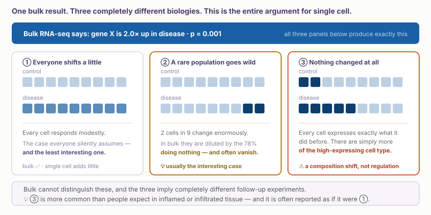{fig-align="center"}

**① 전반적으로 완만한 반응**: bulk의 기본 가정, but not interesting...\
**② 반응하는 rare subpopulation**: interesting.. Bulk에서 유의하지 않을 수도\
**③ 조성의 변화**: celltype 구성은 같음. 특정 cell type이 많아지거나 적어지거나

⚠️ ③은 염증·섬유화·침윤 조직처럼 임상의가 연구하는 바로 그 조직에서 흔하고, 일상적으로 ①인 것처럼 논문에 기술되므로 주의

## 2) Single cell이 가치 있는 경우 {#w5-s1-2}

Single cell은 비싸기 때문에 bulk로 충분한 경우는 굳이x

**✅ Single cell이 적합한 질문:**

-   드문 population을 포함한 **population 발견 또는 특성화**
-   **조성** — 질환에서 어떤 cell type이 달라졌는가
-   **Cell-type-specific effect** — 한 cell type에서는 증가하고 다른 cell type에서는 감소해 bulk에서 보이지 않는 gene
-   **연속적인 state** — activation, exhaustion, differentiation처럼 discrete label이 실패하는 경우

**✅ Bulk가 여전히 적합한 질문:**

-   균질한 system(cell line, sorted population)의 명확한 비교
-   Isoform, splicing, low-expression gene 같은 깊은 transcript-level 분석
-   **대규모 cohort** — 환자 n = 200이며 200회의 single-cell run을 감당할 수 없는 경우

::: {.callout-tip collapse="true"}
## 먼저 sorting하는 전략은 지나치게 과소평가되어 있다

관심 있는 cell type을 이미 안다면?

→ FACS로 sorting한 뒤 deep bulk RNA-seq. 전체 조직 single-cell experiment보다 흔히 **더 싸고, 더 깊고, 통계적으로 더 깨끗함.** 환자를 훨씬 많이 넣을 수 있고, 실제 power는 바로 거기서 나옴(§5)

💡 "Single cell을 했다" ≠ 더 강한 설계. 때로는 power 부족한 연구를 더 비싸게 한 것뿐
:::

------------------------------------------------------------------------

# 2. 장비에 넣기 전에 내리는 결정 🤔 {#w5-s2}

## 1) Platform의 trade-off {#w5-s2-1}

모든 platform은 cell 수를 위해 depth를 포기하거나, depth를 위해 cell 수를 포기

| Platform | Cell 수 | Depth | 사용 시점 |
|-----------------|-----------------|-----------------|---------------------|
| **Droplet (10x)** | 10³–10⁵ | cell당 gene 수천 개, 3′ 또는 5′ end만 측정 | 현재의 기본 선택 |
| **Plate (Smart-seq3)** | 10² | full-length, deep | isoform, 매우 민감한 detection |
| **Combinatorial (sci-, SPLiT-seq)** | 10⁶ | 매우 shallow | whole-organism atlas |

## 2) 3′ vs. 5′ (droplet kit)

Transcript 전체가 아니라 **한쪽 끝**만 읽음 → gene 세기엔 충분, isoform은 x

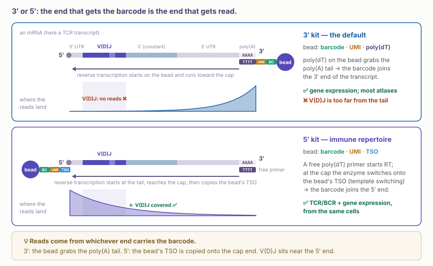{fig-align="center"}

-   ✅ **대부분의 single-cell data = 3′** (공개 atlas 대부분 포함). Clonotype이 필요하면 5′: T/B cell, 종양면역, 자가면역, 백신 반응
-   ⚠️ Gene count만 보면 둘은 대체로 비슷. 하지만 **한 비교 안에서 섞어 쓰기 x** — 3′/5′ sample이 섞인 study = 설계부터 batch effect
-   💡 Fixed / FFPE sample이면 세 번째 길: probe 기반 kit(10x Flex). poly(A) tail을 잡는 대신 probe를 hybridise
-   §3.2의 bead 그림 = 5′ bead (끝에 TSO가 달림)

## 3) Cell vs nucleus {#w5-s2-2}

⚠️ 분석이 아니라 시료 수집 시점에 결정됨\
scRNA-seq = **fresh**한 살아 있는 조직을 온전한 cell로 dissociation해야 가능

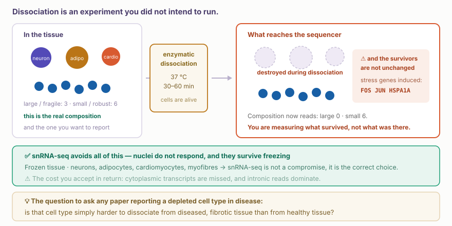{fig-align="center"}

|   | scRNA-seq | snRNA-seq |
|--------------------------|:---------------------:|:---------------------:|
| Frozen / archived tissue | ❌ fresh tissue 필요 | ✅ |
| 크거나 약한 세포(neuron, adipocyte, myofibre, cardiomyocyte) | ❌ dissociation에서 소실 | ✅ |
| Dissociation stress response | ⚠️ 있음 — protocol이 *FOS*, *JUN*, heat-shock gene을 유도 | ✅ 최소 |
| Cytoplasmic transcript | ✅ 포착 | ❌ 놓침 |
| Intronic read | 낮음 | 높음 — nucleus에는 unspliced pre-mRNA가 많음 |

::: {.callout-warning collapse="true"}
## 연구 설계 회의에 가져갈 두 가지 결과

-   ⚠️ **Immediate-early gene은 대표적인 false positive.** *FOS*, *JUN*, *EGR1*로 정의된 cluster는 "activated" state가 아니라 dissociation artifact인 경우가 매우 많음! 한 condition이 bench에 더 오래 있었다면 더 활성화된 것처럼 보이는..
-   ⚠️ **Depletion 주장은 자세히 볼 것.** 데이터로 보면 "질환에서 cell type X가 감소했다" = "질환 조직에서 cell type X를 분리하기 더 어렵다" (구분 안 됨)

→ ✅ 완화 방법: cold-active protease로 낮은 온도에서 dissociation하고, condition 간 protocol을 동일하게 유지하며, 가능하다면 nucleus를 사용
:::

## 4) study design 시 고려하면 좋을 것 {#w5-s2-3}

⚠️ **반복 단위는 donor.** §5의 모든 내용은 여기에서 시작하며, 분석보다 먼저 예산에 반영해야 함

💡 예산이 고정되어 있다면 condition을 비교하는 거의 모든 질문에서 **donor는 더 많이, 각 donor의 cell은 더 적게** 확보하는 편이 **donor는 더 적게, 각 donor의 cell은 더 많이** 확보하는 것보다 나음

------------------------------------------------------------------------

# 3. 데이터 전처리 🧮 {#w5-s3}

## 1) standard pipeline: droplet에서 matrix까지 {#w5-s3-1}

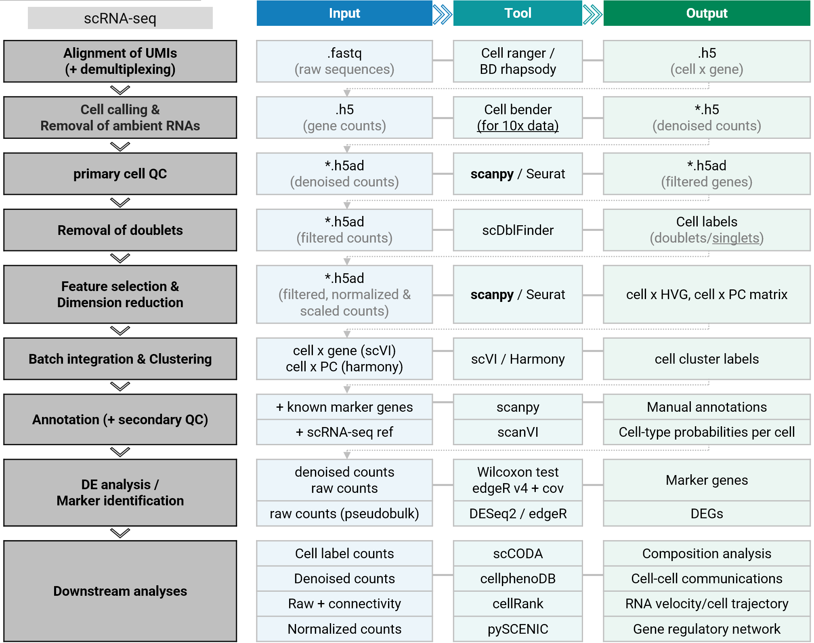

단계가 이렇게나 많은데😟? → 단계가 많을수록 오류도 그만큼 전파됨...😵‍💫

## 2) single cell 포착하기 {#w5-s3-2}

### ① 두 개의 tag: Barcode와 UMI

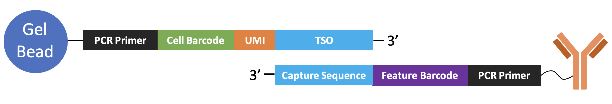

-   **Cell barcode** — bead 하나의 모든 oligo에 똑같이 붙어 있음 → 그 droplet에서 잡힌 모든 molecule에 *"이 cell에서 왔음"* 표시
-   **UMI**(unique molecular identifier) — 무작위, oligo마다 다름 → 증폭 **전**의 원래 mRNA molecule 하나하나에 표시

✅ Matrix가 세는 건 **read가 아니라 molecule** — PCR duplicate, amplification bias 제거\
⚠️ UMI로도 못 고치는 것: 애초에 포착 안 된 molecule은 UMI도 없음. 그래서 아래의 0들

::: {.callout-warning collapse="true"}
### sparsity: matrix의 90% 이상이 0인 이유

Droplet experiment는 약 20,000개 gene 중 cell 하나에서 대략 1,000–5,000개를 검출.\
Count 0의 의미:

-   **Biological zero** — 해당 cell에서 gene이 실제로 발현되지 않음
-   **Technical zero(dropout)** — transcript (o), detection (x). Droplet capture efficiency는 약 10–30%
:::

### ② cell calling

> 어떤 barcode가 cell이고, 어떤 게 빈 droplet?

-   **Droplet** — cell을 일부러 묽게 loading
-   **Barcode rank plot (knee plot)** — 모든 barcode를 total UMI 순으로 줄 세워 log–log로 그림:

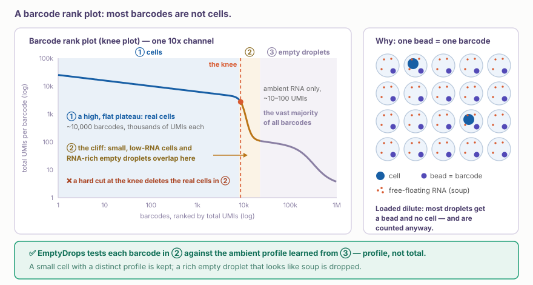{fig-align="center"}

-   ① **높고 평평한 plateau** — 진짜 cell
-   ② **급경사 (the knee)** — 전이 구간
-   ③ **길고 낮은 꼬리** — ambient RNA만 든 빈 droplet

⚠️ Knee에서 hard cut → RNA가 적을 뿐인 진짜 cell까지 삭제 (작거나 quiescent한 cell, neutrophil). 딱 전이 구간에 몰려 있음

✅ **EmptyDrops** (Cell Ranger ≥ 3도 이 방식의 변형 사용): "total이 높은가?"가 아니라 "이 barcode의 **profile**이 ambient profile과 다른가?"를 물음 → total이 낮아도 profile이 뚜렷한 작은 cell은 살아남음

💡 Cell Ranger가 내놓는 matrix 2개: `filtered_feature_bc_matrix`(called cell), `raw_feature_bc_matrix`(모든 barcode). **raw는 꼭 보관** — ambient RNA 보정에 빈 droplet이 필요함

### ③ ambient RNA 제거

Dissociation·loading 중에 터진 cell → mRNA가 suspension으로 흘러나옴. 이 **"soup"**이 모든 droplet에 들어감 → 모든 cell의 profile = 자기 RNA + soup 약간

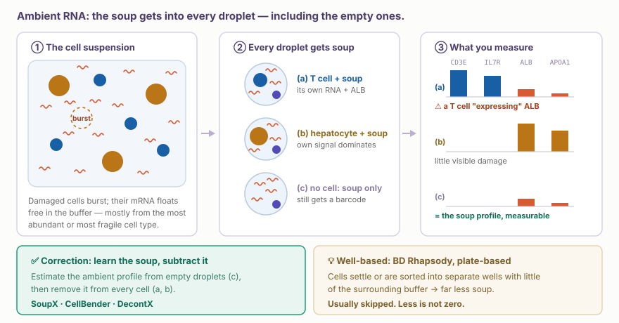{fig-align="center"}

-   **어떻게 보이나** — 가장 많거나 가장 약한 cell type의 marker가 **모든** cluster에서 낮게 검출: 피가 많은 sample이면 모든 cell에 hemoglobin gene, 간이면 immune cell에 *ALB*
-   **왜 문제** — 가짜 co-expression, 흐려진 cluster 경계, ⚠️ 한쪽 condition에서 soup이 더 많으면 가짜 DE (질환·괴사 조직이 보통 더 많음)

⚠️ **모든 droplet 기반 protocol**에 있음. **snRNA-seq이 제일 심함** (nucleus를 분리하면서 모든 cell이 터지니까)

💡 **Well 기반 platform(BD Rhapsody, plate 기반 Smart-seq)은 보통 이 단계 생략.** Cell이 주변 buffer를 거의 안 데리고 각 well로 가라앉거나 sorting됨 → buffer를 cell과 같이 가둬버리는 droplet보다 soup이 훨씬 적음. ⚠️ 적다 ≠ 0. 같은 증상(한 cell type의 marker가 모든 곳에)이 보이면 여전히 오염

| Tool | Input | 아이디어 |
|------------------|------------------|------------------------------------|
| **SoupX** | raw + filtered matrix, cluster | 빈 droplet에서 soup 추정 → contamination fraction만큼 빼기 |
| **CellBender** | raw matrix | Generative model. Cell calling과 ambient RNA 제거를 한 번에; GPU 권장 |
| **DecontX** | filtered matrix (raw는 선택) | Bayesian; 빈 droplet을 안 남겨뒀을 때도 사용 가능 |

✅ QC·clustering **전에**, sample마다 따로 → 보정된 count가 이후 모든 단계의 input

## 3) data QC: cutoff는 직접 정하기 {#w5-s3-3}

### ① low-quality QC

Cell마다 숫자 3개:

| Metric | Seurat / scanpy | 너무 낮으면 → | 너무 높으면 → |
|------------------|------------------|------------------|------------------|
| Total UMI | `nCount_RNA` / `total_counts` | 빈 droplet, debris, 깨진 cell | doublet — 또는 크고 활발한 cell |
| 검출된 gene 수 | `nFeature_RNA` / `n_genes_by_counts` | 위와 같음 | 위와 같음 |
| Mitochondrial % | `percent.mt` / `pct_counts_mt` | — | 죽어가는 cell — 또는 원래 mitochondria가 많은 cell |

**Mito 비율이 높으면 왜 죽어가는 cell?** Membrane이 깨지면 cytoplasmic mRNA는 새어 나가지만, mitochondria 안의 transcript는 mitochondrial membrane에 보호돼 남음 → **비율**이 올라감 (더 많이 만든 게 아님)

⚠️ **같이 볼 것.** Mito 높음 **+** gene 적음 = 깨진 cell. Mito가 높아도 gene 수가 정상이면 진짜 mitochondria-rich cell일 수도 (cardiomyocyte, hepatocyte, renal tubule)\
⚠️ **snRNA-seq**: nucleus엔 mitochondria가 없음 → mito read ≈ 0이 정상. 의미 있는 비율 = cytoplasmic / ambient 오염 → 훨씬 엄격한 cut

✅ **Data-driven cutoff**: median에서 *k* **MAD**(median absolute deviation) 이상 벗어난 cell을 표시 (`scater::isOutlier`; *k* = 3 엄격 … 5 느슨) — threshold가 sample마다 알아서 맞춰짐\
✅ **항상 sample별로.** 더 깊게 sequencing된 sample은 세 분포가 다 같이 이동함

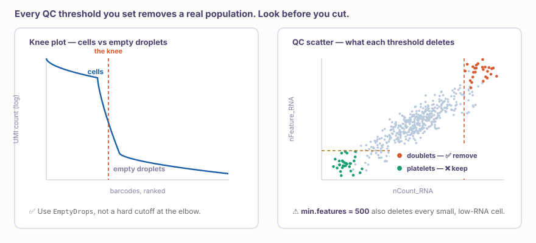{fig-align="center"}

::: {.callout-important collapse="true"}
## 모든 threshold는 각자 데이터 특성에 맞게! (QC 자동화는 말도 안 되는 소리)

-   Mito cutoff 5%는 많이 쓰지만, mitochondria가 실제로 많은 **cardiomyocyte에는 틀린 기준**. tissue/celltype마다 다르게 해야함!!
-   `min.features = 500`은 debris뿐 아니라 **platelet, 일부 granulocyte, 작고 RNA가 적은 cell**도 제거
-   `nFeature` upper cutoff는 doublet뿐 아니라 **실제로 크고 transcription activity가 높은 cell**도 제거

✅ 분포를 그리고, 제안한 cutoff 밖에 무엇이 있는지 확인→ Threshold 결정
:::

### ② doublets

Droplet 하나에 cell 둘 → barcode를 공유 → **hybrid profile을 가진 cell 하나**처럼 보임. Loading을 많이 할수록 ↑: 표준 10x에서 회수 cell 1,000개당 \~0.8% — **10,000 cells → doublet \~8%**

|   | **Heterotypic** | **Homotypic** |
|---------------------|--------------------------|--------------------------|
| 구성 | 서로 다른 cell type (T cell + monocyte) | 같은 type의 cell 둘 |
| 보이는 모습 | 두 type의 marker가 다 나옴; 가짜 "중간" cluster나 cluster 사이 bridge | count가 \~2배인 cell 하나 |
| Expression으로 검출 | ✅ 가능 | ❌ 거의 불가 |
| 피해 | ⚠️ 없는 cell type·transition을 만들어냄 | 경미 |

**핵심 아이디어**: 어떤 barcode가 doublet인지 직접 볼 방법은 없음 — 대신 doublet을 **만들어 놓고**, 진짜 cell 중 누가 그걸 닮았는지 확인

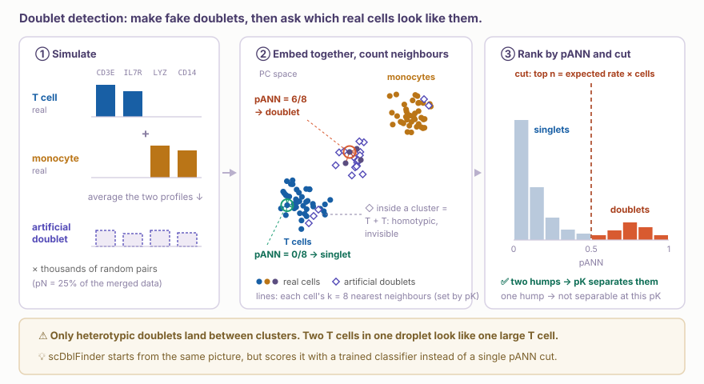{fig-align="center"}

**DoubletFinder — 4단계 로직**

1.  **Simulate** — 진짜 cell 쌍을 무작위로 골라 profile을 평균 → 가짜 doublet (`pN`, 기본값 merged data의 25%)
2.  **같이 embedding** — 진짜 + 가짜 cell → normalise, HVG, PCA
3.  **가짜 이웃 세기** — 진짜 cell마다 **pANN** = nearest neighbour 중 가짜 doublet 비율 (**p**roportion of **a**rtificial **n**earest **n**eighbours). 진짜 doublet은 가짜들 사이에 있음 → pANN 높음
4.  **Threshold** — pANN 순으로 상위 *n*개를 doublet으로. *n* = 예상 비율 × cell 수, 못 보는 homotypic 비율만큼 차감 (`modelHomotypic()`)

중요한 parameter는 **pK**(neighbourhood 크기) 하나. pK를 sweep해서 pANN이 가장 **bimodal**해지는 값(singlet은 낮게, doublet은 높게)을 고름 — BCmvn(mean–variance-normalised bimodality coefficient)으로 점수화

💡 pANN 분포가 뚜렷하게 bimodal = 제대로 작동한다는 증거. Unimodal이면 그 neighbourhood 크기에서는 doublet이 분리 안 됨

```{r}
library(DoubletFinder)

# one sample at a time, after permissive QC, normalisation, PCA and a rough clustering
sweep <- paramSweep(seu, PCs = 1:10, sct = FALSE)
bcmvn <- find.pK(summarizeSweep(sweep, GT = FALSE))
pK    <- as.numeric(as.character(bcmvn$pK[which.max(bcmvn$BCmetric)]))

homotypic <- modelHomotypic(seu$seurat_clusters)    # share of same-type doublets
rate      <- 0.008 * ncol(seu) / 1000               # ~0.8% per 1,000 cells (10x)
nExp      <- round(rate * ncol(seu) * (1 - homotypic))

seu <- doubletFinder(seu, PCs = 1:10, pN = 0.25, pK = pK, nExp = nExp, sct = FALSE)
# → new metadata columns pANN_* and DF.classifications_* (Singlet / Doublet)
```

**scDblFinder — 뭐가 다른가?**

핵심 아이디어는 같음 (가짜 doublet + 진짜 cell이 그 사이 어디에 있는지). 방법이 다름:

|   | DoubletFinder | scDblFinder |
|---------------------|--------------------------|--------------------------|
| 가짜 doublet | 무작위 쌍 | 무작위, **또는 cluster 간** — 중요한 heterotypic에 집중 |
| Score | neighbourhood 크기 하나에서 통계량 하나 (pANN) | 여러 크기의 kNN feature + library size, 검출 gene 수, co-expression으로 gradient-boosted classifier; 반복 재학습 |
| Parameter | pK sweep; 예상 *n*은 직접 설정 | 예상 비율과 misclassification으로 threshold 자동 설정 |
| 여러 sample | sample마다 직접 실행 | `samples =` argument |
| 속도 | 느림 (pK sweep) | 빠름 |

첫 대규모 독립 benchmark에서는 DoubletFinder가 가장 정확 (Xi & Li 2021). 이후 나온 scDblFinder가 같은 dataset에서 동등하거나 더 좋음 (Germain et al. 2021) → 지금은 흔한 기본값. Pipeline 그림에 있는 tool도 이것

```{r}
library(scDblFinder)
sce <- scDblFinder(as.SingleCellExperiment(seu), samples = "sample_id")
seu$doublet <- sce$scDblFinder.class                # "singlet" / "doublet"
```

::: {.callout-warning collapse="true"}
## Doublet detector 공통 규칙

⚠️ **Sample (capture) 하나씩.** Doublet은 capture 안에서만 생김; 서로 다른 환자의 cell로 만든 가짜 doublet = 존재할 수 없는 cell\
⚠️ **Homotypic doublet은 expression 기반 방법으로는 다 못 잡음.** 어느 정도 남는 건 감수\
⚠️ **Cluster 해석 전에 할 것.** Doublet cluster는 두 부모 cluster 사이에 놓임 → transitional state로 착각하기 쉬움\
💡 **설계가 알고리즘보다 나음.** Donor 여러 명을 한 lane에 pooling하고 genotype(`demuxlet`, `souporcell`, `vireo`)이나 hashtag antibody로 demultiplexing → donor 간 doublet은 전부 직접 식별, lane당 cell도 더 많이 loading 가능
:::

### ③ Recap

| 문제 | 관찰되는 모습 | 대응 방법 |
|--------------------|--------------------------|--------------------------|
| **Empty droplet** | Knee 아래의 low-UMI barcode | Hard cutoff가 아니라 `EmptyDrops` |
| **Ambient RNA** | 풍부한 cell type의 marker가 모든 곳에서 나타남 | `SoupX`, `CellBender`, `DecontX` |
| **Doublet** | 높은 UMI **및** 높은 gene count; 양립할 수 없는 두 marker set | `scDblFinder`, `DoubletFinder`; 회수 cell 1,000개당 약 0.8% |
| **Dying cell** | 높은 mitochondrial fraction, 낮은 gene count | 조직에 맞는 mito % threshold |

::: {.callout-tip collapse="true"}
## Doublet이 먼저? QC가 먼저?

두 tool의 공식 문서가 서로 반대:

-   **DoubletFinder**: low-quality cluster를 **먼저** 제거 — 가짜 doublet과 PCA를 왜곡하니까
-   **scDblFinder**: 엄격한 QC **전에** doublet 찾기 — 예상 비율이 넣어준 cell 수로 계산되고, 좋은 cell + 나쁜 cell로 된 doublet은 나쁜 cell이 데이터에 남아 있어야 알아볼 수 있음

✅ 둘을 절충한 순서 — 위의 ① → ②, pipeline 그림과 같음:

1.  **Primary QC, 느슨하게** — 명백한 쓰레기만: 거의 빈 barcode, 극단적인 mito
2.  **Doublet detection**, sample별로
3.  **최종 threshold**, data-driven (MAD)
4.  **Clustering 후 secondary QC** — mito·stress gene으로 정의되거나 양립 불가한 marker 두 세트를 가진 cluster를 통째로 제거 (§4.4)

💡 어느 순서든 명시만 하면 OK. 안 되는 것: upper `nFeature` cutoff **하나만으로** doublet 거르기
:::

## 4) dimension reduction {#w5-s3-4}

QC 후: **cell 수천 개** × gene \~20,000개, 대부분 0

### ① normalization & scaling

| 단계 | 하는 일 | 이유 | Seurat |
|----------------|--------------------|--------------------|----------------|
| **Normalise** | cell의 total UMI로 나누고 × 10,000 → log(1 + x) | capture efficiency가 순전히 기술적인 이유로 cell마다 몇 배씩 차이; log로 몇몇 큰 값을 눌러줌 | `NormalizeData()` |
| **HVG 선택** | 평균으로 예측되는 것보다 variance가 큰 gene \~2,000개만 남김 | 대부분의 gene은 평평하거나 noise; cell-type signal은 HVG에 | `FindVariableFeatures()` |
| **Scale** | gene마다 평균 빼고 SD로 나눔 | 발현량이 크다는 이유만으로 PCA를 지배하지 않게 | `ScaleData()` |

::: {.callout-note collapse="true"}
💡 대안: **SCTransform**(regularised negative binomial model의 Pearson residual — 세 단계를 한 번에), **scran** pooled size factor. 대규모 benchmark 결과 단순한 shifted log + [**PCA가**]{.underline} 정교한 방법들과 비슷하거나 더 좋음 (Ahlmann-Eltze & Huber 2023)\
⚠️ `ScaleData(vars.to.regress = ...)`로 mito %, depth, cell-cycle score를 regress out 가능. 아껴서 쓸 것: 그 "nuisance"가 biology와 상관있으면 (증식성 질환의 cycling cell) biology까지 같이 빠짐\
⚠️ 이제 같은 matrix의 버전 3개가 나란히 존재. §5.1은 뭐가 뭔지 아는 데서 출발:

-   `counts` — raw UMI
-   `data` — log-normalised
-   `scale.data` — z-score, HVG만
:::

### ② PCA: dimension reduction

HVG 2,000개 → **principal component 10–50개**. PC 하나 = 같이 움직이는 gene들의 가중 조합 — gene이 아니라 *program*

-   **Denoising** — gene 하나는 noisy, 상관된 program은 그렇지 않음. 상위 PC = biology, 뒤쪽 PC = 대부분 noise
-   **속도** — 이후 모든 단계(neighbour, clustering, UMAP, batch correction)가 gene이 아니라 PC 위에서 돌아감
-   **몇 개?** `ElbowPlot()` — variance explained가 평평해지는 지점. 10–50 사이에서는 결과가 꽤 안정적; 적게보다는 넉넉하게 (rare population이 PC 25에 있을 수도)

✅ **상위 PC를 움직이는 게 뭔지 확인.** PC1이 `nCount_RNA`나 `percent.mt`를 따라가면 주된 변이 축이 기술적인 것 → QC로 복귀. `VizDimLoadings()`로 gene 확인\
💡 PCA는 linear, 거리에 의미가 있음 — UMAP과 다름(§4.3). 실제 분석은 PC space에서, UMAP은 보는 용도일 뿐

### ③ batch correction

Sample이 여러 개면 cell이 cell type보다 **donor나 batch**별로 먼저 뭉치는 경우가 많음. 보정은 count가 아니라 **embedding**에서:

-   **Harmony** — PC를 반복적으로 조정
-   **scVI** — batch를 covariate로 넣고 [raw count로부터]{.underline} 새 latent space를 학습
-   **Seurat CCA / RPCA** — dataset 간 matched cell을 anchor로

→ neighbour, clustering, UMAP에 사용

✅ **필요한지부터 확인.** 보정 전 UMAP을 sample별로 색칠 → 이미 cell type이 sample 간에 섞여 있으면 생략\
⚠️ **보정된 값은 cell을 묶는 용도, gene 검정용 x.** DE는 donor를 model에 넣고 raw count로 돌아가서 (§5.1)\
⚠️ 과보정하면 질환 특이적인 state가 지워질 수 있음 → 🔗 [W6 §1](w6_scrna_dynamics.qmd#w6-s1)

::: {.callout-note collapse="true"}
## VI universe — 엔진 하나, model 여러 개

scVI = 한 family(**scvi-tools** library)의 첫 번째 member. 모두 같은 엔진:

-   **Variational autoencoder (VAE)** — neural network가 cell의 **raw count**를 latent 숫자 \~10–30개로 압축하고, decoder가 **negative binomial** model로 count를 재구성
-   **Batch를 decoder에 input으로** 넣음 → latent space가 batch 정보를 담을 필요 x — 이게 integration
-   Likelihood를 바꾸거나 modality를 추가 → 새 model

| Model | Data | 용도 | 이 수업에서 |
|----------------|--------------------|--------------------|----------------|
| **scVI** | scRNA-seq | integration, denoised expression, DE | 여기, W6 |
| **scANVI** | scRNA-seq + 일부 cell-type label | label transfer, annotation | §4.4 |
| **scArches** | 새 data + 학습된 reference model | 재학습 없이 query를 atlas에 mapping | §4.4 |
| **totalVI** | CITE-seq (RNA + surface protein) | RNA–protein 통합 분석; antibody background 제거 |  |
| **PeakVI** | scATAC-seq | chromatin accessibility: integration, differential accessibility |  |
| **MultiVI** | multiome (RNA + ATAC), paired 여부 무관 | multiome과 single-modality data 통합 | W11 |
| **DestVI** | spatial spot + scRNA reference | deconvolution, cell type 안의 연속적인 state까지 | W8 |
| **veloVI** | spliced / unspliced count | 불확실성까지 추정하는 RNA velocity | W6 |
| **contrastiveVI** | perturbed vs control cell | 처리 특이적 변이와 공통 변이 분리 |  |
| **MrVI** | sample / donor 다수 | 대규모 cohort에서 sample(donor) 수준 차이 |  |

-   💡 실전: 전부 **raw count** 필요(`counts` layer 보관), Python에서 실행(`scvi-tools`; GPU 있으면 좋음), R에서는 `reticulate`나 `.h5ad` export로
-   ⚠️ Integration 공통 주의: latent space는 cell 묶는 용도. "Batch"를 지우라고 하면 batch와 confounded된 biology도 같이 지워짐 (W6 §1)
:::

------------------------------------------------------------------------

# 4. Cell type 찾기 🗺️ {#w5-s4}

## 1) cell을 묶기 위한 neighbor {#w5-s4-1}

> Clustering과 UMAP은 gene을 직접 안 봄. PC space에서 만든 **누가 누구와 가까운지의 graph**를 봄

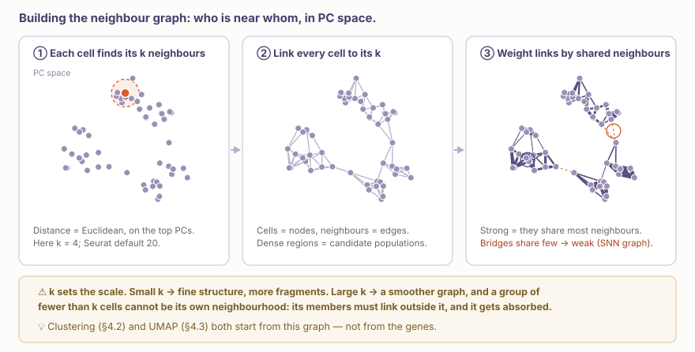{fig-align="center"}

-   **Neighbour** — cell마다 PC space에서 가장 가까운 *k*개 cell (상위 PC에서의 Euclidean distance)
-   **kNN graph** — cell = node; 각 cell을 *k*개 neighbour와 연결. Seurat은 두 cell이 neighbour를 얼마나 **공유**하는지로 link 가중치를 다시 매김 (SNN graph) → outlier 영향 감소
-   **왜 graph?** — cell population은 동그란 덩어리인 경우가 드묾. Graph는 데이터 모양을 그대로 따라감 (길쭉하거나 갈라지거나 연속적인 population 포함), cell 수백만 개까지 확장 가능

⚠️ "kNN clustering"은 잘못된 표현. kNN은 graph를 **만들기만** 하고, clustering(다음)이 그걸 community로 **자름**. *k*-means도 아님 (cluster 수를 미리 정해야 하고 동그란 cluster를 가정)

⚠️ *k*가 scale을 정함 (Seurat `k.param = 20`, scanpy `n_neighbors = 15`). *k*가 작으면 → 세밀한 local 구조, 조각이 많아짐. *k*가 크면 → 매끄러운 graph, 그리고 *k*보다 작은 population은 자기 neighbourhood를 못 만듦 — 구성원이 바깥과 연결될 수밖에 없음

## 2) clustering {#w5-s4-2}

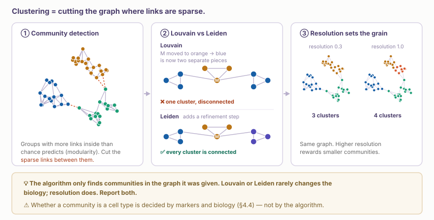{fig-align="center"}

### ① leiden vs. louvain

개념만 — 이름을 알아보고 뭘 최적화하는지만 알면 됨, 구현은 x

-   둘 다 **community detection**: 우연히 기대되는 것보다 서로 더 촘촘히 연결된 그룹으로 graph를 자름 (**modularity** 최대화)
-   **Louvain**(2008) — 각 cell을 modularity를 가장 많이 올리는 이웃 community로 greedy하게 이동 → community 하나를 node 하나로 합침 → 반복
-   ⚠️ 알려진 결함: **연결이 약하거나 아예 끊긴** community가 나올 수 있음 — 조각끼리 graph에서 이어지지 않은 "cluster"
-   **Leiden**(2019) — refinement 단계 추가 → 모든 community가 내부적으로 연결됨을 보장; 더 빠름
-   기본값: scanpy → Leiden. Seurat `FindClusters()` → Louvain(`algorithm = 1`); Leiden은 `algorithm = 4`

💡 Biology 측면에선 어느 걸 쓰든 결론이 거의 안 바뀜. 바뀌는 건 **resolution** — 둘 다 보고할 것

### ② resolution

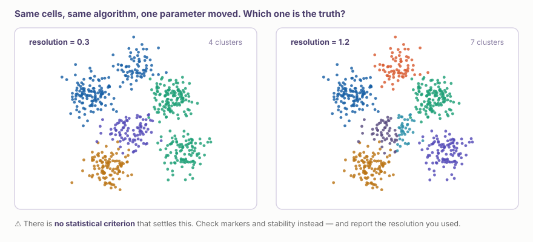{fig-align="center"}

> key parameter for clustering: **resolution**

Resolution = modularity score 안의 항. 값이 클수록 작은 community를 선호 → cluster 수 ↑

⚠️ 최적의 판단기준은 본인이...

-   Score가 아니라 **marker gene**과 알려진 biology에 비추어 cluster를 확인
-   **Stability** 확인: 다른 resolution, 다른 seed, subsampled dataset에서도 cluster가 유지되는가?
-   높은 resolution에서 생긴 "새" cluster가 실제로 고유한 marker를 가지는지, 아니면 같은 marker의 정도 차이?

::: {.callout-note collapse="true"}
## Cluster는 cell type이 아니다

Cluster는 아래가 반영됨:

-   Cell **state**(activated vs resting)
-   Cell-cycle phase
-   Stress response(§2.3)
-   Ambient contamination
-   **Donor identity**

⚠️정말 novel cell type인가 아주 심혈을 기울여야..
:::

## 3) UMAP {#w5-s4-3}

> 수십 개 차원을 2차원으로 옮기는 non-linear projection.\
> Local neighbourhood는 비교적 잘 보존하지만 global structure는 잘 보존x

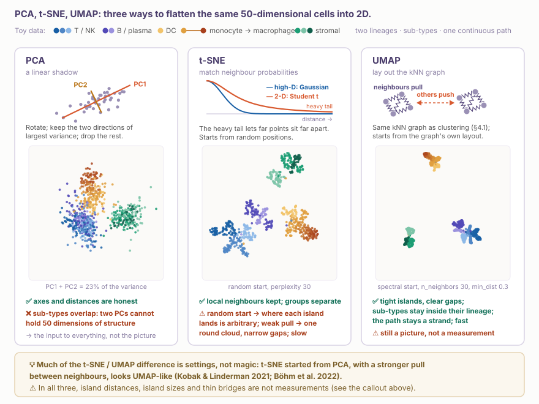{fig-align="center"}

복잡한 조직에서 UMAP이 기본이 된 이유:

-   **Clustering과 같은 kNN graph를 펼침**(§4.1) → island가 대개 cluster와 일치
-   **Neighbour끼리 당기는 힘이 강함** → 단단한 island + 뚜렷한 간격. t-SNE는 group들을 둥근 구름에 고르게 퍼뜨림
-   **Graph 자체의 (spectral) layout에서 출발**, 무작위 위치 x → 관련된 population끼리 가까이 놓이는 경향, 다시 돌려도 비슷
-   **빠름** — cell 수백만 개도 OK, t-SNE는 느림

⚠️ t-SNE가 둥글게 보이는 건 t-분포 때문이 아님 — 오히려 heavy tail 덕분에 간격이 생김. 둥글고 느슨한 모양 = **neighbour끼리 당기는 힘이 약해서**, 배치가 제멋대로인 건 **random start** 때문. t-SNE를 PCA로 시작하고 당기는 힘을 키우면 UMAP처럼 보임

::: {.callout-note collapse="true"}
## UMAP이 알려주지 않는 것

❌ **Cluster 사이 거리 중요x.** 멀리 떨어진 두 cluster가 가까운 두 cluster보다 더 다르다 (x)\
❌ **Cluster 면적 중요x.** 크기 from embedding, not from cell number\
❌ (**보통) 가운데 bridge != trajectory.** 중간에 희끄무리한 거.. 보통 doublet, ambient RNA 또는 parameter artifact. cell-to-cell intermediate 아님!\
⚠️ **Parameter와 random seed에 따라 바뀜.** `n_neighbors` / `min_dist`

→ UMAP은 시각화일뿐. 통계 분석은 high-dimensional space에서 계산한 숫자로
:::

::: {.callout-note collapse="true"}
**PCA, t-SNE, UMAP — 그리고 새로 나온 것들**

| 방법 | 연도 | 보존하는 것 | 주로 보이는 곳 |
|------------|---------|------------------------|----------------------|
| **PCA** | 1901 | global, linear 구조; 거리에 의미 있음 | 이후 모든 단계의 input; cluster를 *보기*엔 너무 거침 |
| **t-SNE** | 2008 | local neighbourhood; global 배치는 임의 | UMAP 이전의 표준; 느림 |
| **UMAP** | 2018 | local neighbourhood + global 구조 일부; 빠름 | 현재 기본값 |
| **PHATE** | 2019 | 연속적인 transition과 branch | 발생, 분화 |
| **densMAP** | 2021 | local **density**까지 — 균질한 population은 촘촘하게, 이질적인 건 넓게 퍼짐 | "이 population이 얼마나 다양한가"가 중요할 때 |
| **PaCMAP** | 2021 | local과 global 구조의 균형 | 범용; single-cell 논문에선 아직 드묾 |

💡 UMAP이 t-SNE보다 global 구조를 더 잘 보존한다는 평판은 대부분 알고리즘이 아니라 **initialisation** 덕분; PCA에서 시작한 t-SNE도 비슷한 수준 (Kobak & Linderman 2021)

⚠️ 결국 전부 2D 그림. 새로운 방법은 한 가지 왜곡을 다른 왜곡과 맞바꿀 뿐; 2D 거리를 측정값으로 만들어 주는 방법은 없음 (Chari & Pachter 2023)
:::

## 4) Annotation {#w5-s4-4}

-   **Marker 기반** — cluster별로 알려진 marker 확인.\
    ✅ 깔끔.\
    ⚠️ 순환적. 알려진 cell type만 가능
-   **Reference 기반** — annotated atlas(Azimuth, SingleR, scANVI)에 mapping.\
    ✅ 빠르고 일관됨.\
    ⚠️ Reference의 cell type이 있는 것만, 그대로

💡 두 방법 모두 사용 권장. **두 방법이 불일치? –\>** novel cell population vs. artifacts

------------------------------------------------------------------------

# 5. 통계 분석 (DEG) 📊 {#w5-s5}

## 1) 사용할 값 {#w5-s5-1}

이 시점엔 cell마다 expression 버전이 여러 개(§3.4). 엉뚱한 버전으로 검정하는 게 흔하고, 티도 안 나는 실수

| 값 | 위치 | ✅ 용도 | ❌ 쓰면 안 되는 곳 |
|-----------------|----------------------|-----------------|-----------------|
| **Raw UMI count** (또는 ambient 보정 count) | `counts` layer (Seurat), `.layers["counts"]` (scanpy) | **pseudobulk DE**(§5.3), count model 전반 | cell끼리 직접 비교 — depth가 다름 |
| **Log-normalised** | `data` layer (Seurat), `normalize_total` + `log1p` 후의 `.X` (scanpy) | 한 dataset 안의 cluster marker(§5.2), feature plot | cell을 *n*으로 하는 condition 비교 |
| **Scaled (z-score)** | `scale.data` layer (Seurat), `sc.pp.scale` 후의 `.X` (scanpy) | PCA, heatmap | DE 전부 |
| **Batch-corrected** (Harmony / scVI) | reduction, 예: `harmony` (Seurat), `.obsm["X_pca_harmony"]`, `.obsm["X_scVI"]` (scanpy) | neighbour, clustering, UMAP | DE 전부 |
| **scVI normalised / denoised expression** | `get_normalized_expression()` 출력, 보통 `.layers`에 저장 (scvi-tools) | 시각화; scVI 자체 DE | [관측 count]{.underline}를 가정하는 표준 검정 |

::: {.callout-tip collapse="true"}
⚠️ scanpy 함정: `normalize_total`, `log1p`, `scale`은 **`.X`를 그 자리에서 덮어씀**. Normalise **전에** raw count를 `.layers["counts"]`에 복사해 둘 것 — 안 그러면 사라짐, pseudobulk할 게 없음

**Cell type 하나만 subset한 뒤 다시 normalise?**

-   **Sub-clustering이면 — 부분적으로 yes.** Subset에서 HVG 선택, scaling, PCA를 다시: 전체 조직의 HVG는 주로 cell type끼리를 가르지, 한 type 안의 state를 가르진 않음
-   **Log-normalisation 자체는 — no.** Cell 단위로 계산되므로 subset해도 안 바뀜
-   **DE면 — 상관없음.** Pseudobulk는 raw count에서 시작하고, DESeq2/edgeR이 pseudo-sample 간 normalise를 알아서 함

⚠️ 예외: SCTransform residual은 fitting한 데이터에 의존. SCT model이 여러 개면(merge한 sample) 검정 전에 `PrepSCTFindMarkers()` 실행
:::

## 2) per-cell test {#w5-s5-2}

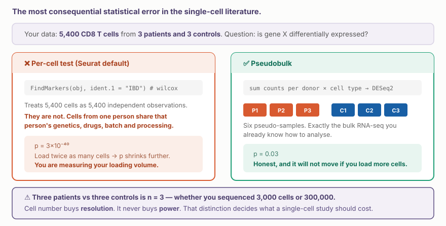{fig-align="center"}

::: {.callout-important collapse="true"}
## Donor 한 명에서 나온 cell은 독립적인 sample이 아니다

Donor 6명에서 나온 cell 5,400개에 Wilcoxon test를 적용하면 cell을 5,400개의 독립 관측치로 취급함. 실제로는 같은 사람의 cell이 그 사람의 genetics, environment, medication, batch, processing을 공유하므로 독립적이지 않음

그 결과:

-   p-value가 여러 order of magnitude만큼 부풀려짐
-   Cell을 추가할수록 p-value가 끝없이 작아짐
-   → 연구한 사람이 몇 명인지가 아니라 **loading한 cell이 몇 개인지** 측정하게 됨

⚠️ Seurat의 기본 `FindMarkers`가 이런 방식임..

-   ✅ 한 dataset 안에서 *cluster marker*를 찾는 건 가능
-   ❌ Condition 비교
:::

## 3) Pseudobulk {#w5-s5-3}

> 각 **donor × cell type**에서 cell의 count를 합치는 것

이제 작은 pseudo-sample matrix가 생김 → 지난 학기 bulk RNA-seq처럼 DESeq2 또는 edgeR으로 분석!

```{r}
library(Seurat); library(DESeq2); library(tidyverse)

pb <- AggregateExpression(seurat,
                          group.by = c("cell_type", "sample_id"),
                          assays   = "RNA")$RNA

# then, per cell type, a completely ordinary DESeq2 run
```

-   Benchmark에서 pseudobulk는 per-cell test보다 false positive가 훨씬 적음
-   Donor random effect를 사용하는 **mixed model**도 합리적임. Power를 더 유지하지만 계산량이 많음

## 4) Differential abundance = compositional {#w5-s5-4}

흥미로운 결과 = cell type의 expression 변화가 아니라 **양의 증가 또는 감소**

⚠️ Proportion = **compositional**. Cell type 하나가 늘면 생물학적 변화가 없어도 단순한 산술 때문에 나머지 모든 proportion이 줄어듦 (서로 연결되어있음 = multivariate)

-   ✅ 이를 다루는 방법: `scCODA`, `miloR`, `propeller`, Dirichlet-multinomial model
-   ❌ Cell count에 대한 χ² test (please never...)
-   ⚠️ Abundance 결과를 믿기 전에 §2.3 ... 실제 composition 때문에? 아니면 dissociation의 한계?

------------------------------------------------------------------------

# 6. 실습 💻 {#w5-s6}

## 1) 코딩 없이: atlas가 이미 답하고 있는가? {#w5-s6-1}

[**CELLxGENE**](https://cellxgene.cziscience.com) → 전문 분야와 관련된 gene 검색

-   ① 어떤 tissue의 어떤 cell type에서 발현?
-   ② Expression이 넓게 퍼져 있나, 아니면 한 population에 국한?
-   ③ 관심 질환의 dataset 찾기. Cell 수가 아니라 **donor가 몇 명**?
-   ④ 💡 Atlas가 "내 gene을 어떤 cell type이 발현하나?"에 이미 답한다면 연구비 아낀 것

## 2) 3k PBMC tutorial from Seurat {#w5-s6-2}

```{r}
library(Seurat); library(SeuratData); library(tidyverse)

InstallData("pbmc3k"); data("pbmc3k")
pbmc <- pbmc3k

pbmc[["percent.mt"]] <- PercentageFeatureSet(pbmc, pattern = "^MT-")

# ⚠️ LOOK before you cut
VlnPlot(pbmc, c("nFeature_RNA", "nCount_RNA", "percent.mt"), ncol = 3, pt.size = 0)

pbmc <- subset(pbmc, nFeature_RNA > 200 & nFeature_RNA < 2500 & percent.mt < 5)

pbmc <- NormalizeData(pbmc) |>
  FindVariableFeatures(nfeatures = 2000) |>
  ScaleData() |>
  RunPCA(verbose = FALSE)

ElbowPlot(pbmc, ndims = 30)

pbmc <- FindNeighbors(pbmc, dims = 1:10) |>
  FindClusters(resolution = 0.5) |>
  RunUMAP(dims = 1:10)

DimPlot(pbmc, label = TRUE)
```

## 3) ✅ 한 가지 바꾸기 {#w5-s6-3}

```{r}
# ① How many cells did each threshold remove, and which ones?
table(pbmc3k$seurat_annotations[pbmc3k$percent.mt >= 5])   # who did the mito cut delete?

# ② Re-cluster at three resolutions and count
for (r in c(0.2, 0.5, 1.2)) {
  pbmc <- FindClusters(pbmc, resolution = r, verbose = FALSE)
  cat("resolution", r, "→", nlevels(pbmc$seurat_clusters), "clusters\n")
}

# ③ Re-run UMAP with a different seed and compare the picture
pbmc <- RunUMAP(pbmc, dims = 1:10, seed.use = 99)
DimPlot(pbmc, label = TRUE)
```

## 4) 다음 주를 위해 저장하기 {#w5-s6-4}

```{r}
saveRDS(pbmc, here::here("analysis", "5_pbmc_annotated.rds"))
```

**W6 — trajectory, cell–cell communication, multi-sample integration.**

```{r}
BiocManager::install("monocle3")
install.packages(c("harmony", "CellChat"))
```

------------------------------------------------------------------------

# 📝 요약

-   하나의 bulk fold change = 전체의 균일한 변화, 반응하는 드문 subpopulation, **순수한 composition 변화** 모두 가능
-   ✅ 많은 환자를 sorting + deep bulk하는 쪽이 적은 환자의 whole-tissue single cell보다 나은 경우가 많음
-   ⚠️ **Fresh냐 frozen이냐는 수집할 때 결정** → scRNA-seq vs snRNA-seq 선택이 그때 고정됨
-   ⚠️ **Dissociation은 stress gene을 유도하고 특정 cell을 선택적으로 파괴.** *FOS*/*JUN* cluster는 대개 artifact, depletion 주장은 자세히 볼 것
-   UMI는 read가 아니라 molecule을 셈. Matrix의 90% 이상이 0이고, 0 하나의 의미는 제한적
-   Cell calling과 ambient RNA 제거에는 빈 droplet까지 포함된 **raw** matrix가 필요 — 꼭 보관
-   ⚠️ Doublet detection은 **sample별로**; homotypic doublet은 expression 기반 방법으로는 못 잡음
-   ⚠️ **모든 QC threshold는 실제 population을 삭제함.** Mito 5% → cardiomyocyte, min.features 500 → platelet
-   PC space의 kNN graph가 clustering과 UMAP을 둘 다 결정. Leiden vs Louvain보다 resolution이 훨씬 중요
-   ❌ UMAP의 거리, cluster 면적, bridge는 **해석 불가**
-   ⚠️ Clustering resolution은 임의적. Marker와 stability를 확인하고 **사용한 값을 보고**
-   ⚠️ Scaled·batch-corrected 값은 cell을 묶는 용도, **DE에는 절대 x** — 검정은 raw count로
-   ⚠️ **Condition 간 per-cell differential expression은 무효.** Pseudobulk 사용. n은 **donor 수**
-   ⚠️ Cell-type proportion은 compositional → cell count에 χ² test는 무효

------------------------------------------------------------------------

# 🔑 핵심 용어

| 용어 | 한 줄 뜻 |
|----------------------------|--------------------------------------------|
| Cell barcode | 각 읽기값이 어느 액적에서 왔는지 식별하는 염기서열 |
| UMI | 원래의 mRNA 분자 하나를 표시하는 고유 표지 |
| Dropout | 발현되었지만 포착되지 않은 전사체 때문에 생긴 기술적 0 |
| Knee plot (barcode rank plot) | UMI 수를 순위대로 그려 세포와 빈 액적을 구분하는 그림 |
| Cell calling | 어떤 barcode가 세포이고 어떤 것이 빈 액적인지 판정하는 과정 |
| Ambient RNA | 모든 액적을 오염시키는 주변의 유리 RNA |
| Doublet | 하나의 액적에 두 세포가 함께 포착된 상태 |
| Homotypic / heterotypic doublet | 같은 유형끼리의 doublet(거의 검출 불가) / 다른 유형끼리의 doublet(혼합 profile) |
| pANN | DoubletFinder의 점수: 세포의 최근접 이웃 중 인공 doublet의 비율 |
| MAD | 중앙값 절대 편차 — 시료별, 데이터 기반 QC cutoff의 기준 |
| snRNA-seq | 세포 전체가 아니라 핵의 전사체를 분석하는 방법 |
| Dissociation artifact | 생물학적 현상이 아니라 조직 해리 과정이 유도한 유전자 발현 |
| Log-normalisation | 세포마다 총합을 같게 맞춘 뒤 log(1 + x) 변환 |
| HVG | PCA 전에 선택하는 고변이 유전자 |
| Batch correction | 세포가 batch가 아니라 유형별로 묶이도록 embedding에서 시료를 정렬하는 것 |
| kNN / SNN graph | PC 공간에서 각 세포를 가장 가까운(또는 이웃을 공유하는) 세포와 연결한 그래프 |
| UMAP / t-SNE | 시각화만을 위한 비선형 2차원 임베딩 |
| Leiden / Louvain | kNN 그래프에서 수행하는 그래프 기반 군집 탐지; Leiden은 연결된 군집을 보장 |
| Resolution | 생성되는 군집 수를 조절하는 매개변수 |
| Pseudobulk | 검정 전에 기증자 × 세포 유형별로 계수값을 합하는 방법 |
| Differential abundance | 세포 유형의 구성 비율이 달라졌는지 검정하는 것 |
| Compositional data | 전체 합이 1이므로 각 비율이 독립적으로 변할 수 없는 자료 |

------------------------------------------------------------------------

# ➕ 참고문헌

### 개요와 모범 사례

Heumos L, et al. [*Best practices for single-cell analysis across modalities.*](https://doi.org/10.1038/s41576-023-00586-w) Nat Rev Genet. 2023.\
[Single-cell best practices (online book)](https://www.sc-best-practices.org/) — 무료이며 최신 내용을 유지하므로 열어둘 가치가 있는 자료\
Luecken MD, Theis FJ. [*Current best practices in single-cell RNA-seq analysis: a tutorial.*](https://doi.org/10.15252/msb.20188746) Mol Syst Biol. 2019.

### 기술, QC, artifact

Lun ATL, et al. [*EmptyDrops: distinguishing cells from empty droplets in droplet-based single-cell RNA sequencing data.*](https://doi.org/10.1186/s13059-019-1662-y) Genome Biol. 2019.\
Young MD, Behjati S. [*SoupX removes ambient RNA contamination.*](https://doi.org/10.1093/gigascience/giaa151) GigaScience. 2020.\
van den Brink SC, et al. [*Single-cell sequencing reveals dissociation-induced gene expression in tissue subpopulations.*](https://doi.org/10.1038/nmeth.4437) Nat Methods. 2017. **← dissociation protocol을 설계하기 전에 읽을 논문**\
Denisenko E, et al. [*Systematic assessment of tissue dissociation and storage biases in single-cell and single-nucleus RNA-seq workflows.*](https://doi.org/10.1186/s13059-020-02048-6) Genome Biol. 2020.\
Fleming SJ, et al. [*Unsupervised removal of systematic background noise from droplet-based single-cell experiments using CellBender.*](https://doi.org/10.1038/s41592-023-01943-7) Nat Methods. 2023.\
McGinnis CS, Murrow LM, Gartner ZJ. [*DoubletFinder: doublet detection in single-cell RNA sequencing data using artificial nearest neighbors.*](https://doi.org/10.1016/j.cels.2019.03.003) Cell Syst. 2019.\
Germain PL, et al. [*Doublet identification in single-cell sequencing data using scDblFinder.*](https://doi.org/10.12688/f1000research.73600.2) F1000Research. 2021.\
Xi NM, Li JJ. [*Benchmarking computational doublet-detection methods for single-cell RNA sequencing data.*](https://doi.org/10.1016/j.cels.2020.11.008) Cell Syst. 2021.

### Embedding과 clustering

Chari T, Pachter L. [*The specious art of single-cell genomics.*](https://doi.org/10.1371/journal.pcbi.1011288) PLoS Comput Biol. 2023. **← 2D embedding에 대한 날카롭고 유용한 비판**\
Becht E, et al. [*Dimensionality reduction for visualizing single-cell data using UMAP.*](https://doi.org/10.1038/nbt.4314) Nat Biotechnol. 2019.\
Kobak D, Linderman GC. [*Initialization is critical for preserving global data structure in both t-SNE and UMAP.*](https://doi.org/10.1038/s41587-020-00809-z) Nat Biotechnol. 2021.\
Böhm JN, Berens P, Kobak D. [*Attraction-repulsion spectrum in neighbor embeddings.*](https://jmlr.org/papers/v23/21-0055.html) J Mach Learn Res. 2022. **← UMAP이 t-SNE보다 촘촘해 보이는 이유**\
Ahlmann-Eltze C, Huber W. [*Comparison of transformations for single-cell RNA-seq data.*](https://doi.org/10.1038/s41592-023-01814-1) Nat Methods. 2023.\
Traag VA, Waltman L, van Eck NJ. [*From Louvain to Leiden: guaranteeing well-connected communities.*](https://doi.org/10.1038/s41598-019-41695-z) Sci Rep. 2019.\
Lopez R, et al. [*Deep generative modeling for single-cell transcriptomics.*](https://doi.org/10.1038/s41592-018-0229-2) Nat Methods. 2018. **← scVI**\
Gayoso A, et al. [*A Python library for probabilistic analysis of single-cell omics data.*](https://doi.org/10.1038/s41587-021-01206-w) Nat Biotechnol. 2022. **← scvi-tools와 model family**

### 통계

Squair JW, et al. [*Confronting false discoveries in single-cell differential expression.*](https://doi.org/10.1038/s41467-021-25960-2) Nat Commun. 2021.\
Zimmerman KD, Espeland MA, Langefeld CD. [*A practical solution to pseudoreplication bias in single-cell studies.*](https://doi.org/10.1038/s41467-021-21038-1) Nat Commun. 2021.\
Murphy AE, Skene NG. [*A balanced measure shows superior performance of pseudobulk methods.*](https://doi.org/10.1038/s41467-022-35519-4) Nat Commun. 2022.\
Büttner M, et al. [*scCODA is a Bayesian model for compositional single-cell data analysis.*](https://doi.org/10.1038/s41467-021-27150-6) Nat Commun. 2021.

### Atlas

[Human Cell Atlas](https://www.humancellatlas.org/) · [CELLxGENE](https://cellxgene.cziscience.com/) · [Azimuth](https://azimuth.hubmapconsortium.org/) · [Tabula Sapiens](https://tabula-sapiens.sf.czbiohub.org/)
