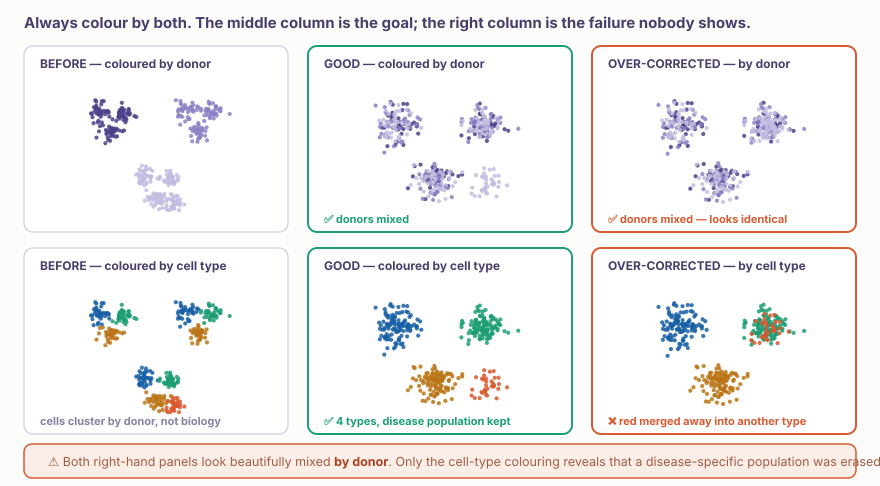
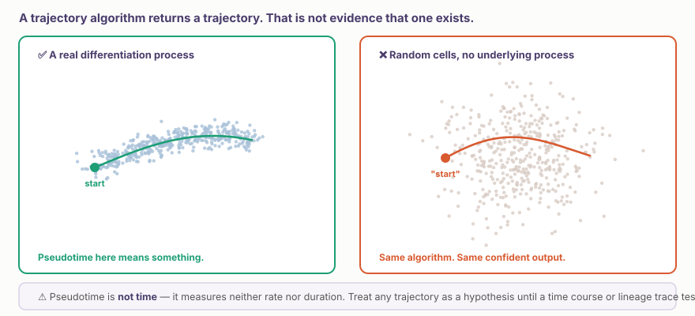
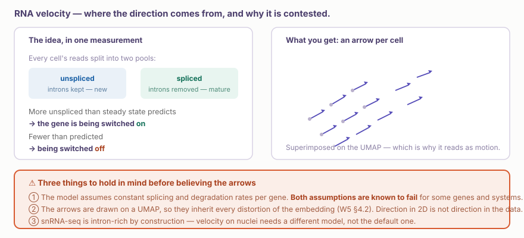
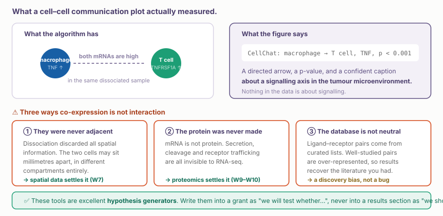

::: {.callout-note collapse="true"}
## 🎯 학습목표

이 장을 마치면 다음을 할 수 있어야 합니다.

-   Integration이 가정하는 것을 설명하고, ⚠️ 찾으려던 biology를 지워버린 경우를 알아본다
-   ✅ Over-correction을 드러내는 두 가지 colouring을 요구한다
-   Pseudotime이 무엇의 순서를 정하는지, 그리고 ⚠️ 왜 실제 시간이 아닌지 설명한다
-   ⚠️ Trajectory algorithm이 항상 trajectory를 반환하는 이유를 설명한다
-   RNA velocity의 방향이 어디에서 나오며 어떤 가정이 논쟁 중인지 설명한다
-   ⚠️ Ligand–receptor co-expression이 interaction의 근거가 아닌 이유를 설명한다
-   어떤 결과가 hypothesis로서 연구비 신청서에 들어가고, 어떤 결과가 finding으로서 논문에 들어가는지 판단한다
:::

> 🤔 **동기 질문**
>
> 한 논문이 환자와 대조군의 cell이 완벽하게 겹치는 아름다운 UMAP을 보여준 뒤, 질환 특이적인 fibroblast state가 존재한다고 보고합니다. 이 두 주장은 양립할 수 있을까요?

------------------------------------------------------------------------

# 1. Integration과 그 대가 🔗 {#w6-s1}

## 1) Integration이 해결하는 문제 {#w6-s1-1}

Single-cell data에서 **donor**는 대개 가장 큰 variation source입니다. Cell type보다 환자에 따라 먼저 clustering되어 데이터를 biology로 해석하기 어려워집니다.

**Integration method**(Harmony, scVI, Seurat RPCA, scANVI)는 서로 다른 donor에서 나온 같은 cell type이 함께 위치하는 shared representation을 찾습니다.

## 2) ⚠️ Integration은 숨어 있는 가정이다 {#w6-s1-2}

{fig-align="center"}

가정은 다음과 같습니다. **모든 batch에 같은 cell type이 존재하며 batch와 관련된 variation은 모두 technical하다.**

⚠️ Biology가 흥미로운 바로 그 경우에 이 가정이 실패합니다.

-   질환 특이적인 cell state
-   하나의 condition에만 존재하는 population
-   Treatment-induced program

→ Aggressive integration은 이를 합쳐 없애고, 그 결과인 UMAP은 아름답게 섞여 보입니다.

::: {.callout-important collapse="true"}
## 진단 방법과 이것이 거의 제시되지 않는 이유

-   ✅ Batch **및** cell type으로 각각 colouring하세요. 둘 다 출판해야 합니다
-   ✅ Integration 뒤에도 알려진 cell-type marker가 분리되는지 확인하세요
-   ✅ 하나의 condition에만 있는 population이 **살아남았는지** 확인하세요
-   ✅ **scIB** 같은 benchmark는 바로 이 batch-removal / biology-preservation trade-off를 평가합니다

⚠️ 대부분의 논문은 batch colouring만 보여줍니다. 방법이 작동했다는 것을 보여주는 그림이기 때문입니다. 동시에 실패를 드러낼 수 없는 그림이기도 합니다.

💡 동기 질문으로 돌아가면, 완벽하게 섞인 UMAP과 질환 특이적인 state는 서로 **긴장 관계**에 있습니다. 불가능한 것은 아니지만 논문은 두 번째 colouring을 제시해야 합니다.
:::

## 3) ⚠️ Integration이 전혀 도울 수 없는 경우 {#w6-s1-3}

Disease status와 batch가 완전히 confounded되어 모든 환자를 하루에, 모든 대조군을 다른 날에 처리했다면 **어떤 integration method도 둘을 분리할 수 없습니다.** 🔗 [W1 §3.3](../part1/w1_intro.qmd#w1-s3-3)의 논리와 정확히 같고, 여기에서도 되돌릴 수 없습니다.

------------------------------------------------------------------------

# 2. Trajectory와 Pseudotime 🧭 {#w6-s2}

## 1) 아이디어 {#w6-s2-1}

Biology는 동적이지만 single-cell experiment는 snapshot입니다. 진행 중인 process의 서로 다른 지점에서 cell을 포착했다면 transcriptional similarity의 축을 따라 **순서를 정할** 수 있습니다. 이것이 **pseudotime**입니다.

-   Stem cell → progenitor → differentiated
-   Naive T cell → activated → effector → exhausted
-   Fibroblast → myofibroblast → senescent

도구: **Monocle3**, **Slingshot**, **PAGA**.

## 2) ⚠️ Algorithm은 항상 성공한다 {#w6-s2-2}

{fig-align="center"}

::: {.callout-warning collapse="true"}
## 명확하게 말할 가치가 있는 세 가지 주의점

-   ⚠️ **Trajectory algorithm은 underlying process가 없는 데이터를 포함해 어떤 dataset에서도 trajectory를 반환합니다.** “Trajectory를 찾지 못함”이라는 출력은 없습니다
-   ⚠️ **Pseudotime은 시간이 아닙니다.** Rate도 duration도 측정하지 않습니다. Pseudotime에서 멀리 떨어진 두 cell은 실제로 수분 또는 수개월 떨어졌을 수 있고, 순서가 반대일 수도 있습니다
-   ⚠️ **Root는 사용자가 선택해야 합니다.** Root를 반대로 선택하면 biology도 함께 뒤집힙니다. 이 선택은 결과처럼 보이지만 사실 prior knowledge가 들어온 것입니다

→ ✅ Sanity check: cell label을 섞거나 homogeneous population에서 algorithm을 실행하고 무엇이 나오는지 보세요. 생각을 바꾸게 하는 5분입니다.
:::

## 3) RNA velocity {#w6-s2-3}

{fig-align="center"}

RNA velocity는 gene별 unspliced(new) transcript와 spliced(mature) transcript를 비교해 **방향**을 더합니다. Steady state의 예측보다 unspliced transcript가 많다면 해당 gene이 켜지고 있는 것입니다.

⚠️ Splicing과 degradation kinetics에 관한 가정은 **논쟁 중**이며 일부 gene과 system에서 실패한다고 알려져 있습니다. 화살표는 UMAP 위에 그려지므로 🔗 [W5 §4.2](w5_scrna_qc.qmd#w5-s4-2)의 모든 distortion을 물려받습니다.

✅ Trajectory 주장을 확정하는 것은 더 나은 algorithm이 아니라 **time course** 또는 **lineage tracing**입니다.

------------------------------------------------------------------------

# 3. ⚠️ 세포 간 소통 📡 {#w6-s3}

## 1) 도구가 실제로 계산하는 것 {#w6-s3-1}

CellPhoneDB, CellChat, NicheNet은 **co-expression**을 바탕으로 cluster pair 사이의 ligand–receptor pair에 score를 줍니다. Cluster A에서 ligand mRNA가 높고 cluster B에서 receptor mRNA가 높은지를 계산합니다.

{fig-align="center"}

## 2) 정직하게 사용하는 방법 {#w6-s3-2}

-   ✅ **Hypothesis generator로 사용** — “어떤 axis를 검정할 가치가 있는가?”가 이 도구에 정확히 맞는 질문입니다
-   ✅ **공간적으로 검증** — 두 cell type이 물리적으로 인접해 있다면(🔗 [W7](../part4/w7_spatial_basics.qmd)) 예측이 그럴듯해집니다
-   ✅ **기능적으로 검증** — blocking antibody, receptor knockout, ligand stimulation
-   ❌ **독립적인 결과로 사용** — “Macrophage가 TNF를 통해 T cell에 signal을 보낸다”는 사실은 co-expression으로 입증되지 않습니다

💡 NicheNet은 종류가 조금 다릅니다. Ligand의 *downstream target gene*이 receiver cell에서 유도되는지 묻습니다. 여전히 correlative하지만 co-expression만 보는 것보다 더 강한 correlation입니다.

------------------------------------------------------------------------

# 4. 이번 주 내용을 하나로 묶기 🧩 {#w6-s4}

이 장의 모든 방법은 데이터가 완전히 뒷받침할 수 없는, 확신에 찬 모양의 출력을 만듭니다. 사용하지 말아야 한다는 뜻이 아니라 결과의 정체를 정확히 표현해야 한다는 뜻입니다.

| 결과 | 근거의 강도 | 들어갈 위치 |
|-------------------|--------------------------|---------------------------|
| 검증된 marker가 있는 cluster | ✅ 기술적, 견고함 | Results |
| Donor 간 pseudobulk DE(W5) | ✅ 추론적, 견고함 | Results |
| Compositional method를 사용한 differential abundance | ⚠️ n이 donor라면 견고함 | Results, caveat 포함 |
| Pseudotime ordering | ⚠️ Hypothesis | “consistent with”로 표현한 Results |
| RNA velocity direction | ⚠️ Hypothesis, 논쟁 중인 method | Supplementary 또는 hypothesis |
| Ligand–receptor prediction | ❌ Hypothesis일 뿐 | Discussion 또는 grant aim |

::: {.callout-tip collapse="true"}
## 논문을 곤란하게 만드는 문장

*“Trajectory analysis revealed that fibroblasts differentiate into myofibroblasts, and cell–cell communication analysis showed that macrophage-derived TGF-β drives this transition.”*

이 문장은 어떤 것도 revealed하거나 showed하지 않았습니다. Dissociated cell의 snapshot 하나에서 두 algorithm이 두 ordering을 만들었을 뿐입니다.

✅ 정직한 표현: *“Pseudotime ordering은 fibroblast-to-myofibroblast transition과 일치하며, ligand–receptor analysis는 macrophage TGF-β를 candidate driver로 제시한다. 우리는 [spatial validation / receptor blockade]로 이를 검정하고 있다.”*

→ 두 번째 문장은 연구비를 받을 만한 다음 단계처럼 읽히는 문장이기도 합니다.
:::

------------------------------------------------------------------------

# 5. 실습 💻 {#w6-s5}

## 1) 정직한 진단을 포함한 integration {#w6-s5-1}

```{r}
library(Seurat); library(harmony); library(patchwork)

obj <- readRDS(here::here("analysis", "5_pbmc_annotated.rds"))

obj <- obj |>
  RunHarmony(group.by.vars = "donor") |>
  FindNeighbors(reduction = "harmony", dims = 1:20) |>
  FindClusters(resolution = 0.5) |>
  RunUMAP(reduction = "harmony", dims = 1:20)

# ✅ the two panels that must always appear together
DimPlot(obj, group.by = "donor")     |
DimPlot(obj, group.by = "cell_type", label = TRUE)
```

✅ **한 가지 바꾸기:** Harmony의 `theta`를 높여 correction을 더 aggressive하게 만들고, 오른쪽 panel에서 작은 population이 사라지는지 보세요.

## 2) Trajectory와 sanity check {#w6-s5-2}

```{r}
library(monocle3)

cds <- as.cell_data_set(obj)
cds <- cluster_cells(cds) |> learn_graph()
cds <- order_cells(cds)              # ⚠️ you choose the root — that is an assumption
plot_cells(cds, color_cells_by = "pseudotime")
```

⚠️ **그다음 아래 코드를 실행하고** 출력을 정직하게 살펴보세요.

```{r}
# Run the same pipeline on one homogeneous cluster with no expected process
mono <- subset(obj, cell_type == "CD14 Mono")
cds_null <- as.cell_data_set(mono) |> cluster_cells() |> learn_graph()
plot_cells(cds_null, color_cells_by = "pseudotime")
```

💡 Trajectory가 나올 것입니다. 이 결과가 앞의 그림에 어떤 의미를 주는지 논의하세요.

## 3) Cell–cell communication {#w6-s5-3}

```{r}
library(CellChat)

cc <- createCellChat(obj, group.by = "cell_type") |>
  subsetData() |> identifyOverExpressedGenes() |>
  identifyOverExpressedInteractions() |> computeCommunProb() |>
  filterCommunication(min.cells = 10) |> aggregateNet()

netVisual_circle(cc@net$weight, weight.scale = TRUE)
```

✅ 가장 강하게 예측된 interaction 하나를 고르고 이를 검정할 실험을 설명하는 **문장 하나**를 쓰세요. Plot이 아니라 그 문장이 deliverable입니다.

## 4) 다음 주 전까지 {#w6-s5-4}

**W7 — spatial transcriptomics.** 자신의 진료과에 관한 다음 질문의 답을 생각해 오세요.

> *Outcome data와 연결된 FFPE block이 있는가? 대략 몇 개인가?*

W7–W8의 모든 내용이 그 답에 달려 있습니다.

------------------------------------------------------------------------

# 📝 요약

-   Integration은 모든 batch에 같은 cell type이 존재하며 batch variation이 technical하다고 가정합니다
-   ⚠️ **Over-correction은 찾고 있던 질환 특이적 population을 지우지만**, 결과 UMAP은 완벽해 보입니다
-   ✅ 항상 batch **및** cell type으로 colouring하세요. Review에서도 두 panel을 모두 요구하세요
-   ⚠️ 모든 case를 하루에, 모든 control을 다른 날에 처리한 confounded design은 어떤 integration method로도 구할 수 없습니다
-   ⚠️ **Trajectory algorithm은 random data에서도 trajectory를 반환합니다.** Null output은 없습니다
-   ⚠️ **Pseudotime은 시간이 아닙니다.** Rate도 duration도 없고 root는 결과가 아니라 사용자의 가정입니다
-   RNA velocity의 kinetic assumption은 논쟁 중이며 화살표는 왜곡된 2D embedding 위에 놓입니다
-   ⚠️ **Ligand–receptor co-expression은 interaction이 아닙니다.** Cell이 인접하지 않을 수 있고 protein이 만들어지지 않을 수 있으며 database는 알려진 내용으로 편향되어 있습니다
-   ✅ 이 방법들은 hypothesis generator입니다. “consistent with”로 표현하고 검정할 실험을 명시하세요

------------------------------------------------------------------------

# 🔑 핵심 용어

| 용어 | 한 줄 뜻 |
|-------------------------|-----------------------------------------|
| Integration | 공통 세포 유형이 함께 군집화되도록 여러 데이터셋을 정렬하는 것 |
| Over-correction | 실제 생물학적 차이까지 제거해 버린 통합 |
| scIB | 배치 제거와 생물학적 신호 보존을 함께 평가하는 비교 체계 |
| Pseudotime | 추정된 생물학적 과정을 따라 세포의 순서를 정한 값 |
| Root cell | 사용자가 선택한 시작 세포 — 전체 순서를 반대로 만들 수 있음 |
| Trajectory inference | 발현 공간에 놓인 세포들을 통과하는 경로를 추정하는 것 |
| RNA velocity | 미접합 읽기값과 접합 읽기값의 차이로 추정한 변화 방향 |
| Spliced / unspliced | 성숙한 mRNA / 인트론을 포함한 초기 전사체 |
| Ligand–receptor pair | 세포 간 소통 점수 계산에 사용하는 선별된 상호작용 쌍 |
| CellChat / CellPhoneDB / NicheNet | 상관관계에 기반해 세포 간 소통을 추정하는 도구 |
| Hypothesis generator | 출력이 답이 아니라 후속 검증이 필요한 질문인 방법 |

------------------------------------------------------------------------

# ➕ 참고문헌

### Integration

Korsunsky I, et al. [*Fast, sensitive and accurate integration of single-cell data with Harmony.*](https://doi.org/10.1038/s41592-019-0619-0) Nat Methods. 2019.  
Luecken MD, et al. [*Benchmarking atlas-level data integration in single-cell genomics.*](https://doi.org/10.1038/s41592-021-01336-8) Nat Methods. 2022. (scIB)  
Lopez R, et al. [*Deep generative modeling for single-cell transcriptomics.*](https://doi.org/10.1038/s41592-018-0229-2) Nat Methods. 2018. (scVI)

### Trajectory와 velocity

Saelens W, et al. [*A comparison of single-cell trajectory inference methods.*](https://doi.org/10.1038/s41587-019-0071-9) Nat Biotechnol. 2019. **← method 선택이 얼마나 중요한지 보여주는 benchmark**  
Cao J, et al. [*The single-cell transcriptional landscape of mammalian organogenesis.*](https://doi.org/10.1038/s41586-019-0969-x) Nature. 2019. (Monocle3)  
Bergen V, et al. [*Generalizing RNA velocity to transient cell states through dynamical modeling.*](https://doi.org/10.1038/s41587-020-0591-3) Nat Biotechnol. 2020. (scVelo)  
Bergen V, Soldatov RA, Kharchenko PV, Theis FJ. [*RNA velocity — current challenges and future perspectives.*](https://doi.org/10.15252/msb.202110282) Mol Syst Biol. 2021. **← Figure에 velocity를 사용하기 전에 읽을 논문**

### Cell–cell communication

Jin S, et al. [*Inference and analysis of cell-cell communication using CellChat.*](https://doi.org/10.1038/s41467-021-21246-w) Nat Commun. 2021.  
Browaeys R, Saelens W, Saeys Y. [*NicheNet: modeling intercellular communication by linking ligands to target genes.*](https://doi.org/10.1038/s41592-019-0667-5) Nat Methods. 2020.  
Dimitrov D, et al. [*Comparison of methods and resources for cell-cell communication inference from single-cell RNA-Seq data.*](https://doi.org/10.1038/s41467-022-30755-0) Nat Commun. 2022. **← 선택한 tool과 database에 따라 답이 얼마나 달라지는지 보여주는 자료**
