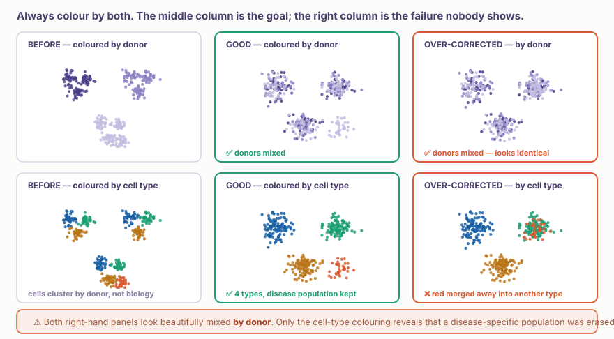
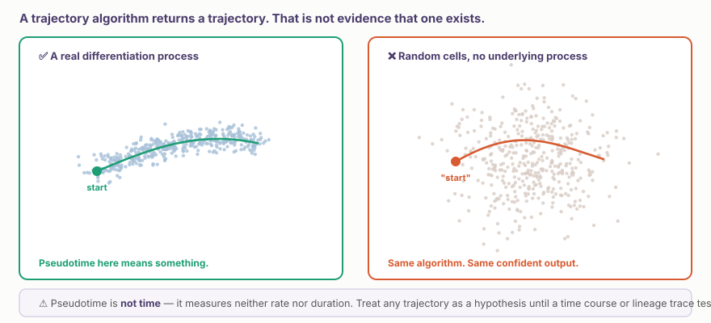
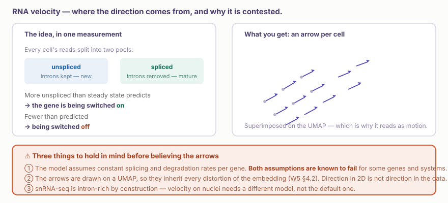
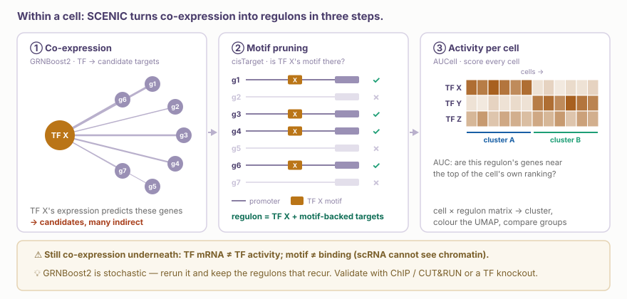
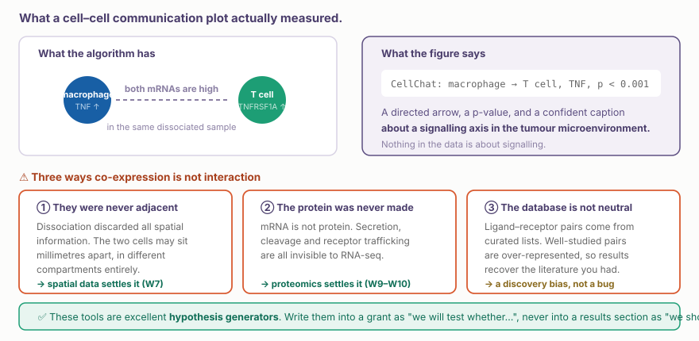

::: {.callout-note collapse="true"}
## 🎯 학습목표

이 장을 마치면 다음을 할 수 있어야 합니다.

-   Integration이 가정하는 것을 설명하고, ⚠️ 찾으려던 biology를 지워버린 경우를 알아본다
-   ✅ Over-correction을 드러내는 두 가지 colouring을 요구한다
-   Pseudotime이 무엇의 순서를 정하는지, 그리고 ⚠️ 왜 실제 시간이 아닌지 설명한다
-   ⚠️ Trajectory algorithm이 항상 trajectory를 반환하는 이유를 설명한다
-   RNA velocity의 방향이 어디에서 나오며 어떤 가정이 논쟁 중인지 설명한다
-   ⚠️ TF–target co-expression으로 만든 regulon이 말해주는 것과 말해주지 않는 것을 구분한다
-   ⚠️ Ligand–receptor co-expression이 interaction의 근거가 아닌 이유를 설명한다
-   어떤 결과가 hypothesis로서 연구비 신청서에 들어가고, 어떤 결과가 finding으로서 논문에 들어가는지 판단한다
:::

> 🤔 **동기 질문**
>
> 한 논문이 환자와 대조군의 cell이 완벽하게 겹치는 아름다운 UMAP을 보여준 뒤, 질환 특이적인 fibroblast state가 존재한다고 보고합니다. 이 두 주장은 양립할 수 있을까요?

------------------------------------------------------------------------

# 1. Integration과 그 대가 🔗 {#w6-s1}

## 1) Integration이 해결하는 문제 {#w6-s1-1}

Single-cell data에서 가장 큰 variation source = 대개 **donor**. Cell type보다 환자별로 먼저 clustering됨 → 이대로는 biology로 해석 불가

**Integration method**(Harmony, scVI, Seurat RPCA, scANVI) = 서로 다른 donor에서 온 같은 cell type이 한곳에 모이는 shared representation 찾기

## 2) ⚠️ Integration = 숨어 있는 가정 {#w6-s1-2}

{fig-align="center"}

가정: **모든 batch에 같은 cell type이 있고, batch와 관련된 variation은 전부 technical**

⚠️ 이 가정은 biology가 흥미로운 바로 그때 깨짐:

-   질환 특이적인 cell state
-   한 condition에만 있는 population
-   Treatment-induced program

→ Aggressive integration은 이걸 합쳐서 없애버림. 그런데 결과 UMAP은 아름답게 섞여 보임..

::: {.callout-important collapse="true"}
## 진단 방법, 그리고 이걸 거의 안 보여주는 이유

-   ✅ Batch **와** cell type으로 각각 colouring. 둘 다 논문에 실을 것
-   ✅ Integration 후에도 알려진 cell-type marker가 분리되는지 확인
-   ✅ 한 condition에만 있는 population이 **살아남았는지** 확인
-   ✅ **scIB** 같은 benchmark = 바로 이 batch 제거 vs biology 보존 trade-off를 점수화

⚠️ 대부분의 논문은 batch colouring만 보여줌. 방법이 작동했다는 걸 보여주는 그림이니까.. 동시에 실패는 절대 드러낼 수 없는 그림이기도 함

💡 동기 질문으로 돌아가면: 완벽하게 섞인 UMAP과 질환 특이적 state는 **서로 긴장 관계**. 불가능은 아니지만, 그렇다면 논문이 두 번째 colouring을 보여줘야 함
:::

## 3) ⚠️ Integration이 전혀 못 도와주는 경우 {#w6-s1-3}

Disease status와 batch가 완전히 confounded (환자는 전부 하루에, 대조군은 전부 다른 날에 처리) → **어떤 integration method로도 둘을 분리 불가.** 🔗 [W1 §3.3](../part1/w1_intro.qmd#w1-s3-3)과 똑같은 논리, 여기서도 되돌릴 방법 없음

------------------------------------------------------------------------

# 2. Trajectory와 Pseudotime 🧭 {#w6-s2}

## 1) 아이디어 {#w6-s2-1}

Biology는 동적인데 single-cell experiment는 snapshot. 진행 중인 process의 여러 지점에서 cell이 잡혔다면 → transcriptional similarity 축을 따라 **순서 매기기** 가능 = **pseudotime**

-   Stem cell → progenitor → differentiated
-   Naive T cell → activated → effector → exhausted
-   Fibroblast → myofibroblast → senescent

도구: **Monocle3**, **Slingshot**, **PAGA**

## 2) ⚠️ Algorithm은 항상 성공한다 {#w6-s2-2}

{fig-align="center"}

::: {.callout-warning collapse="true"}
## 분명히 짚고 갈 세 가지 주의점

-   ⚠️ **Trajectory algorithm은 어떤 dataset에서든 trajectory를 반환함** — underlying process가 없는 데이터도 포함. "Trajectory 없음"이라는 출력은 없음!
-   ⚠️ **Pseudotime ≠ 시간.** Rate도 duration도 측정 x. Pseudotime상 멀리 떨어진 두 cell이 실제로는 몇 분 차이일 수도, 몇 달 차이일 수도 — 순서가 거꾸로일 수도
-   ⚠️ **Root는 내가 고르는 것.** Root를 뒤집으면 biology도 같이 뒤집힘. 결과처럼 보이지만 사실 prior knowledge가 끼어든 것

✅ Sanity check: cell label을 섞거나 homogeneous population에 algorithm을 돌려서 뭐가 나오는지 보기
:::

## 3) RNA velocity {#w6-s2-3}

{fig-align="center"}

RNA velocity = gene별로 unspliced(new) vs spliced(mature) transcript를 비교해서 **방향**을 추가. Steady state가 예측하는 것보다 unspliced가 많으면 → 그 gene이 켜지는 중

⚠️ Splicing·degradation kinetics에 대한 가정은 **논쟁 중**, 일부 gene·system에서는 안 맞는다고 알려져 있음. 게다가 화살표가 UMAP 위에 그려지므로 🔗 [W5 §4.3](w5_scrna_qc.qmd#w5-s4-3)의 왜곡도 전부 물려받음

✅ Trajectory 이야기를 하려면 더 좋은 algorithm이 썼다고 하지 말고 **time course** 또는 **lineage tracing**

------------------------------------------------------------------------

# 3. Co-expression으로 기전 추론하기 📡 {#w6-s3}

재료는 똑같음 = 같은 snapshot 안의 **co-expression**. 어디를 보느냐만 다름:

-   **Cell 안 (within cell)** — TF ↔ target gene → **regulon** (gene regulatory network)
-   **Cell 사이 (between cells)** — ligand ↔ receptor → **cell–cell communication**

→ 한계도 똑같음: co-expression ≠ 조절, co-expression ≠ 상호작용. 둘 다 hypothesis generator

## 1) Cell 안: gene regulatory network (regulon) {#w6-s3-1}

> 어떤 TF가 이 cell state를 켜고 있는가?

{fig-align="center"}

**SCENIC — 3단계**

1.  **Co-expression (GRNBoost2)** — TF 발현으로 각 gene의 발현을 예측 (tree-based regression) → TF–target 후보. 대부분 간접적인 상관
2.  **Motif pruning (cisTarget)** — target의 promoter 주변에 그 TF의 motif가 농축된 것만 남김 → **regulon** (TF + motif로 뒷받침되는 target). 이 단계 덕분에 단순 co-expression 이상이 됨
3.  **Activity per cell (AUCell)** — cell마다 regulon gene들이 발현 순위 상위에 몰려 있는 정도(AUC) → cell × regulon matrix → clustering, UMAP 색칠, 그룹 비교

Tool: **pySCENIC**(Python, 실제로 가장 많이 씀), SCENIC(R, 원조, 느림)

::: {.callout-warning collapse="true"}
## Regulon 해석 시 주의

-   ⚠️ **TF mRNA ≠ TF activity.** 인산화, 핵 이동(NF-κB), ligand 결합(nuclear receptor) 같은 번역 후 조절은 RNA에 안 보임. 게다가 TF는 발현이 낮아 dropout이 많음
-   ⚠️ **Motif가 있다 ≠ 실제로 붙는다.** Chromatin이 닫혀 있으면 못 붙음 — scRNA만으로는 확인 불가 (multiome/scATAC이 있으면 SCENIC+, 이 수업 범위 밖)
-   ⚠️ **돌릴 때마다 다름.** GRNBoost2는 stochastic → 여러 번 돌려서 반복해서 나오는 regulon만 쓰는 게 관행
-   ⚠️ **순환 논리.** Expression으로 나눈 cluster끼리 regulon activity를 비교 → 차이가 나오는 게 당연
-   ⚠️ **Condition 비교 = W5의 per-cell test 함정 그대로.** Donor 단위로 집계해서 비교 (🔗 [W5 §5.2](w5_scrna_qc.qmd#w5-s5-2))

💡 가벼운 대안: **decoupleR + CollecTRI** — network를 새로 추론하지 않고, 이미 알려진 TF–target set으로 TF activity만 점수화. 빠르고 재현성 좋고 R/Seurat에서 바로 됨 (§5.4). 대신 알려진 biology 안에서만 답이 나옴

✅ 검증: binding은 ChIP-seq / CUT&RUN, 기능은 TF knockout / CRISPR / Perturb-seq
:::

## 2) Cell 사이: cell–cell communication {#w6-s3-2}

CellPhoneDB, CellChat, NicheNet = cluster 쌍 사이의 ligand–receptor pair를 **co-expression** 기반으로 점수화. Cluster A에서 ligand mRNA가 높고, cluster B에서 receptor mRNA가 높은가? 그게 전부

{fig-align="center"}

💡 NicheNet은 결이 좀 다름 = 두 축을 잇는 방법: ligand(cell 사이)의 *downstream target gene*이 receiver cell 안에서 실제로 유도되는지(cell 안)를 봄. 여전히 correlative지만, co-expression만 보는 것보단 강한 correlation

## 3) 적절한 사용법 (둘 다) {#w6-s3-3}

-   ✅ **Hypothesis generator로** — "어떤 TF / 어떤 axis를 검정해 볼 만한가?"가 딱 이 도구들용 질문
-   ✅ **공간적으로 검증 (CCC)** — 두 cell type이 물리적으로 붙어 있다면(🔗 [W7](../part4/w7_spatial_basics.qmd)) 예측이 그럴듯해짐
-   ✅ **기능적으로 검증** — CCC는 blocking antibody, receptor knockout, ligand stimulation / regulon은 TF knockout, Perturb-seq
-   ❌ **단독 결과로 x** — "Macrophage가 TNF로 T cell에 signal을 보낸다", "TF X가 fibrosis program을 구동한다" 둘 다 co-expression만으로는 입증 안 됨

------------------------------------------------------------------------

# 4. 이번 주 정리 🧩 {#w6-s4}

이 장의 방법들은 전부 데이터가 다 받쳐주지 못하는, 자신만만한 모양의 출력을 냄. 쓰지 말라는 게 아니라 → 결과가 정확히 뭔지 정확하게 표현하라는 것

| 결과 | 근거의 강도 | 들어갈 위치 |
|----------------------------------------|----------------------------------------|--------------------------------------|
| 검증된 marker가 있는 cluster | ✅ 기술적(descriptive), 견고함 | Results |
| Donor 간 pseudobulk DE(W5) | ✅ 추론적(inferential), 견고함 | Results |
| Compositional method를 쓴 differential abundance | ⚠️ n이 donor라면 견고함 | Results, caveat 포함 |
| Pseudotime ordering | ⚠️ Hypothesis | Results, "consistent with"로 표현 |
| RNA velocity direction | ⚠️ Hypothesis, 논쟁 중인 method | Supplementary 또는 hypothesis |
| Regulon / TF activity (SCENIC, decoupleR) | ⚠️ Hypothesis | Results, "consistent with"로 표현 |
| Ligand–receptor prediction | ❌ Hypothesis일 뿐 | Discussion 또는 grant aim |

::: {.callout-tip collapse="true"}
## 논문을 곤란하게 만드는 문장

*"Trajectory analysis revealed that fibroblasts differentiate into myofibroblasts, and cell–cell communication analysis showed that macrophage-derived TGF-β drives this transition."*

이 문장은 아무것도 revealed하거나 showed하지 않음. Dissociated cell snapshot 하나에서 algorithm 두 개가 ordering 두 개를 만든 것뿐

✅ 정직한 버전: *"Pseudotime ordering은 fibroblast-to-myofibroblast transition과 일치하며, ligand–receptor analysis는 macrophage TGF-β를 candidate driver로 제시한다. 우리는 \[spatial validation / receptor blockade\]로 이를 검정하고 있다."*

→ 두 번째 버전이 연구비 받을 만한 다음 단계처럼 읽히기도 함
:::

------------------------------------------------------------------------

# 5. 실습 💻 {#w6-s5}

## 1) 정직한 진단을 포함한 integration {#w6-s5-1}

```{r}
library(Seurat); library(harmony); library(patchwork)

obj <- readRDS(here::here("analysis", "5_pbmc_annotated.rds"))

obj <- obj |>
  RunHarmony(group.by.vars = "donor") |>
  FindNeighbors(reduction = "harmony", dims = 1:20) |>
  FindClusters(resolution = 0.5) |>
  RunUMAP(reduction = "harmony", dims = 1:20)

# ✅ the two panels that must always appear together
DimPlot(obj, group.by = "donor")     |
DimPlot(obj, group.by = "cell_type", label = TRUE)
```

✅ **한 가지 바꾸기:** Harmony의 `theta`를 올려서 correction을 더 aggressive하게 → 오른쪽 panel에서 작은 population이 사라지는지 확인

## 2) Trajectory와 sanity check {#w6-s5-2}

```{r}
library(monocle3)

cds <- as.cell_data_set(obj)
cds <- cluster_cells(cds) |> learn_graph()
cds <- order_cells(cds)              # ⚠️ you choose the root — that is an assumption
plot_cells(cds, color_cells_by = "pseudotime")
```

⚠️ **그다음 아래 코드 실행** → 출력을 정직하게 보기

```{r}
# Run the same pipeline on one homogeneous cluster with no expected process
mono <- subset(obj, cell_type == "CD14 Mono")
cds_null <- as.cell_data_set(mono) |> cluster_cells() |> learn_graph()
plot_cells(cds_null, color_cells_by = "pseudotime")
```

💡 Trajectory가 나올 것.. 이게 앞의 그림에 대해 뭘 말해주는지 토론

## 3) Cell–cell communication {#w6-s5-3}

```{r}
library(CellChat)

cc <- createCellChat(obj, group.by = "cell_type") |>
  subsetData() |> identifyOverExpressedGenes() |>
  identifyOverExpressedInteractions() |> computeCommunProb() |>
  filterCommunication(min.cells = 10) |> aggregateNet()

netVisual_circle(cc@net$weight, weight.scale = TRUE)
```

✅ 가장 강하게 예측된 interaction 하나를 고르고, 그걸 검정할 실험을 **한 문장**으로 쓰기. Deliverable은 plot이 아니라 그 문장

## 4) TF activity (decoupleR) {#w6-s5-4}

```{r}
library(decoupleR)

net  <- get_collectri(organism = "human", split_complexes = FALSE)   # known TF–target pairs
mat  <- as.matrix(LayerData(obj, assay = "RNA", layer = "data"))      # log-normalised
acts <- run_ulm(mat = mat, net = net, .source = "source", .target = "target",
                .mor = "mor", minsize = 5)

obj[["tf"]] <- acts |>
  tidyr::pivot_wider(id_cols = "source", names_from = "condition", values_from = "score") |>
  tibble::column_to_rownames("source") |>
  CreateAssayObject()

# TF mRNA vs TF activity, side by side
DefaultAssay(obj) <- "RNA"; p1 <- FeaturePlot(obj, "SPI1")
DefaultAssay(obj) <- "tf";  p2 <- FeaturePlot(obj, "SPI1")
p1 | p2
```

✅ **한 가지 바꾸기:** SPI1(PU.1) 말고 관심 있는 TF 하나로 바꿔서 mRNA vs activity 비교 → 얼마나 다른가? Condition을 비교하고 싶다면 cell이 아니라 donor별 평균으로

## 5) 다음 주 전까지 {#w6-s5-5}

**W7 — spatial transcriptomics.** 내 진료과 기준으로 다음 질문의 답을 생각해 오기:

> *Outcome data와 연결된 FFPE block이 있는가? 대략 몇 개인가?*

W7–W8 내용 전부가 그 답에 달려 있음

------------------------------------------------------------------------

# 📝 요약

-   Integration의 가정: 모든 batch에 같은 cell type, batch variation은 technical
-   ⚠️ **Over-correction은 찾던 질환 특이적 population을 지워버림** — 그래도 UMAP은 완벽해 보임
-   ✅ 항상 batch **와** cell type으로 colouring. Review할 때도 두 panel 다 요구할 것
-   ⚠️ Case는 전부 하루에, control은 전부 다른 날에 처리한 confounded design → 어떤 integration method로도 구제 불가
-   ⚠️ **Trajectory algorithm은 random data에서도 trajectory를 반환.** Null output은 없음
-   ⚠️ **Pseudotime ≠ 시간.** Rate도 duration도 없고, root는 결과가 아니라 내 가정
-   RNA velocity의 kinetic assumption은 논쟁 중, 화살표는 왜곡된 2D embedding 위에 그려짐
-   Regulon(cell 안)과 cell–cell communication(cell 사이)은 같은 재료 = snapshot의 co-expression
-   ⚠️ **TF–target co-expression ≠ regulation.** SCENIC은 motif로 한 번 거르지만, TF mRNA ≠ activity, motif ≠ binding
-   ⚠️ **Ligand–receptor co-expression ≠ interaction.** Cell끼리 붙어 있지 않을 수도, protein이 안 만들어질 수도 있고, database는 이미 알려진 것 쪽으로 편향
-   ✅ 이 방법들 = hypothesis generator. "consistent with"로 표현하고, 검정할 실험을 명시

------------------------------------------------------------------------

# 🔑 핵심 용어

| 용어 | 한 줄 뜻 |
|-----------------------------------|----------------------------------------------------------------------------------|
| Integration | 공통 세포 유형이 함께 군집화되도록 여러 데이터셋을 정렬하는 것 |
| Over-correction | 실제 생물학적 차이까지 제거해 버린 통합 |
| scIB | 배치 제거와 생물학적 신호 보존을 함께 평가하는 비교 체계 |
| Pseudotime | 추정된 생물학적 과정을 따라 세포의 순서를 정한 값 |
| Root cell | 사용자가 선택한 시작 세포 — 전체 순서를 반대로 만들 수 있음 |
| Trajectory inference | 발현 공간에 놓인 세포들을 통과하는 경로를 추정하는 것 |
| RNA velocity | 미접합 읽기값과 접합 읽기값의 차이로 추정한 변화 방향 |
| Spliced / unspliced | 성숙한 mRNA / 인트론을 포함한 초기 전사체 |
| Regulon | 전사인자와, 그 전사인자의 motif로 뒷받침되는 표적 유전자 집합 |
| SCENIC | 공발현 → motif 가지치기 → 세포별 regulon 활성 점수의 3단계 유전자 조절 네트워크 추론 방법 |
| TF activity | 표적 유전자들의 발현으로 추정한 전사인자 활성 — 전사인자 자체의 mRNA 양과 다름 |
| Ligand–receptor pair | 세포 간 소통 점수 계산에 사용하는 선별된 상호작용 쌍 |
| CellChat / CellPhoneDB / NicheNet | 상관관계에 기반해 세포 간 소통을 추정하는 도구 |
| Hypothesis generator | 출력이 답이 아니라 후속 검증이 필요한 질문인 방법 |

------------------------------------------------------------------------

# ➕ 참고문헌

### Integration

Korsunsky I, et al. [*Fast, sensitive and accurate integration of single-cell data with Harmony.*](https://doi.org/10.1038/s41592-019-0619-0) Nat Methods. 2019.\
Luecken MD, et al. [*Benchmarking atlas-level data integration in single-cell genomics.*](https://doi.org/10.1038/s41592-021-01336-8) Nat Methods. 2022. (scIB)\
Lopez R, et al. [*Deep generative modeling for single-cell transcriptomics.*](https://doi.org/10.1038/s41592-018-0229-2) Nat Methods. 2018. (scVI)

### Trajectory와 velocity

Saelens W, et al. [*A comparison of single-cell trajectory inference methods.*](https://doi.org/10.1038/s41587-019-0071-9) Nat Biotechnol. 2019. **← method 선택이 얼마나 중요한지 보여주는 benchmark**\
Cao J, et al. [*The single-cell transcriptional landscape of mammalian organogenesis.*](https://doi.org/10.1038/s41586-019-0969-x) Nature. 2019. (Monocle3)\
Bergen V, et al. [*Generalizing RNA velocity to transient cell states through dynamical modeling.*](https://doi.org/10.1038/s41587-020-0591-3) Nat Biotechnol. 2020. (scVelo)\
Bergen V, Soldatov RA, Kharchenko PV, Theis FJ. [*RNA velocity — current challenges and future perspectives.*](https://doi.org/10.15252/msb.202110282) Mol Syst Biol. 2021. **← Figure에 velocity를 쓰기 전에 읽을 논문**

### Gene regulatory network

Aibar S, et al. [*SCENIC: single-cell regulatory network inference and clustering.*](https://doi.org/10.1038/nmeth.4463) Nat Methods. 2017.\
Van de Sande B, et al. [*A scalable SCENIC workflow for single-cell gene regulatory network analysis.*](https://doi.org/10.1038/s41596-020-0336-2) Nat Protoc. 2020. **← pySCENIC 실전 protocol, 여러 번 돌리기 포함**\
Badia-i-Mompel P, et al. [*decoupleR: ensemble of computational methods to infer biological activities from omics data.*](https://doi.org/10.1093/bioadv/vbac016) Bioinform Adv. 2022.\
Müller-Dott S, et al. [*Expanding the coverage of regulons from high-confidence prior knowledge for accurate estimation of transcription factor activities.*](https://doi.org/10.1093/nar/gkad841) Nucleic Acids Res. 2023. (CollecTRI)

### Cell–cell communication

Jin S, et al. [*Inference and analysis of cell-cell communication using CellChat.*](https://doi.org/10.1038/s41467-021-21246-w) Nat Commun. 2021.\
Browaeys R, Saelens W, Saeys Y. [*NicheNet: modeling intercellular communication by linking ligands to target genes.*](https://doi.org/10.1038/s41592-019-0667-5) Nat Methods. 2020.\
Dimitrov D, et al. [*Comparison of methods and resources for cell-cell communication inference from single-cell RNA-Seq data.*](https://doi.org/10.1038/s41467-022-30755-0) Nat Commun. 2022. **← 고른 tool과 database에 따라 답이 얼마나 달라지는지 보여주는 자료**
