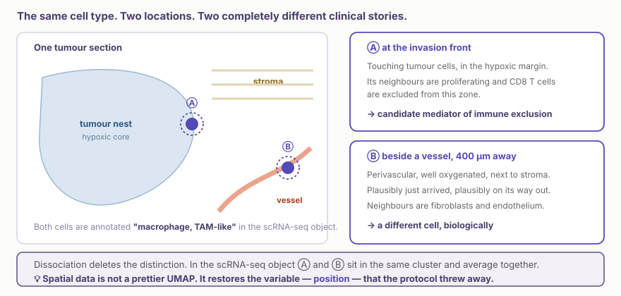
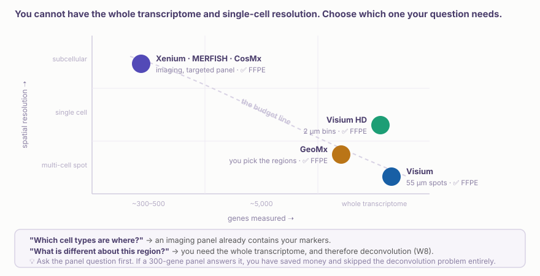
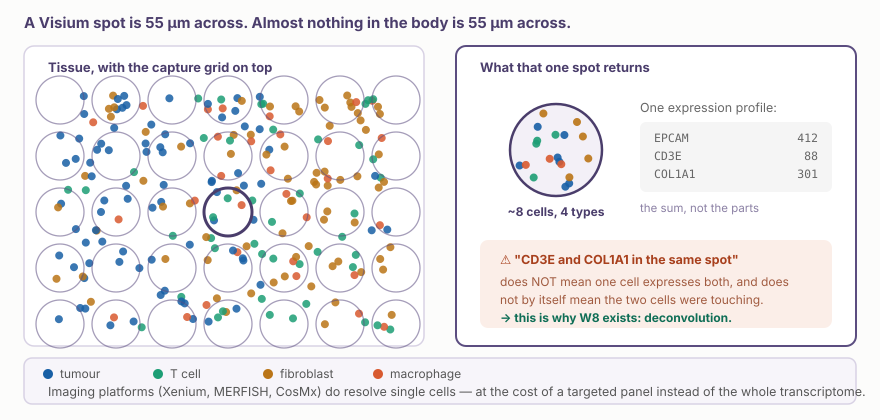
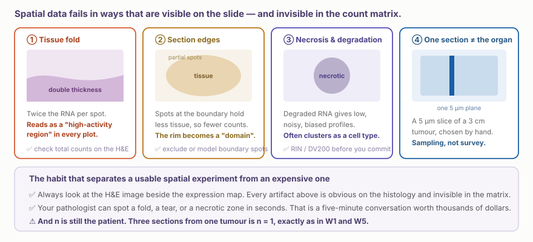

::: {.callout-note collapse="true"}
## 🎯 학습목표

이 장을 마치면 다음을 할 수 있어야 합니다.

-   조직 해리가 없애 버린 정보 가운데 공간 데이터가 무엇을 복원하는지 말할 수 있다
-   주요 플랫폼을 해상도와 측정 범위의 상충관계 위에 놓고, 질문에 맞는 플랫폼을 선택할 수 있다
-   ⚠️ **FFPE 호환성**이 이 장에서 실무적으로 가장 중요한 사실인 이유를 말할 수 있다
-   ⚠️ Visium spot이 세포가 아닌 이유와 그로부터 무엇이 따라오는지 설명할 수 있다
-   ⚠️ 주름, 절편 가장자리, 괴사처럼 생물학적 신호로 가장하는 물리적 artifact를 알아볼 수 있다
-   이웃한 spot이 서로 독립적인 관측치가 아닌 이유를 말할 수 있다
-   공간 실험에서 자신의 n이 무엇인지 명시할 수 있다
:::

> 🤔 **동기 질문**
>
> 단일세포 데이터에서 비반응자에게 TAM 유사 대식세포가 풍부하다는 결과가 나왔습니다. 공동연구자가 묻습니다. *"그 세포들은 어디에 있었나요?"* 지금 가진 데이터로 답할 수 있습니까?

------------------------------------------------------------------------

# 1. 조직 해리가 버린 것 🗺️ {#w7-s1}

## 1) 같은 세포 유형, 서로 다른 두 세포 {#w7-s1-1}

{fig-align="center"}

W6까지의 모든 분석은 현탁액 속 세포를 대상으로 했습니다. 프로토콜의 첫 단계는 임상적 직관 대부분이 의존하는 변수, 즉 **세포가 어디에 있었는가**를 없애 버립니다.

## 2) 공간 데이터만 답할 수 있는 질문 {#w7-s1-2}

-   **구조(architecture)** — 면역세포 침윤이 종양 내부에 있는가, 아니면 경계에 막혀 있는가? (면역 배제형, 염증형, 면역 사막형)
-   **이웃 관계(neighbourhoods)** — 단순히 함께 존재하는 것이 아니라 실제로 어떤 세포 유형들이 서로 인접해 있는가?
-   **구배(gradients)** — 혈관, 침윤 전선, 배중심으로부터의 거리에 따라 무엇이 달라지는가?
-   **영역별 이질성(regional heterogeneity)** — 종양의 한 부분은 치료에 저항하고 다른 부분은 민감한가?
-   **조직병리와의 연결** — 병리의사가 150년 동안 판독해 온 영상과 분자 정보를 어떻게 연결할 것인가?

💡 이 가운데 상당수는 병리의사가 이미 눈으로 평가하는 항목입니다. 공간전사체학은 상당 부분 **여러분의 진료과가 이미 내리는 판단에 분자적 수치를 부여하는 일**입니다. 그래서 이 장에서 가장 유용한 공동연구자는 병리의사입니다.

------------------------------------------------------------------------

# 2. 플랫폼 🔬 {#w7-s2}

## 1) 하나의 상충관계, 나머지는 세부사항 {#w7-s2-1}

{fig-align="center"}

-   **시퀀싱 기반**(Visium, Visium HD, GeoMx, Slide-seq) — 격자 또는 선택한 영역에서 전사체를 포획합니다. ✅ 전장 전사체를 측정합니다. ⚠️ 각 포획 영역에 여러 세포가 들어갈 수 있습니다
-   **이미징 기반**(Xenium, MERFISH, CosMx) — 제자리에 있는 개별 분자를 영상화합니다. ✅ 단일세포, 때로는 세포내 해상도를 제공합니다. ⚠️ 미리 선택한 수백에서 수천 개 유전자의 표적 패널만 측정합니다

## 2) ⚠️ 여러분에게 가장 중요한 사실은 FFPE입니다 {#w7-s2-2}

현재 거의 모든 플랫폼은 **포르말린 고정 파라핀 포매(formalin-fixed paraffin-embedded, FFPE)** 조직에서 작동합니다.

::: {.callout-important collapse="true"}
## 이것이 병원에서 가능한 일을 바꾸는 이유

병리과에는 수년 또는 수십 년 전의 블록이 보관되어 있고, 각 블록에는 누가 반응했고, 재발했고, 생존했는지에 대한 결과가 연결되어 있습니다.

-   ✅ 실제 임상 결과가 연결된 **후향적 공간 연구**를 지금 시작할 수 있습니다. 전향적 코호트가 쌓일 때까지 5년을 기다릴 필요가 없습니다
-   ✅ 동의한 환자를 순서대로 분석하는 것보다 훨씬 강한 설계인 반응자 대 비반응자처럼 *결과를 기준으로* 증례를 선택할 수 있습니다
-   ⚠️ 오래된 블록은 RNA 품질이 제각각입니다. **DV200**이 표준 지표이므로 연구를 확정하기 전에 확인하십시오
-   ⚠️ 보관 조직의 윤리와 동의에는 별도 절차가 필요합니다. 대개 가장 오래 걸리는 단계이므로 일찍 시작하십시오

💡 이 수업을 듣는 전공의 대부분에게 이는 “내가 실제로 무엇을 할 수 있는가?”에 대한 구체적인 답입니다.
:::

## 3) 플랫폼 선택 {#w7-s2-3}

| 연구 질문 | 플랫폼 종류 |
|-----------------------------------|-------------------------------------|
| “어떤 세포 유형이 어디에 있는가?” — 표지자가 알려져 있음 | ✅ 이미징 패널(Xenium, CosMx) |
| “이 영역의 전사 특성은 무엇이 다른가?” | ✅ 전장 전사체(Visium, Visium HD) |
| “조직학적으로 정의한 두 영역을 비교하고 싶다” | ✅ GeoMx — 연구자가 영역을 직접 지정 |
| “이 두 세포 유형이 서로 맞닿아 있는가?” | ✅ 이미징; ❌ 표준 Visium으로는 구분 불가 |
| “환자 블록 60개를 저렴하게 선별하고 싶다” | ⚠️ 비용이 결정적 — 설계 전에 코어 시설과 상의 |

------------------------------------------------------------------------

# 3. ⚠️ Spot은 세포가 아닙니다 🔍 {#w7-s3}

{fig-align="center"}

표준 Visium spot의 지름은 55 µm이며, 보통 여러 유형의 세포 **1–10개**가 들어 있습니다. 측정값은 이들의 **합계**입니다.

::: {.callout-warning collapse="true"}
## Spot만으로 도출할 수 없는 세 가지 주장

-   ❌ **“이 두 유전자가 함께 발현된다”** — 같은 spot 안의 서로 다른 세포에서 발현되었을 수 있습니다. 단일세포 공동발현의 오류(🔗 [W6 §3](../part3/w6_scrna_dynamics.qmd#w6-s3))가 다른 모습으로 되돌아온 것입니다
-   ❌ **“이 spot은 대식세포다”** — spot에는 세포 유형이 없습니다. 세포 조성이 있을 뿐입니다
-   ⚠️ **“이 세포 유형들은 서로 상호작용한다”** — 같은 55 µm spot 안에 있다는 것은 접촉의 약한 근거입니다. 해리된 데이터보다는 낫지만, 인접성을 뜻하지는 않습니다

→ ✅ 말할 수 있는 것은 *이 영역에 대식세포 신호가 풍부하다*는 것입니다. 이는 실제로 유용하고 방어 가능한 주장입니다. 여기서 세포 비율을 추정하는 방법은 W8에서 다룹니다.
:::

------------------------------------------------------------------------

# 4. 공간 데이터 분석 📐 {#w7-s4}

## 1) 분석 파이프라인 {#w7-s4-1}

```
QC(spot별로, 그리고 H&E와 대조)
   → 정규화
   → 발현 공간에서 클러스터링  →  "공간 영역"
   → 공간 가변 유전자 탐색
   → 영역을 조직병리와 연결
   → [W8] deconvolution 후 이웃 관계 분석
```

⚠️ 표준 클러스터링은 **좌표를 완전히 무시**합니다. Seurat가 세포를 묶는 것과 같은 방식으로 spot을 묶습니다. 그런데도 공간적으로 이어진 영역이 나온다면 좋은 신호입니다. 그렇지 않은 결과 역시 중요한 정보입니다.

## 2) 공간 가변 유전자 {#w7-s4-2}

차등발현과는 다른 질문입니다. *“이 유전자가 집단 간에 다른가?”*가 아니라 *“이 유전자의 발현은 어떤 방식으로든 공간적으로 조직되어 있는가?”*를 묻습니다.

-   도구: `SpatialDE`, `nnSVG`, Moran's I, `SPARK`
-   ✅ 아직 어떤 영역이 중요한지 모를 때 탐색에 유용합니다

## 3) ⚠️ 이웃한 spot은 서로 독립적이지 않습니다 {#w7-s4-3}

::: {.callout-important collapse="true"}
## 공간 자기상관과 모든 결과가 부풀려지는 이유

인접한 spot은 확산된 전사체를 공유하고, 같은 국소 조직을 공유하며, 때로는 실제로 세포를 공유합니다. 설계상 서로 **양의 상관관계**를 가집니다.

4,000개 spot을 4,000개의 독립 관측치로 취급하는 검정은 🔗 [W5 §5.1](../part3/w5_scrna_qc.qmd#w5-s5-1)의 세포별 검정만큼 p-value를 부풀립니다. 이유도 같습니다.

-   ⚠️ “이 영역에는 차등발현 유전자가 3,412개이며 모두 *p* < 10⁻¹⁵이다”는 결과가 아니라 문제의 증상입니다
-   ✅ 공간 의존성을 반영하는 방법이 있습니다(`nnSVG`, SPARK-X, 공간항을 포함한 혼합모형)
-   ✅ 환자 간 비교에서는 해결법도 늘 같습니다. **환자 단위로 집계한 다음 환자끼리 비교**하십시오
:::

## 4) 영역과 niche {#w7-s4-4}

발현에 따라 spot을 클러스터링하는 것을 넘어, spot **주변에 무엇이 있는가**, 즉 국소 이웃의 조성에 따라 묶을 수 있습니다. 진정한 공간 생물학은 여기에서 나타나며, 먼저 deconvolution이 필요합니다. 🔗 [W8](w8_spatial_integration.qmd).

------------------------------------------------------------------------

# 5. ⚠️ 조직의 현실 🧪 {#w7-s5}

{fig-align="center"}

::: {.callout-tip collapse="true"}
## 이러한 문제 대부분을 잡아내는 심사 질문

*“H&E 영상과 발현 지도를 같은 축척으로 나란히 보여 주십시오.”*

“새로운 공간 영역”이 절편 가장자리, 주름 또는 괴사 부위와 정확히 겹친다면 영상에서는 2초 만에 보이지만 어떤 통계에서도 드러나지 않습니다.

💡 자신의 연구에도 같은 조언이 적용됩니다. 데이터를 얻은 다음이 아니라 블록을 고르기 **전에** 병리의사와 함께 검토하십시오.
:::

⚠️ **여전히 n은 환자입니다.** 종양 하나에서 얻은 절편 세 장은 n = 1입니다. 🔗 [W1 §3.2](../part1/w1_intro.qmd#w1-s3-2)와 🔗 [W5 §5](../part3/w5_scrna_qc.qmd#w5-s5)의 원칙과 같습니다. 공간 실험은 검체당 비용이 높기 때문에 환자는 적고 spot은 많은 설계로 기울기 쉽습니다. 일반화하려는 연구에는 잘못된 방향입니다.

------------------------------------------------------------------------

# 6. 실습 💻 {#w7-s6}

## 1) 코드 없이 실제 절편 살펴보기 {#w7-s6-1}

[**10x Genomics 데이터셋**](https://www.10xgenomics.com/datasets) → H&E 영상이 있는 Visium 또는 Xenium 데이터셋을 하나 고르십시오.

-   ① H&E와 총 count 지도를 찾으십시오. count가 높은 영역 중 주름이나 두꺼운 부위와 겹치는 곳이 있습니까?
-   ② 클러스터링 그림을 찾으십시오. 절편의 **가장자리**를 따라가는 클러스터가 있습니까?
-   ③ 몇 명의 환자가 참여했고, 환자마다 절편을 몇 장 사용했습니까?
-   ④ 💡 논문의 주장을 읽고 ①–③을 거친 뒤에도 어떤 주장이 살아남는지 물어보십시오

## 2) 분석 파이프라인 {#w7-s6-2}

```{r}
library(Seurat); library(tidyverse); library(patchwork)

br <- LoadData("stxBrain", type = "anterior1")

# ⚠️ QC against the image, not just the numbers
SpatialFeaturePlot(br, features = "nCount_Spatial") +
  ggtitle("Look for folds and edges before anything else")

br <- SCTransform(br, assay = "Spatial", verbose = FALSE) |>
  RunPCA() |> FindNeighbors(dims = 1:30) |>
  FindClusters(resolution = 0.6) |> RunUMAP(dims = 1:30)

# the two views that must always appear together
DimPlot(br, reduction = "umap", label = TRUE) |
  SpatialDimPlot(br, label = TRUE, label.size = 3)

# ✅ save it — W8 picks this object up
saveRDS(br, here::here("analysis", "7_visium.rds"))
```

## 3) 공간 가변 유전자 {#w7-s6-3}

```{r}
svg_genes <- FindSpatiallyVariableFeatures(
  br, assay = "SCT", features = VariableFeatures(br)[1:1000],
  selection.method = "moransi")

top <- SpatiallyVariableFeatures(br, selection.method = "moransi")[1:6]
SpatialFeaturePlot(br, features = top, ncol = 3, alpha = c(0.1, 1))
```

## 4) ✅ 한 가지 바꾸기 {#w7-s6-4}

```{r}
# Are the domains driven by biology, or by how much tissue was in each spot?
br$log_counts <- log10(br$nCount_Spatial)
VlnPlot(br, "log_counts", group.by = "seurat_clusters")
```

💡 한 클러스터의 총 count가 체계적으로 더 높다면 이름을 붙이기 전에 그것이 조직의 생물학적 영역인지, 아니면 조직 **두께**의 영역인지 물어보십시오.

## 5) 다음 주 전까지 {#w7-s6-5}

**W8 — deconvolution과 통합.** W6에서 던진 질문의 답을 가져오십시오. 소속 진료과에는 임상 결과가 연결된 FFPE 블록이 몇 개 있습니까?

------------------------------------------------------------------------

# 📝 요약

-   공간 데이터는 **위치**를 복원합니다. 위치는 조직 해리가 없애고, 임상적 추론 대부분이 사용하는 변수입니다
-   해상도와 전사체 측정 범위 사이에는 상충관계가 있습니다. 이미징은 단일세포 해상도와 표적 패널을, 시퀀싱은 전장 전사체와 여러 세포가 섞인 spot을 제공합니다
-   ✅ **대부분의 플랫폼이 FFPE에서 작동합니다.** 따라서 실제 임상 결과가 연결된 후향적 코호트 연구를 전공의도 지금 시작할 수 있습니다
-   ⚠️ **55 µm spot에는 1–10개의 세포가 들어 있습니다.** spot에는 세포 유형이 아니라 조성이 있습니다. 한 spot 안의 공동발현은 한 세포 안의 공동발현이 아닙니다
-   ⚠️ 표준 클러스터링은 좌표를 무시합니다. 공간적으로 이어진 영역은 좋은 신호이지만 결과의 타당성을 보장하지는 않습니다
-   ⚠️ **이웃한 spot은 서로 독립적이지 않습니다.** 아주 작은 p-value가 수천 개 나오는 것은 이를 무시했다는 증상입니다
-   ⚠️ 주름, 절편 가장자리, 괴사는 모두 그럴듯한 “영역”을 만듭니다. ✅ 항상 지도 옆에 H&E를 제시하십시오
-   ⚠️ **n은 여전히 환자입니다.** 종양 하나에서 얻은 절편 세 장은 n = 1입니다

------------------------------------------------------------------------

# 🔑 핵심 용어

| 용어 | 한 줄 정의 |
|-------------------------|-----------------------------------------|
| Spot / capture area | 측정 위치 하나. Visium에서는 지름 55 µm이며 여러 세포를 포함 |
| Visium HD | 연속적인 2 µm 구간화로 단일세포에 가까운 해상도와 전장 전사체를 측정 |
| Imaging-based ST | 분자를 직접 영상화하는 방법(Xenium, MERFISH, CosMx)으로 표적 패널을 사용 |
| GeoMx | 연구자가 선택한 관심 영역의 분자 신호를 분석하는 방법 |
| FFPE | 포르말린으로 고정하고 파라핀에 포매한 병리 보관 조직의 표준 형식 |
| DV200 | FFPE 검체의 RNA 품질을 나타내며 실험 전에 반드시 확인해야 하는 수치 |
| Spatial domain | 발현 양상이 비슷한 측정 위치의 군집 |
| Spatially variable gene | 발현 양상이 공간적으로 조직되어 있는 유전자 |
| Moran's I | 공간 자기상관을 측정하는 고전적 통계량 |
| Spatial autocorrelation | 가까운 위치의 측정값이 설계상 서로 닮는 현상 |
| Niche / neighbourhood | 한 위치 주변의 국소 세포 조성(W8) |

------------------------------------------------------------------------

# ➕ 참고문헌

### 개요

Moses L, Pachter L. [*Museum of spatial transcriptomics.*](https://doi.org/10.1038/s41592-022-01409-2) Nat Methods. 2022. **← 분야 전체를 솔직하게 평가한 개요**\
Rao A, Barkley D, França GS, Yanai I. [*Exploring tissue architecture using spatial transcriptomics.*](https://doi.org/10.1038/s41586-021-03634-9) Nature. 2021.\
Bressan D, Battistoni G, Hannon GJ. [*The dawn of spatial omics.*](https://doi.org/10.1126/science.abq4964) Science. 2023.

### 방법과 통계

Weber LM, et al. [*nnSVG for the scalable identification of spatially variable genes using nearest-neighbor Gaussian processes.*](https://doi.org/10.1038/s41467-023-39748-z) Nat Commun. 2023.\
Svensson V, Teichmann SA, Stegle O. [*SpatialDE: identification of spatially variable genes.*](https://doi.org/10.1038/nmeth.4636) Nat Methods. 2018.\
Palla G, et al. [*Squidpy: a scalable framework for spatial omics analysis.*](https://doi.org/10.1038/s41592-021-01358-2) Nat Methods. 2022.

### 임상과 FFPE

Janesick A, et al. [*High resolution mapping of the tumor microenvironment using integrated single-cell, spatial and in situ analysis.*](https://doi.org/10.1038/s41467-023-43458-x) Nat Commun. 2023.\
[10x Genomics 공개 데이터셋](https://www.10xgenomics.com/datasets) · [Squidpy 문서](https://squidpy.readthedocs.io)
