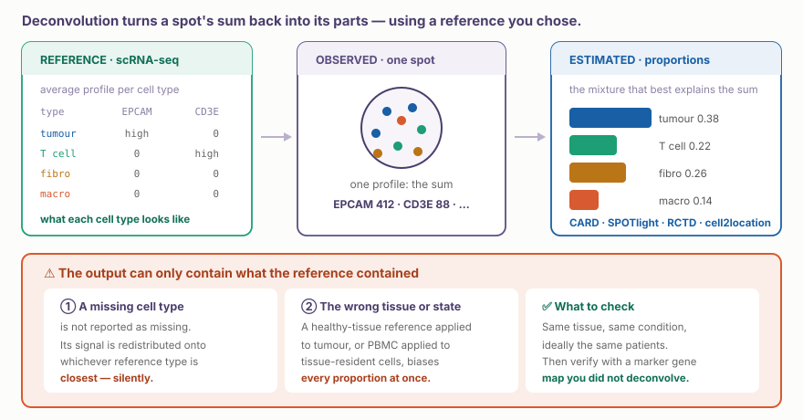
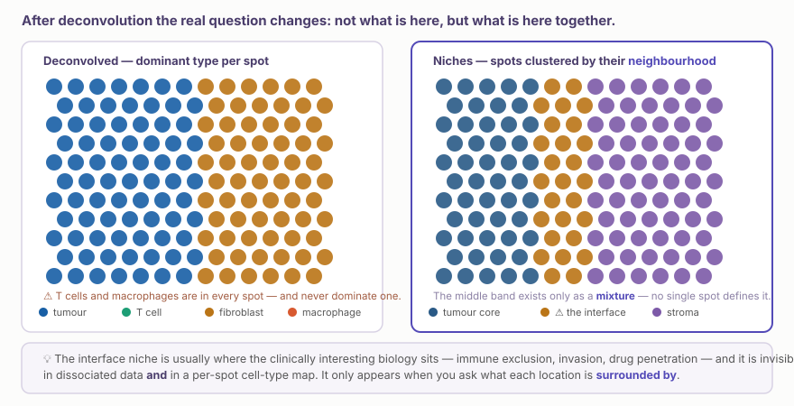
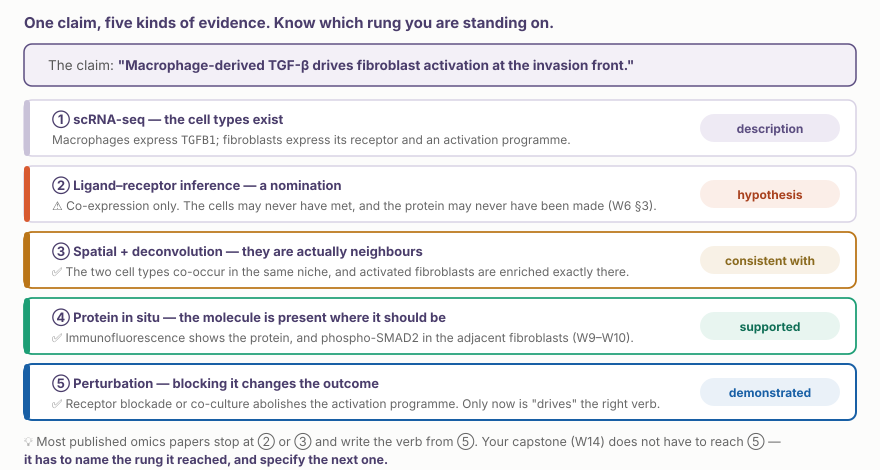

::: {.callout-note collapse="true"}
## 🎯 학습목표

이 장을 마치면 다음을 할 수 있어야 합니다.

-   deconvolution이 무엇을 추정하며 무엇은 추정할 수 없는지 설명할 수 있다
-   ⚠️ 참조 데이터셋이 답을 결정하는 이유와 참조를 신뢰하기 전에 확인할 사항을 말할 수 있다
-   세포 유형 지도와 **niche** 지도를 구분하고, 대개 두 번째 지도에 생물학적 의미가 있는 이유를 말할 수 있다
-   ⚠️ 조직 구조를 보존하는 귀무가설을 사용해 공위치(co-localisation)를 검정할 수 있다
-   ⚠️ 이웃한 spot이 유의성을 부풀리는 이유와 그 대처법을 말할 수 있다
-   모든 주장을 기술에서 입증까지의 근거 사다리 위에 놓을 수 있다
-   W5–W6에서 생성한 가설을 위한 공간 검증 단계를 설계할 수 있다
:::

> 🤔 **동기 질문**
>
> 4,000개 spot을 deconvolution한 결과 조절 T세포와 탈진 CD8 T세포가 함께 나타났습니다(*p* < 10⁻¹²). 이 p-value는 얼마나 많은 것을 알려 줍니까?

------------------------------------------------------------------------

# 1. Deconvolution 🧩 {#w8-s1}

## 1) 문제를 다시 정의하기 {#w8-s1-1}

🔗 [W7 §3](w7_spatial_basics.qmd#w7-s3)에서 살펴봤듯이 Visium spot은 **혼합물**입니다. Deconvolution은 각 세포 유형이 어떤 모습인지 정의하는 사전으로 단일세포 데이터를 사용해, 관측된 발현 profile을 가장 잘 설명하는 세포 유형의 혼합을 추정합니다.

{fig-align="center"}

| 방법 | 접근법 | 특징 |
|----------------------|--------------------|------------------------------|
| **RCTD** | 통계 모형, 플랫폼 효과를 모형화 | 견고하고 널리 사용됨 |
| **cell2location** | 베이지안, 절대 abundance 추정 | ✅ 비율뿐 아니라 세포 수도 제시 |
| **CARD** | spot 간 공간 상관관계 이용 | 이웃 spot의 정보를 함께 사용 |
| **SPOTlight** | NMF 기반 | 빠름 |
| **Tangram** | 단일세포를 공간에 배치 | 짝지어진 데이터가 있을 때 유용 |

💡 방법보다 참조 선택이 더 중요합니다. Benchmark에서 방법 간 성능 차이는 크지 않지만, 잘못된 참조는 답 전체를 바꿉니다.

## 2) ⚠️ 참조 편향 {#w8-s1-2}

::: {.callout-important collapse="true"}
## 오류 메시지 없이 발생하는 실패

Deconvolution은 **연구자가 제공한 세포 유형 안에서 합이 1이 되는** 비율을 반환합니다. “여기에는 내가 한 번도 본 적 없는 무언가가 있다”고 보고할 방법이 없습니다.

-   ⚠️ **참조에 없는 세포 유형**은 결측으로 나타나지 않습니다. 그 신호는 참조에서 가장 가까운 유형으로 재분배됩니다. 한 단계 아래에서 다시 나타나는 단일세포판 참조 편향입니다
-   ⚠️ **건강한 조직의 참조**를 종양에 적용하거나 PBMC 참조를 조직 상주 세포에 적용하면, 영향을 받는 유형만이 아니라 모든 비율이 동시에 편향됩니다
-   ⚠️ **다른 플랫폼의 참조**(Smart-seq 대 10x, 세포 대 핵)는 체계적인 차이를 추정치에 그대로 전달합니다

✅ 실제로 확인할 사항:

-   같은 조직, 같은 상태이며 가능하면 공간 절편과 **같은 환자**에서 얻은 참조인가?
-   Deconvolution에 사용하지 않은 표지 유전자로 검증하십시오. 원시 *CD3E*를 그려 T세포 비율과 같은 위치에 나타나는지 확인합니다
-   드물지만 중요한 세포 집단이 참조에 실제로 들어 있는지 확인하십시오
:::

## 3) 비율이 알려 주는 것과 알려 주지 못하는 것 {#w8-s1-3}

-   ✅ “이 영역은 저 영역보다 대식세포 신호가 풍부하다” — 견고한 주장
-   ✅ “대식세포 비율은 침윤 전선으로부터의 거리와 상관된다” — 견고하면서 흥미로운 주장
-   ⚠️ “이 spot에는 대식세포가 2.3개 있다” — cell2location과 같은 방법만 절대 세포 수를 추정하며, 불확실성도 큽니다
-   ❌ “바로 이 대식세포들이 유전자 X를 발현한다” — 훨씬 강한 가정 없이는 혼합물에서 세포 유형별 발현을 얻을 수 없습니다

------------------------------------------------------------------------

# 2. 세포 유형에서 Niche로 🏘️ {#w8-s2}

## 1) 공간 데이터가 실제로 답하기 위한 질문 {#w8-s2-1}

Spot별 세포 유형 지도는 유용하지만 여전히 한 번에 위치 하나만 봅니다. 기하학적 정보를 실제로 사용하는 단계는 각 위치가 **무엇에 둘러싸여 있는가**를 묻는 것입니다.

{fig-align="center"}

**작동 방식:** 각 spot에 대해 *k*개의 spot 또는 고정된 반경 안에 있는 이웃의 세포 유형 조성 벡터를 만들고, 그 벡터들을 클러스터링합니다. 이렇게 얻은 클러스터가 반복해서 나타나는 조직 미세환경인 **niche**입니다.

💡 왼쪽 패널이 무엇을 숨기는지 보십시오. T세포와 대식세포는 거의 어디에나 존재하지만 **거의 어디에서도 우세하지 않기** 때문에 “우세 세포 유형” 지도에서는 완전히 사라집니다. 정체성이 아니라 조성을 보아야 면역 생물학이 드러납니다.

## 2) ⚠️ 공위치를 정직하게 검정하기 {#w8-s2-2}

::: {.callout-warning collapse="true"}
## 어떤 귀무가설과 비교할 것인가?

“세포 유형 A와 B가 기대보다 자주 함께 나타난다”는 말에는 *기대*의 정의가 필요합니다.

-   ❌ **완전 공간 무작위성**은 잘못된 귀무가설입니다. 조직은 무작위가 아니라 층, 혈관, 피막, 샘 구조를 가집니다. 거의 모든 두 세포 유형이 이 귀무가설을 기각할 수 있습니다
-   ✅ 전체 구조와 각 세포 유형의 총 abundance를 보존하면서 **조직 안에서 표지를 순열화**하십시오
-   ✅ 또는 같은 해부학 구조와 다른 질병 상태를 가진 **짝지은 대조 조직**과 비교하십시오

⚠️ 동기 질문으로 돌아가면, 4,000개 spot에서 나온 *p* < 10⁻¹²는 대부분 spot이 4,000개였다는 사실을 말해 줍니다. 이웃 spot은 설계상 양의 상관관계를 가지므로(🔗 [W7 §4.3](w7_spatial_basics.qmd#w7-s4-3)) 유효 표본 수는 명목 표본 수보다 훨씬 작습니다.

→ ✅ 중요한 수치는 여러 **환자**에서 재현된 **효과크기**입니다.
:::

## 3) 단일세포를 공간에 배치하기 {#w8-s2-3}

반대 방향의 분석도 가능합니다. scRNA-seq에서 찾은 클러스터를 가져와 조직의 어디에 위치하는지 묻습니다.

-   **Tangram**, **Seurat anchor transfer** — 단일세포 표지를 공간 데이터에 투영합니다
-   ✅ 구체적 가설을 검정하는 데 실제로 유용합니다. *“우리가 찾은 탈진 CD8 상태는 종양 내부에 있는가, 경계에 있는가?”*
-   ⚠️ 순환논리의 위험이 있습니다. 클러스터를 정의한 유전자와 같은 유전자로 mapping했다면, 그 클러스터를 다시 찾은 것은 독립적인 근거가 아닙니다

------------------------------------------------------------------------

# 3. ⚠️ 근거 단계에서의 위치 🪜 {#w8-s3}

{fig-align="center"}

::: {.callout-tip collapse="true"}
## 공간 검증이 더해 주는 것과 더해 주지 못하는 것

공간 데이터는 주장을 **② 가설**에서 **③ 일치함**으로 올려 줍니다. 이는 실제로 의미 있는 상승이지만 증명은 아닙니다.

-   ✅ Ligand–receptor 추론에서 가장 흔한 실패, 즉 두 세포가 같은 장소에 한 번도 없었던 경우를 배제합니다
-   ✅ 임상의와 병리의사가 모두 읽을 수 있는 그림을 제공합니다
-   ❌ 단백질이 실제로 만들어졌음을 보여 주지 않으며(④단계), 인과성을 입증하지도 않습니다(⑤단계)

💡 전공의 연구에서 ③은 흔히 정직하면서 달성 가능한 최고 단계입니다. ③이라고 명시하면 출판할 수 있습니다. 논문을 무너뜨리는 것은 ③의 근거 위에 ⑤의 동사를 쓰는 일입니다.
:::

------------------------------------------------------------------------

# 4. 공간 연구 설계 📋 {#w8-s4}

이제 공간 연구를 설계하는 데 필요한 내용을 갖추었습니다. 순서가 중요합니다.

**① 플랫폼이 아니라 가설에서 시작하십시오.** “몇몇 종양에 spatial을 하겠다”는 설계가 아닙니다. “비반응자에서 TAM이 풍부한 niche가 CD8 T세포를 배제하는지 검정하겠다”는 설계입니다.

**② 가설에 필요한 해상도를 결정하십시오**(🔗 [W7 §2.3](w7_spatial_basics.qmd#w7-s2-3)). 질문이 “두 세포 유형이 접촉하는가?”라면 어떤 분석을 하더라도 spot 기반 데이터만으로는 답할 수 없습니다.

**③ 절편이 아니라 환자 수를 세십시오.**

| 설계 | 유효 n | 판단 |
|--------------------------|----------------|-----------------------------|
| 절편 3장, 환자 1명 | 1 | ❌ spot 4,000개가 있는 증례보고 |
| 환자 6명, 각 절편 1장 | 6 | ⚠️ 예비 연구이며 그렇게 보고해야 함 |
| 결과에 따라 선택한 환자 20명, 각 절편 1장 | 20 | ✅ 연구 |

**④ 가능하면 결과에 따라 증례를 선택하십시오.** 보관 검체에서 반응자와 비반응자를 선택하는 설계는 동의한 환자를 연속적으로 모집하는 것보다 강하며, FFPE 덕분에 가능합니다(🔗 [W7 §2.2](w7_spatial_basics.qmd#w7-s2-2)).

**⑤ 연구를 확정하기 전에 짝지은 단일세포 참조를 확보하십시오.** 같은 조직과 상태에서 얻은 참조를 사용하고, 없다면 생성 비용을 예산에 포함하십시오.

**⑥ 병리의사 일정을 가장 먼저 잡으십시오.** 블록 선택은 과학적 의사결정이며 한 번만 할 수 있습니다.

------------------------------------------------------------------------

# 5. 실습 💻 {#w8-s5}

## 1) Deconvolution 후 참조 확인 {#w8-s5-1}

```{r}
library(Seurat); library(spacexr); library(tidyverse)   # spacexr = RCTD

sp  <- readRDS(here::here("analysis", "7_visium.rds"))
ref <- readRDS(here::here("analysis", "5_pbmc_annotated.rds"))   # ⚠️ is this the right reference?

reference <- Reference(GetAssayData(ref, "counts"), factor(ref$cell_type))
puck      <- SpatialRNA(GetTissueCoordinates(sp), GetAssayData(sp, "counts"))

rctd <- create.RCTD(puck, reference, max_cores = 4) |> run.RCTD(doublet_mode = "full")
props <- normalize_weights(rctd@results$weights)
```

⚠️ **결과를 믿기 전에** PBMC 참조를 조직 절편에 사용한다는 것이 무엇을 뜻하는지 물어보십시오. 조직 상주 대식세포, 섬유아세포, 내피세포는 참조에 없습니다. 이들의 신호는 어디로 갔습니까?

## 2) ✅ 반사적으로 해야 할 검증 {#w8-s5-2}

```{r}
# Plot a raw marker gene next to the estimated proportion of its cell type
p1 <- SpatialFeaturePlot(sp, features = "CD3E") + ggtitle("raw CD3E")
sp$Tcell_prop <- props[, "CD8 T"]
p2 <- SpatialFeaturePlot(sp, features = "Tcell_prop") + ggtitle("estimated CD8 T")
p1 | p2
```

💡 두 지도가 일치하지 않는다면 deconvolution 결과는 조직이 아니라 참조에 관해 말하고 있는 것입니다.

## 3) Niche {#w8-s5-3}

```{r}
library(FNN)

coords <- GetTissueCoordinates(sp)
nn     <- get.knn(as.matrix(coords), k = 6)$nn.index

# neighbourhood composition per spot
nbr_comp <- t(apply(nn, 1, \(idx) colMeans(props[idx, , drop = FALSE])))

set.seed(1)
sp$niche <- factor(kmeans(nbr_comp, centers = 5)$cluster)
SpatialDimPlot(sp, group.by = "niche")
```

## 4) ✅ 한 가지 바꾸기 {#w8-s5-4}

```{r}
# Does your co-localisation survive a structure-preserving null?
observed <- cor(props[, "CD8 T"], props[, "Macrophage"])

null <- replicate(1000, {
  perm <- sample(nrow(props))          # ⚠️ a naive permutation — discuss why this is still too easy
  cor(props[perm, "CD8 T"], props[, "Macrophage"])
})

cat("observed:", round(observed, 3),
    " null 95%:", round(quantile(null, c(.025, .975)), 3), "\n")
```

⚠️ 이제 논의해 보십시오. 이 순열은 **모든** 조직 구조를 파괴하므로 §2.2에서 말한 지나치게 쉬운 귀무가설입니다. 더 나은 귀무가설은 어떤 모습일까요? 힌트: 해부학적 영역 안에서만 순열화하거나 전체 표지 지도를 그대로 평행 이동하십시오.

## 5) 다음 주 전까지 {#w8-s5-5}

**[W9 — 단백체학](../part5/w9_proteomics_tech.qmd).** 지금까지는 모두 RNA를 측정했습니다. 다음에는 단백질이 실제로 만들어졌는지 묻고, 답이 ‘아니오’인 경우가 얼마나 많은지 살펴봅니다.

설치할 것은 없습니다. W9은 개념 중심 수업입니다.

------------------------------------------------------------------------

# 📝 요약

-   Deconvolution은 단일세포 **참조**를 사용해 각 spot의 세포 유형 혼합을 추정합니다
-   ⚠️ **참조가 답을 결정합니다.** 참조에 없는 세포 유형은 가장 가까운 이웃 유형으로 조용히 재분배됩니다
-   ✅ 참조의 조직, 상태, 플랫폼, 환자를 확인하고 deconvolution에 쓰지 않은 표지 유전자로 검증하십시오
-   우세 세포 유형 지도는 어디에나 있지만 어느 곳에서도 우세하지 않은 세포를 숨깁니다. 보통 면역세포 구획이 여기에 해당합니다
-   ✅ 이웃 조성으로 spot을 클러스터링한 **niche**에 공간 생물학이 있습니다
-   ⚠️ 완전 공간 무작위성은 잘못된 귀무가설입니다. 조직 구조 안에서 순열화하거나 짝지은 대조 조직과 비교하십시오
-   ⚠️ 수천 개 spot은 p-value를 부풀립니다. 여러 **환자**에서 재현된 **효과크기**가 핵심입니다
-   공간 검증은 주장을 *가설*에서 *일치함*으로 올리지만 *입증됨*으로 올리지는 않습니다
-   ✅ 가설에서 설계를 시작하고, 절편이 아니라 환자를 세며, 결과에 따라 증례를 선택하고, 병리의사를 먼저 섭외하십시오

------------------------------------------------------------------------

# 🔑 핵심 용어

| 용어 | 한 줄 정의 |
|-------------------------|-----------------------------------------|
| Deconvolution | 혼합된 spot 안의 세포 유형 비율 추정 |
| 참조(reference) | 각 세포 유형의 모습을 정의하는 단일세포 데이터셋 |
| 참조 편향 | 참조에 없는 것은 결과에 나타날 수 없는 현상 |
| RCTD / cell2location / CARD | 대표적인 deconvolution 방법 |
| 절대 abundance | 비율이 아니라 추정된 세포 수 |
| Niche / 이웃 | 한 위치 주변에서 반복되는 국소 조성 |
| 공위치(co-localisation) | 두 세포 유형이 기대보다 자주 함께 나타나는 현상 |
| 구조 보존 귀무가설 | 조직 구조를 유지하는 순열 |
| Label transfer | 단일세포 주석을 공간 데이터에 투영하는 방법 |
| 유효 표본 수 | 실제로 서로 독립적인 관측치의 수 |
| 근거 사다리 | 기술 → 가설 → 일치함 → 지지됨 → 입증됨 |

------------------------------------------------------------------------

# ➕ 참고문헌

### Deconvolution

Cable DM, et al. [*Robust decomposition of cell type mixtures in spatial transcriptomics.*](https://doi.org/10.1038/s41587-021-00830-w) Nat Biotechnol. 2022. (RCTD)\
Kleshchevnikov V, et al. [*Cell2location maps fine-grained cell types in spatial transcriptomics.*](https://doi.org/10.1038/s41587-021-01139-4) Nat Biotechnol. 2022.\
Ma Y, Zhou X. [*Spatially informed cell-type deconvolution for spatial transcriptomics.*](https://doi.org/10.1038/s41587-022-01273-7) Nat Biotechnol. 2022. (CARD)\
Li B, et al. [*Benchmarking spatial and single-cell transcriptomics integration methods for transcript distribution prediction and cell type deconvolution.*](https://doi.org/10.1038/s41592-022-01480-9) Nat Methods. 2022. **← 방법 간 차이가 얼마나 작고 참조의 영향이 얼마나 큰지 보여 주는 연구**

### Niche와 공간 통계

Palla G, et al. [*Squidpy: a scalable framework for spatial omics analysis.*](https://doi.org/10.1038/s41592-021-01358-2) Nat Methods. 2022.\
Schürch CM, et al. [*Coordinated cellular neighborhoods orchestrate antitumoral immunity at the colorectal cancer invasive front.*](https://doi.org/10.1016/j.cell.2020.07.005) Cell. 2020. **← ‘이웃’을 분석 단위로 만든 논문**\
Chen Z, Soifer I, Hilton H, Keren L, Jojic V. [*Modeling multiplexed images with spatial-LDA reveals novel tissue microenvironments.*](https://doi.org/10.1089/cmb.2019.0340) J Comput Biol. 2020.

### 통합과 연구 설계

Longo SK, et al. [*Integrating single-cell and spatial transcriptomics to elucidate intercellular tissue dynamics.*](https://doi.org/10.1038/s41576-021-00370-8) Nat Rev Genet. 2021.\
Biancalani T, et al. [*Deep learning and alignment of spatially resolved single-cell transcriptomes with Tangram.*](https://doi.org/10.1038/s41592-021-01264-7) Nat Methods. 2021.
