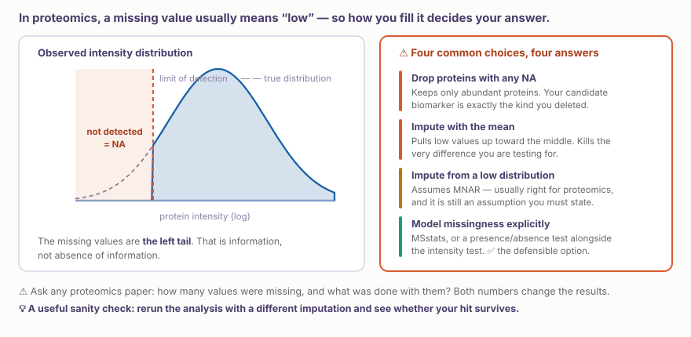
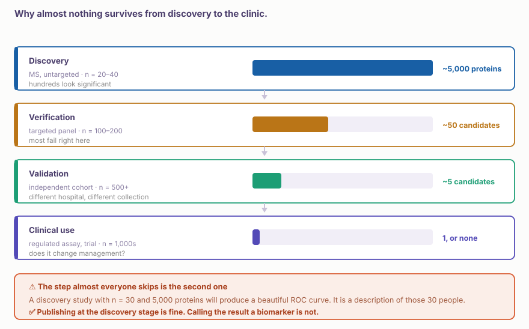
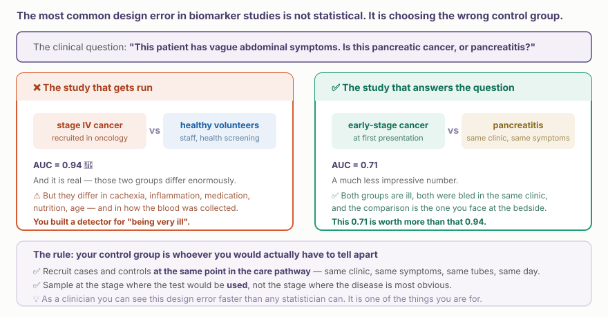

::: {.callout-note collapse="true"}
## 🎯 학습목표

이 장을 마치면 다음을 할 수 있어야 합니다.

-   ⚠️ 단백체학의 결측값이 무작위 결측이 아닌 이유와 대치법 선택이 결론을 어떻게 바꾸는지 설명할 수 있다
-   `limma`로 차등 abundance 분석을 수행하고, 이것이 단순한 t-test가 아닌 이유를 말할 수 있다
-   ⚠️ 바이오마커 주장을 발견 → 확인 → 검증 → 임상의 단계에 놓을 수 있다
-   ⚠️ 잘못된 대조군 오류를 알아보고 이를 피하도록 연구를 설계할 수 있다
-   발견 연구에서 AUC 0.94라는 결과가 얼마나 가치 있는지 말할 수 있다
-   진단, 예후, 예측 바이오마커를 구분하고 연구가 실제로 어느 것을 검정했는지 말할 수 있다
-   소속 진료과에서 수행할 수 있는 바이오마커 연구 설계를 작성할 수 있다
:::

> 🤔 **동기 질문**
>
> 한 논문에서 혈장 단백질 하나가 췌장암 환자와 건강한 대조군을 AUC = 0.94로 구분한다고 보고했습니다. 막연한 복통을 호소하는 눈앞의 환자에게 이 검사를 처방하시겠습니까?

------------------------------------------------------------------------

# 1. ⚠️ 결측값을 가장 먼저 다루십시오 🕳️ {#w10-s1}

단백체학에서는 통계 분석 전에 전사체학에는 없는 결정을 내려야 합니다.

{fig-align="center"}

## 1) 결측이 무작위가 아닌 이유 {#w10-s1-1}

어떤 run에서 단백질이 결측되는 주된 이유는 **검출한계보다 낮았기 때문**, 즉 abundance가 낮았기 때문입니다. 통계학에서는 이를 **MNAR**(missing not at random)이라고 하며, 대부분의 기본 방법이 가정하는 것과 정반대입니다.

-   ⚠️ **DDA는 여기에 기술적 결측을 한 층 더 추가합니다**(🔗 [W9 §2.2](w9_proteomics_tech.qmd#w9-s2-2)). 단백질이 낮아서가 아니라 선택되지 않아 결측될 수 있습니다
-   ✅ **DIA 데이터는 이 점에서 훨씬 깨끗합니다.** 현재 DIA가 기본 선택이 된 가장 큰 이유입니다

## 2) 네 가지 선택과 각 선택이 결과에 미치는 영향 {#w10-s1-2}

::: {.callout-important collapse="true"}
## 각각은 정리 단계가 아니라 가정입니다

-   ❌ **결측값이 하나라도 있는 단백질을 제외한다.** Abundance가 높고 거의 모든 검체에서 검출되는 단백질만 남깁니다. 새로운 바이오마커가 나올 법한 집합과 정확히 반대입니다
-   ❌ **행 평균으로 대치한다.** 낮은 값이 중앙으로 올라가 검정하려는 차이를 바로 축소합니다
-   ⚠️ **낮은 분포에서 값을 뽑아 대치한다**(예: Perseus의 평균을 이동시키고 폭을 좁힌 정규분포). 대개 MNAR 기전에 합리적으로 맞지만, 여전히 Methods section에 명시해야 할 가정입니다
-   ✅ **결측을 명시적으로 모형화한다.** `MSstats`를 사용하거나 intensity 검정과 함께 존재/부재 검정을 보고하십시오. NA도 데이터라는 사실을 숨기지 않으므로 가장 방어 가능한 접근입니다

💡 **반사적으로 해야 할 확인:** 다른 대치법으로 다시 분석해 결과가 살아남는지 보십시오. 살아남지 않는다면 심사자가 지적하기 전에 중요한 사실을 알아낸 것입니다.
:::

------------------------------------------------------------------------

# 2. 차이 검정 📊 {#w10-s2}

## 1) t-test가 아니라 `limma`를 사용하는 이유 {#w10-s2-1}

단백체 데이터셋은 넓고 짧습니다. 단백질은 수천 개지만 검체는 수십 개입니다. 단백질별 t-test는 각 분산 추정치가 매우 적은 관측치에 의존하므로 불안정합니다.

`limma`는 **경험적 베이즈(empirical Bayes)**를 사용해 각 단백질의 분산을 전체 추세 쪽으로 축소합니다. 우연히 매우 일정해 보이는 단백질이 자동으로 유의하다고 판정되지 않게 합니다.

```{r}
library(limma); library(tidyverse)

# mat: log2 intensities, proteins × samples. meta: one row per sample.
design <- model.matrix(~ condition + sex + age + batch, data = meta)   # ⚠️ batch belongs here

fit <- lmFit(mat, design) |> eBayes(trend = TRUE, robust = TRUE)
res <- topTable(fit, coef = "conditionCase", number = Inf) |>
  as_tibble(rownames = "protein")
```

-   ✅ `trend = TRUE`는 MS 데이터에 전형적인 intensity–variance 관계를 반영합니다
-   ⚠️ 설계에 **batch, sex, age**를 포함하십시오. 모형에서 빼도 이 변수들이 사라지지는 않습니다
-   ✅ 기술 반복이나 fractionation이 있는 MS 설계에서는 **`MSstats`**가 계층 구조를 올바르게 모형화합니다

## 2) 보고할 내용 {#w10-s2-2}

-   효과크기(log2 fold change)와 보정 p-value를 **함께** 보고하십시오. 지난 학기 DESeq2에서와 같은 원칙입니다
-   검정한 단백질 수와 결측 때문에 제외한 단백질 수를 보고하십시오. ⚠️ 다중검정은 살아남은 단백질이 아니라 검정한 단백질 전체를 기준으로 합니다(🔗 [W2 §2.4](../part1/w2_scripts_ai.qmd#w2-s2-4))
-   다른 대치법에서도 결과가 유지되는지 보고하십시오

------------------------------------------------------------------------

# 3. ⚠️ 차이에서 바이오마커로 🪜 {#w10-s3}

집단 간 유의한 차이는 매우 긴 과정의 시작입니다.

{fig-align="center"}

## 1) 자주 혼동되는 세 종류의 바이오마커 {#w10-s3-1}

| 종류 | 질문 | 필요한 것 |
|--------------------|--------------------------|--------------------------|
| **진단** | 이 환자가 *지금* 질병을 가지고 있는가? | 내원 시점의 환자군과 올바른 감별진단군 |
| **예후** | 이 환자에게 앞으로 어떤 일이 생길 것인가? | 추적관찰, 임상 결과, 생존모형 |
| **예측** | 이 환자가 *이* 약물에 반응할 것인가? | ⚠️ 치료군과 비치료군. 그렇지 않으면 치료 반응 예측과 예후를 구분할 수 없음 |

⚠️ **예측 바이오마커가 가장 어렵지만 가장 자주 주장됩니다.** “반응자는 비반응자보다 수치가 높았다”는 결과는 표지자가 치료와 무관하게 단지 예후가 좋은 질병을 나타내는 경우와도 양립합니다.

## 2) ⚠️ AUC 0.94가 아무 가치도 없을 수 있는 이유 {#w10-s3-2}

{fig-align="center"}

::: {.callout-warning collapse="true"}
## 동기 질문으로 돌아가기

그 연구만으로는 **처방하지 않습니다**.

논문은 진행성 암 환자와 건강한 자원자를 비교했습니다. 눈앞의 환자는 어느 쪽에도 속하지 않습니다. 진료에서 유용하려면 표지자가 **내원 시점의 조기 암과 이를 모방하는 질환을 구분**해야 합니다.

그 아래에는 두 번째 문제가 숨어 있습니다. 환자군은 종양 병동에서, 대조군은 건강검진센터에서 채혈했다면 채혈 tube, 처리까지 걸린 시간, 공복 여부가 집단 간에 모두 체계적으로 다릅니다(🔗 [W9 §5](w9_proteomics_tech.qmd#w9-s5)). AUC의 일부는 **어디에서 채혈했는가**를 측정한 것입니다.

→ ✅ 환자군과 대조군을 같은 진료 경로의 같은 시점, 같은 장소, 같은 tube로 채취했는지 물어보십시오.
:::

## 3) 진료 현장에서는 유병률이 모든 것을 바꿉니다 {#w10-s3-3}

AUC는 유병률과 무관하지만 **양성예측도는 그렇지 않습니다**.

```
민감도 90%, 특이도 90%:

  유병률 50%(임상시험 코호트)    →  PPV ≈ 90%
  유병률  1%(선별검사 진료소)    →  PPV ≈  8%
```

⚠️ 같은 검사입니다. 양성 결과 100건 중 92건이 거짓양성이며, 모두 CT 검사를 받게 됩니다.

💡 이 계산은 여러분이 할 수 있지만 생물정보학자는 할 수 없습니다. **여러분의** 진료 현장 유병률이 필요하기 때문입니다.

------------------------------------------------------------------------

# 4. 실제로 수행할 수 있는 연구 설계 📋 {#w10-s4}

**① 임상적 의사결정을 명시하십시오.** “X의 바이오마커를 찾는다”가 아니라 *“현재 추측해야 하는 바로 그 시점에 A와 B를 구분한다”*라고 쓰십시오.

**② 대조군을 명시**하고 실제로 구별해야 하는 집단을 선택하십시오.

**③ 첫 검체를 받기 전에 채취 protocol을 확정하십시오.** 같은 tube, 같은 원심분리까지 걸린 시간, 같은 aliquot 부피, 기록된 동결–해동 횟수를 한 페이지에 적으십시오.

**④ Batch에 무작위 배정하십시오.** 🔗 [W1 §3.3](../part1/w1_intro.qmd#w1-s3-3) — 여기에서 가장 큰 문제가 됩니다.

**⑤ 어떤 결과도 보기 전에 검증 세트를 따로 떼어 두십시오.** 환자 단위로 나누고, 가능하면 모집 기관 또는 기간으로 나누십시오.

**⑥ 무엇을 성공으로 볼지 미리 정하십시오.** AUC 기준이 아니라 어떤 의사결정이 바뀌는지로 정의하십시오.

::: {.callout-tip collapse="true"}
## 전공의가 실제로 수행할 수 있는 형태

시작하기 위해 새로운 전향적 코호트가 꼭 필요한 것은 아닙니다.

-   ✅ 많은 병원에서 잔여 혈청 또는 혈장을 보관합니다. 무엇이 어떤 동의 아래 보관되어 있는지 확인하십시오
-   ✅ 반응자 대 비반응자, 재발 대 비재발처럼 **결과에 따라 선택한** 후향적 검체 집합은 연속 모집보다 강한 설계이며 이미 추적관찰 결과가 연결되어 있습니다
-   ⚠️ 주의점: 보관 검체는 당시의 조건으로 채취되었으므로 분석 전 변이가 실제 위험입니다. 채취 과정이 protocol화되어 있었는지 확인하십시오
-   ✅ 보관 검체 300개를 affinity panel로 분석하는 것이 새로운 검체 30개를 MS로 분석하는 것보다 저렴하면서 훨씬 유용할 수 있습니다
:::

------------------------------------------------------------------------

# 5. 실습 💻 {#w10-s5}

## 1) 결측을 의도적으로 처리하기 {#w10-s5-1}

⚠️ 이 데이터셋은 모의 데이터입니다. 환자 검체를 공유할 수 없으며 **batch와 condition이 부분적으로 교락**되어 있습니다. B1에는 대조군 28명과 환자군 12명, B2에는 그 반대가 들어 있습니다. 환자군과 대조군을 서로 다른 시기에 수집한 실제 보관 코호트의 모습을 의도적으로 재현한 것입니다.

```{r}
library(tidyverse); library(limma)

prot <- readRDS(here::here("rawdata", "plasma_proteomics.rds"))  # proteins × samples, log2
meta <- readRDS(here::here("rawdata", "plasma_meta.rds"))

table(meta$batch, meta$condition)    # ⚠️ look at this before anything else

# ⚠️ Look before deciding
miss <- rowMeans(is.na(prot))
hist(miss, breaks = 40, main = "Fraction missing per protein")

# Is missingness related to abundance? (if yes → MNAR)
plot(rowMeans(prot, na.rm = TRUE), miss,
     xlab = "mean intensity", ylab = "fraction missing", pch = 16, col = "#185FA5")
```

💡 두 번째 그림에서 뚜렷한 음의 추세가 보인다면 그것이 바로 MNAR의 근거입니다. Supplement에 제시하십시오.

## 2) 중요한 공변량을 포함해 검정하기 {#w10-s5-2}

```{r}
keep <- miss < 0.30                       # state this threshold in the methods
mat  <- prot[keep, ]

design <- model.matrix(~ condition + age + sex + batch, data = meta)
fit    <- lmFit(mat, design) |> eBayes(trend = TRUE, robust = TRUE)
res    <- topTable(fit, coef = "conditionCase", number = Inf) |>
  as_tibble(rownames = "protein")

sum(res$adj.P.Val < 0.05)
```

## 3) ✅ 한 가지를 세 번 바꾸기 {#w10-s5-3}

```{r}
# ① Drop batch from the design. How many hits change?
#    (you should go from ~40 proteins to ~209 — that gap is 169 false positives)
# ② Impute from a low distribution instead of filtering. Do the top 10 survive?
# ③ Split by patient into train/test, fit on train, evaluate AUC on test.
#    Compare that AUC with the one from the full dataset.
```

⚠️ ③이 가장 중요합니다. 표본 내 AUC와 별도로 보관한 데이터의 AUC 차이가 과적합의 크기이며, 보통 예상보다 큽니다.

## 4) 설계 과제 계속하기 {#w10-s5-4}

🔗 [W9 §6.3](w9_proteomics_tech.qmd#w9-s6-3)에서 작성한 다섯 문장에 다음 내용을 추가하십시오.

-   실제로 필요한 **대조군**
-   결과가 바꿀 **의사결정**
-   검사를 사용할 진료 현장에서 질환의 **유병률**

W14에 가져오십시오. 충분히 타당한 종합 프로젝트가 됩니다.

------------------------------------------------------------------------

# 📝 요약

-   ⚠️ **단백체학의 결측값은 대부분 ‘너무 낮아서 검출되지 않음’**을 뜻합니다. MCAR가 아니라 MNAR입니다
-   ❌ NA가 있는 단백질을 제외하면 abundance가 높은 단백질만 남고, ❌ 평균 대치는 검정하려는 효과를 축소합니다
-   ✅ 낮은 분포에서 대치하거나 결측을 명시적으로 모형화하고(`MSstats`), **어떤 방법을 사용했는지 명시**하십시오
-   ✅ 다른 대치법으로 다시 분석하십시오. 결과가 유지되지 않는다면 심사자보다 먼저 알아내는 편이 낫습니다
-   경험적 베이즈를 사용하는 `limma`는 단백질별 t-test보다 안정적입니다. ⚠️ 설계에 batch, age, sex를 포함하십시오
-   ⚠️ 발견 → 확인 → 검증 → 임상. **각 단계에서 약 90%가 탈락**하며 두 번째 단계를 가장 자주 건너뜁니다
-   ⚠️ **진단, 예후, 예측은 서로 다른 주장입니다.** 예측에는 비치료군이 필요합니다
-   ⚠️ **건강한 자원자와 비교한 AUC 0.94는 매우 아픈 상태를 탐지한 값일 수 있으며**, 일부는 채혈 장소를 반영할 수 있습니다
-   ✅ 대조군은 실제로 구분해야 할 사람들이며, 같은 진료 경로의 같은 시점에 채취해야 합니다
-   ⚠️ **낮은 유병률에서는 PPV가 무너집니다.** 민감도·특이도 90%인 검사를 유병률 1% 집단에 쓰면 PPV는 약 8%입니다
-   ✅ 결과에 따라 선택한 보관 검체와 affinity panel의 조합은 전공의에게 현실적인 시작점입니다

------------------------------------------------------------------------

# 🔑 핵심 용어

| 용어 | 한 줄 정의 |
|-------------------------|-----------------------------------------|
| MNAR / MCAR | 무작위가 아닌 결측 / 완전 무작위 결측 |
| Left-censoring | 검출한계보다 낮은 값을 결측으로 기록하는 것 |
| Imputation | 결측값을 채우는 과정으로, 선택한 방법마다 가정이 따름 |
| MSstats | 결측과 연구 설계를 함께 모형화하는 단백체학 패키지 |
| Empirical Bayes | 단백질별 분산을 전체 분산 추세 쪽으로 축소하는 방법(`limma`) |
| Discovery / verification / validation | 바이오마커가 임상에 도달하기 전에 거치는 발견·확인·검증의 세 단계 |
| Diagnostic biomarker | 환자가 현재 질병을 가지고 있는지 판별하는 지표 |
| Prognostic biomarker | 치료와 무관하게 앞으로 일어날 결과를 예측하는 지표 |
| Predictive biomarker | 특정 환자가 특정 치료로 이득을 볼지 예측하는 지표 |
| Comparator group | 검사가 환자군과 실제로 구분해야 하는 비교 집단 |
| PPV | 검사 양성인 사람 중 실제 환자의 비율로, 유병률에 따라 달라짐 |
| Overfitting | 별도로 보관한 코호트에서는 유지되지 않는 과도하게 낙관적인 성능 |

------------------------------------------------------------------------

# ➕ 참고문헌

### 결측값과 통계

Lazar C, et al. [*Accounting for the multiple natures of missing values in label-free quantitative proteomics data sets.*](https://doi.org/10.1021/acs.jproteome.5b00981) J Proteome Res. 2016. **← 단백체학의 MNAR와 MCAR를 다룬 핵심 문헌**\
Choi M, et al. [*MSstats: an R package for statistical analysis of quantitative mass spectrometry-based proteomic experiments.*](https://doi.org/10.1093/bioinformatics/btu305) Bioinformatics. 2014.\
Ritchie ME, et al. [*limma powers differential expression analyses for RNA-sequencing and microarray studies.*](https://doi.org/10.1093/nar/gkv007) Nucleic Acids Res. 2015.

### 바이오마커 개발과 실패

Pepe MS, et al. [*Phases of biomarker development for early detection of cancer.*](https://doi.org/10.1093/jnci/93.14.1054) J Natl Cancer Inst. 2001. **← 문제를 가장 명확히 설명하는 5단계 framework**\
Ioannidis JPA, Bossuyt PMM. [*Waste, leaks, and failures in the biomarker pipeline.*](https://doi.org/10.1373/clinchem.2016.254649) Clin Chem. 2017.\
Geyer PE, et al. [*Revisiting biomarker discovery by plasma proteomics.*](https://doi.org/10.15252/msb.20156297) Mol Syst Biol. 2017.\
Collins GS, et al. [*Transparent reporting of a multivariable prediction model for individual prognosis or diagnosis (TRIPOD).*](https://doi.org/10.7326/M14-0697) Ann Intern Med. 2015. **← 논문 작성에 사용할 보고 지침**

### 연구 설계

Bossuyt PM, et al. [*STARD 2015: an updated list of essential items for reporting diagnostic accuracy studies.*](https://doi.org/10.1136/bmj.h5527) BMJ. 2015.\
Rifai N, Gillette MA, Carr SA. [*Protein biomarker discovery and validation: the long and uncertain path to clinical utility.*](https://doi.org/10.1038/nbt1235) Nat Biotechnol. 2006.
