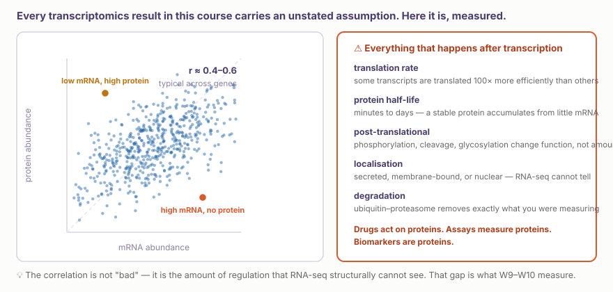
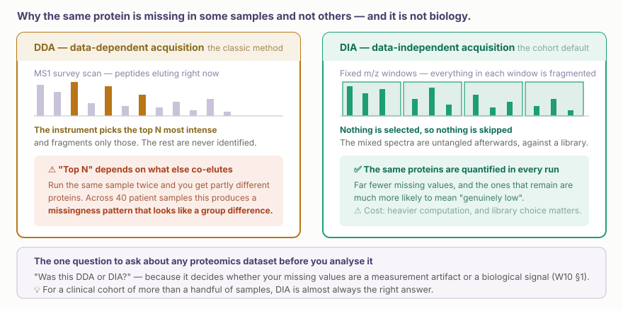
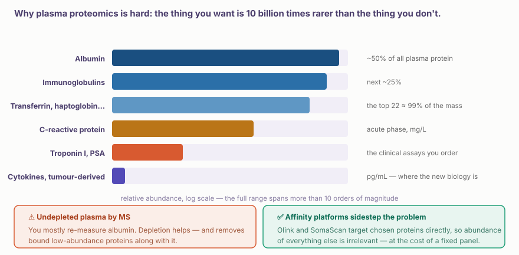
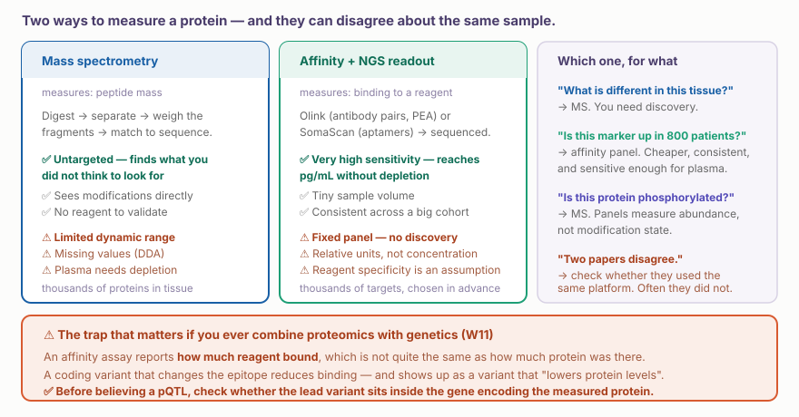

::: {.callout-note collapse="true"}
## 🎯 학습목표

이 장을 마치면 다음을 할 수 있어야 합니다.

-   ⚠️ mRNA가 단백질의 제한적인 대리 지표인 이유를 말하고 그 한계의 크기를 수치로 설명할 수 있다
-   질량분석기가 무엇을 측정하는지 모호한 표현 없이 한 문단으로 설명할 수 있다
-   ⚠️ DDA가 생물학적 신호처럼 보이는 결측값을 만드는 이유를 설명할 수 있다
-   혈장이 단백체학에서 가장 어렵지만 임상적으로 가장 유용한 검체인 이유를 말할 수 있다
-   연구 질문에 따라 질량분석과 affinity panel 중 하나를 선택할 수 있다
-   ⚠️ 거짓 pQTL을 만드는 epitope artifact를 알아볼 수 있다
-   단백체 코어 시설에 연구의 성패를 결정하는 세 가지 질문을 할 수 있다
:::

> 🤔 **동기 질문**
>
> RNA-seq에서 반응자의 유전자 발현이 3배 높았습니다. 공동연구자가 단백질을 측정했지만 차이가 없었습니다. 어느 결과가 틀렸습니까?

------------------------------------------------------------------------

# 1. ⚠️ 지금까지 모든 분석이 의존한 가정 🧬 {#w9-s1}

## 1) mRNA는 단백질을 얼마나 잘 예측하는가? {#w9-s1-1}

{fig-align="center"}

한 검체 안에서 유전자별 mRNA와 단백질 abundance의 상관계수는 보통 약 **r = 0.4–0.6**입니다. 하나의 유전자를 여러 검체에서 비교한 상관성은 유전자마다 크게 다릅니다. 어떤 유전자는 강하지만 다른 유전자는 사실상 0입니다.

::: {.callout-important collapse="true"}
## 동기 질문의 두 결과는 모두 틀리지 않았습니다

서로 다른 것을 측정한 결과입니다.

-   RNA-seq은 **전사와 전사체 안정성**을 측정했습니다
-   단백질 검사는 **번역, 접힘, 분비, 분해의 균형**을 측정했습니다

mRNA가 3배 증가했지만 단백질에는 변화가 없는 것은 실제로 해석할 수 있는 결과입니다. 전사 이후의 어떤 과정이 그 변화를 완충하고 있습니다. 이는 두 결과가 일치했을 때보다 더 흥미로울 수 있습니다.

⚠️ 문제는 불일치 자체가 아닙니다. RNA-seq 결과를 마치 단백질에 관한 진술인 것처럼 작성한 것이 문제입니다.
:::

## 2) 이것이 기술적으로만 아니라 임상적으로도 중요한 이유 {#w9-s1-2}

-   **약물은 단백질에 작용합니다.** 전사체 데이터만으로 표적을 선정했다면 한 단계를 건너뛴 것입니다
-   **진료에서 처방하는 모든 바이오마커 검사**, 즉 troponin, PSA, CRP, HbA1c는 단백질 또는 단백질 변형을 측정합니다
-   **번역후 변형은 RNA-seq에서 보이지 않습니다.** 인산화, 절단, 당화는 단백질의 양을 바꾸지 않고도 단백질이 *무엇을 하는지* 바꿉니다
-   **분비도 보이지 않습니다.** 세포는 cytokine을 전사하고도 분비하지 않을 수 있습니다(🔗 [W6 §3](../part3/w6_scrna_dynamics.qmd#w6-s3))

------------------------------------------------------------------------

# 2. 질량분석기가 하는 일 🔬 {#w9-s2}

## 1) 측정 과정을 정확히 말하기 {#w9-s2-1}

질량분석기는 단백질 서열을 읽지 않습니다. 전하를 띤 조각의 질량을 매우 정밀하게 측정하고, 소프트웨어가 그 질량으로부터 서열을 추론합니다.

```
단백질 혼합물
   → trypsin으로 분해          (단백질은 너무 크지만 peptide는 그렇지 않음)
   → 액체 크로마토그래피       (시간에 따라 peptide를 분리)
   → MS1: peptide 질량 측정    (현재 용출되는 물질을 조사)
   → MS2: 분해 후 질량 측정    (조각의 패턴으로 서열을 식별)
   → 데이터베이스와 대조       → 단백질의 정체와 양
```

⚠️ 이후 분석에 중요한 세 가지 결과가 이 설계에서 따라옵니다.

-   **Peptide를 측정하고 단백질을 추론합니다.** 단백질 family가 공유하는 peptide는 모호성을 만듭니다
-   **식별은 데이터베이스에 의존합니다.** 데이터베이스에 없는 단백질 형태는 찾을 수 없습니다
-   표지된 표준물질을 첨가하지 않는 한 **정량은 상대적**입니다

## 2) ⚠️ DDA와 DIA — 통계를 결정하는 차이 {#w9-s2-2}

{fig-align="center"}

::: {.callout-warning collapse="true"}
## DDA의 결측이 위험한 이유

DDA에서는 장비가 각 cycle에서 intensity가 가장 높은 precursor를 선택합니다. 무엇이 “가장 높은가”는 같은 순간에 함께 용출되는 다른 모든 물질에 따라 달라집니다.

-   ⚠️ 같은 검체를 두 번 측정해도 **단백질 목록이 부분적으로 달라집니다**
-   ⚠️ 코호트에서 단백질이 측정되었는지는 총 단백질 양, chromatography drift, 측정 순서와 상관됩니다
-   ⚠️ 환자군과 대조군을 서로 다른 batch에서 측정했다면(🔗 [W1 §3.3](../part1/w1_intro.qmd#w1-s3-3)), 결측 자체가 집단 차이가 됩니다

→ ✅ **DIA는 고정된 window 안의 모든 물질을 분해**하므로 모든 run에서 같은 단백질을 정량합니다. 임상 코호트에서는 이를 기본 선택으로 삼아야 하며, 다른 사람의 데이터셋을 볼 때 가장 먼저 물어야 할 사항입니다.
:::

------------------------------------------------------------------------

# 3. ⚠️ 혈장: 가장 쓰고 싶지만 가장 어려운 검체 🩸 {#w9-s3}

{fig-align="center"}

혈장 단백질 농도는 **10자릿수보다 넓은 범위**에 걸쳐 있습니다. Albumin 하나가 전체 단백질 질량의 약 절반이며, abundance 상위 약 22개 단백질이 약 99%를 차지합니다. 우리가 관심을 두는 cytokine이나 종양 유래 단백질은 반대편 끝에 있습니다.

::: {.callout-tip collapse="true"}
## 실제로 수행할 연구에서 이것이 뜻하는 것

-   ⚠️ **Depletion하지 않은 혈장을 MS로 분석**하면 대부분 albumin을 다시 측정합니다. 수백 개 단백질을 얻겠지만 대부분 이미 일반 화학검사에서 측정하는 단백질입니다
-   ⚠️ **Depletion column**은 abundance가 높은 단백질과 이에 결합한 abundance가 낮은 단백질, 즉 “albuminome”도 함께 제거합니다. 피할 수 없다고 알려진 손실입니다
-   ✅ **Affinity panel은 표적 단백질만 측정**하므로 tube 안의 다른 물질과 무관하게 이 문제를 우회합니다. 현재 대규모 혈장 바이오마커 연구 대부분이 affinity panel을 사용하는 이유입니다
-   ✅ **조직은 혈장보다 훨씬 쉽습니다.** 생검으로 답할 수 있는 질문이라면 이러한 문제 없이 MS로 수천 개 단백질을 측정할 수 있습니다

💡 누군가 “혈장 단백체학”을 제안하면서 플랫폼을 말하지 않는다면 가장 먼저 그것부터 물어보십시오.
:::

------------------------------------------------------------------------

# 4. 두 기술, 서로 다른 두 측정값 ⚖️ {#w9-s4}

{fig-align="center"}

## 1) ⚠️ Affinity assay는 결합을 측정합니다 {#w9-s4-1}

::: {.callout-important collapse="true"}
## Epitope artifact와 W11에서 이것이 중요한 이유

항체 또는 aptamer가 보고하는 값은 **시약이 얼마나 많이 결합했는가**입니다. 대개는 단백질 abundance를 반영하지만 때로는 그렇지 않습니다.

결합 epitope를 바꾸는 coding variant는 단백질 양의 변화 없이 신호를 줄입니다. 유전 분석에서는 단백질 수치를 “낮추는” 변이, 즉 **거짓 pQTL**처럼 보입니다. 유전자 내부에 있는 *cis* 변이가 epitope를 바꿀 수 있으므로 이러한 결과는 *cis* 변이에 특히 집중됩니다.

✅ 확인법: 모든 *cis*-pQTL에서 lead variant가 같은 유전자의 단백질 변형 변이인지 물어보십시오. 그렇다면 직교 검증이 필요합니다. Peptide를 직접 측정하는 MS가 가장 좋습니다.

⚠️ pQTL이 약물 표적 Mendelian randomization에 점점 더 많이 쓰이기 때문에 중요합니다(🔗 [W3 §3.2](../part2/w3_gwas.qmd#w3-s3-2)). 여기서 발생한 artifact는 표적 선정까지 전파됩니다.
:::

## 2) 플랫폼 간 불일치는 정상입니다 {#w9-s4-2}

Affinity 플랫폼끼리 또는 affinity 플랫폼과 MS를 비교한 연구에서는 상당수 표적의 상관성이 낮게 나타납니다.

-   ⚠️ 같은 단백질에서 서로 다른 결과를 보고한 두 논문이 각각 자신이 측정한 것에 대해서는 모두 옳을 수 있습니다
-   ✅ 중요한 결과라면 두 번째 플랫폼으로 확인하십시오. Methods section에서 심사자의 비판을 견디는 문장이 됩니다

------------------------------------------------------------------------

# 5. 단백체 코어 시설과 상의하기 💬 {#w9-s5}

이 모든 실험을 직접 수행하지는 않을 것입니다. 다음 세 가지 질문이 연구의 성패를 결정합니다.

**① “제 연구 질문에는 MS와 affinity panel 중 무엇을 권하며, 그 이유는 무엇입니까?”**

좋은 코어 시설은 보유 장비가 아니라 검체 유형과 코호트 크기를 근거로 답합니다.

**② “한 batch에 검체를 몇 개 측정할 수 있으며, 제 검체는 어떻게 무작위 배정합니까?”**

⚠️ 두 번째 질문의 답을 들으면 confounding을 고려했는지 알 수 있습니다. 편의상 환자군과 대조군을 서로 다른 batch에 나누려 한다면 지금 바로 수정하십시오(🔗 [W1 §3.3](../part1/w1_intro.qmd#w1-s3-3)).

**③ “필요한 검체량과 분석 전 조건은 무엇입니까?”**

::: {.callout-warning collapse="true"}
## 분석 전 변이는 어떤 분석법 선택보다 더 많은 바이오마커 연구를 좌초시킵니다

-   **혈청인가, 혈장인가?** 혈청은 응고 과정을 거치므로 혈소판 내용물이 방출됩니다
-   **어떤 항응고제를 썼는가?** EDTA, citrate, heparin은 서로 다른 결과를 만들며 heparin은 일부 검사를 방해합니다
-   **처리까지 걸린 시간.** 불안정한 단백질은 실온에서 몇 분만 지나도 영향을 받습니다
-   **동결–해동 횟수.** 횟수를 세고 기록하십시오
-   **용혈.** 분홍색 검체에는 다른 모든 신호를 압도할 농도의 적혈구 내용물이 들어 있습니다

⚠️ 환자군은 외래에서, 대조군은 건강검진센터에서 채취했다면 이 모든 조건이 체계적으로 다릅니다. **실험복을 입은 batch effect**이며 바이오마커가 재현되지 않는 가장 흔한 이유입니다.
:::

------------------------------------------------------------------------

# 6. 실습 💻 {#w9-s6}

이번 주에는 설치할 것이 없습니다. 브라우저 실습 두 가지와 설계 과제 하나를 진행합니다.

## 1) 진료에서 처방하는 단백질 찾아보기 {#w9-s6-1}

[**Human Protein Atlas**](https://www.proteinatlas.org) → 진료에서 사용하는 바이오마커 하나를 검색하십시오(troponin I, PSA, CA-125, NT-proBNP 등).

-   ① 어떤 조직과 세포 유형에서 발현됩니까? 임상에서 설명하는 만큼 특이적입니까?
-   ② 같은 페이지에서 **RNA**와 **단백질**의 조직 profile을 비교하십시오. 어디에서 일치하지 않습니까?
-   ③ 병리 항목을 살펴보십시오. 어떤 암에서든 발현이 생존과 관련됩니까?

## 2) 단백체 데이터셋을 믿기 전에 확인하기 {#w9-s6-2}

자신의 분야에서 혈장 단백체학 논문 하나를 골라 다음 질문에 답하십시오.

-   ④ **플랫폼은 무엇입니까?** MS인가 affinity인가? MS라면 **DDA인가 DIA인가?**
-   ⑤ **Depletion을 했습니까?** 몇 개의 단백질을 정량했으며, 그 수가 검체 유형에 비추어 타당합니까?
-   ⑥ **결측값**은 얼마나 많으며 어떻게 처리했습니까? 이것은 🔗 [W10 §1](w10_clinical_proteomics.qmd#w10-s1)에서 다룹니다
-   ⑦ **분석 전 조건**은 무엇입니까? 환자군과 대조군을 같은 장소에서 같은 방식으로 채취했습니까?
-   ⑧ **Batch**에 집단을 무작위 배정했습니까? 이 사실을 언급하기는 했습니까?

💡 ⑦과 ⑧은 보통 supplement에 있거나 아예 없습니다. 없다는 사실 자체가 답입니다.

## 3) 설계 과제 {#w9-s6-3}

소속 진료과에서 현실적으로 수행할 수 있는 단백체 연구를 다섯 문장으로 작성하십시오. 검체 유형, 플랫폼, n, 비교 집단, 가장 우려하는 분석 전 변수를 명시하십시오.

[W10](w10_clinical_proteomics.qmd)에서 이 설계를 사용합니다.

------------------------------------------------------------------------

# 📝 요약

-   ⚠️ mRNA와 단백질의 상관계수는 약 **r = 0.4–0.6**입니다. 그 차이는 RNA-seq으로 볼 수 없는 조절입니다
-   전사체와 단백질의 불일치는 오류가 아니라 **결과**입니다
-   MS는 peptide의 질량을 측정해 단백질을 추론합니다. 식별은 데이터베이스에 의존하고 정량은 대개 상대적입니다
-   ⚠️ **DDA는 intensity가 가장 높은 precursor를 선택**하므로 run마다 결측이 달라지며 집단 차이처럼 보일 수 있습니다
-   ✅ **DIA는 임상 코호트의 기본 선택**입니다. 매번 같은 단백질을 정량합니다
-   ⚠️ 혈장은 10자릿수보다 넓은 dynamic range를 가지며, albumin이 질량의 절반을 차지하고 depletion은 결합 단백질도 제거합니다
-   ✅ Affinity panel(Olink, SomaScan)은 depletion 없이 pg/mL에 도달하지만 고정된 panel만 측정합니다
-   ⚠️ **Affinity assay는 결합을 측정합니다.** Epitope를 바꾸는 변이는 거짓 *cis*-pQTL을 만듭니다
-   ⚠️ 혈청 대 혈장, tube 종류, 원심분리까지 걸린 시간, 동결–해동, 용혈과 같은 **분석 전 변이**는 어떤 통계적 선택보다 더 많은 바이오마커 연구를 좌초시킵니다

------------------------------------------------------------------------

# 🔑 핵심 용어

| 용어 | 한 줄 정의 |
|-------------------------|-----------------------------------------|
| Tryptic digest | 측정할 수 있도록 단백질을 펩타이드로 절단하는 과정 |
| MS1 / MS2 | 온전한 펩타이드의 탐색 스캔 / 펩타이드 조각의 질량 스펙트럼 |
| DDA | 장비가 신호가 강한 상위 N개 전구체를 선택해 측정하는 방식 |
| DIA | 고정된 질량 범위 안의 모든 물질을 빠짐없이 측정하는 방식 |
| Spectral library | DIA 스펙트럼을 해석하는 데 사용하는 참조 자료 |
| Protein inference | 여러 단백질에 공통된 펩타이드를 원래 단백질에 배정하는 과정 |
| Dynamic range | 검체에서 가장 많은 단백질과 가장 적은 단백질 사이의 범위 |
| Depletion | 분석 전에 양이 많은 혈장 단백질을 제거하는 과정 |
| PEA (Olink) | 항체 쌍과 NGS 판독을 이용하는 근접 연장 분석법 |
| Aptamer (SomaScan) | 항체 대신 표적 단백질에 결합하도록 만든 핵산 분자 |
| pQTL | 단백질 수치와 연관된 유전 변이 |
| Epitope artifact | 변이가 시약 결합을 바꾸어 단백질 양이 변한 것처럼 보이는 현상 |
| Pre-analytical variation | 환자에게서 검체를 채취한 뒤 냉동고에 보관할 때까지 생기는 모든 변이 |
| PTM | 단백질 번역 후 일어나는 변형으로 RNA-seq에서는 관측되지 않음 |

------------------------------------------------------------------------

# ➕ 참고문헌

### mRNA와 단백질

Liu Y, Beyer A, Aebersold R. [*On the dependency of cellular protein levels on mRNA abundance.*](https://doi.org/10.1016/j.cell.2016.03.014) Cell. 2016. **← 상관성이 그 정도인 이유를 가장 명확히 설명한 논문**\
Buccitelli C, Selbach M. [*mRNAs, proteins and the emerging principles of gene expression control.*](https://doi.org/10.1038/s41576-020-0258-4) Nat Rev Genet. 2020.

### 질량분석

Aebersold R, Mann M. [*Mass-spectrometric exploration of proteome structure and function.*](https://doi.org/10.1038/nature19949) Nature. 2016.\
Ludwig C, et al. [*Data-independent acquisition-based SWATH-MS for quantitative proteomics: a tutorial.*](https://doi.org/10.15252/msb.20178126) Mol Syst Biol. 2018.\
Sinitcyn P, Rudolph JD, Cox J. [*Computational methods for understanding mass spectrometry-based shotgun proteomics data.*](https://doi.org/10.1146/annurev-biodatasci-080917-013516) Annu Rev Biomed Data Sci. 2018.

### 혈장과 임상 단백체학

Geyer PE, et al. [*Revisiting biomarker discovery by plasma proteomics.*](https://doi.org/10.15252/msb.20156297) Mol Syst Biol. 2017. **← 혈장 연구를 설계하기 전에 읽어야 할 논문**\
Anderson NL, Anderson NG. [*The human plasma proteome: history, character, and diagnostic prospects.*](https://doi.org/10.1074/mcp.r200007-mcp200) Mol Cell Proteomics. 2002. (dynamic range 논의를 시작한 논문)

### Affinity 플랫폼과 pQTL

Sun BB, et al. [*Genomic atlas of the human plasma proteome.*](https://doi.org/10.1038/s41586-018-0175-2) Nature. 2018.\
Ferkingstad E, et al. [*Large-scale integration of the plasma proteome with genetics and disease.*](https://doi.org/10.1038/s41588-021-00978-w) Nat Genet. 2021.\
Pietzner M, et al. [*Synergistic insights into human health from aptamer- and antibody-based proteomic profiling.*](https://doi.org/10.1038/s41467-021-27164-0) Nat Commun. 2021. **← 두 플랫폼이 얼마나 일치하지 않는지 측정한 연구**

### 자료

[Human Protein Atlas](https://www.proteinatlas.org) · [PRIDE 저장소](https://www.ebi.ac.uk/pride/) · [PeptideAtlas](https://peptideatlas.org)
