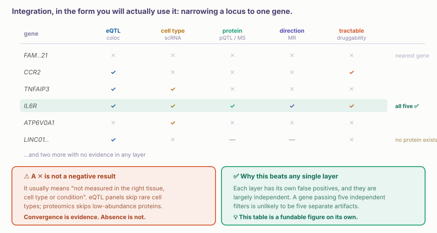
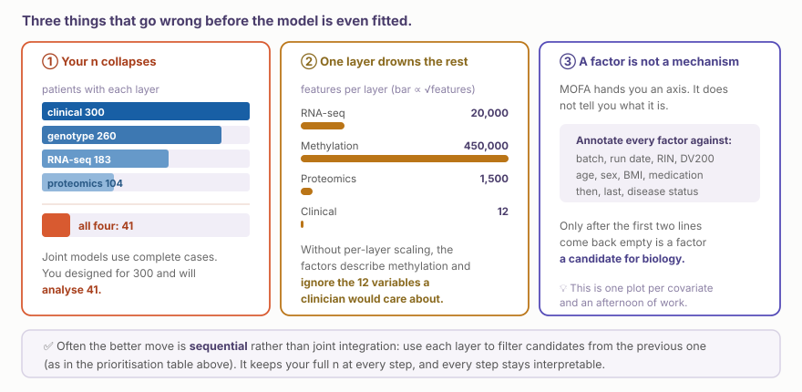

::: {.callout-note collapse="true"}
## 🎯 학습목표

이 장을 마치면 다음을 할 수 있어야 합니다.

-   **순차 통합**과 **공동 통합**을 구분하고 연구 질문에 어느 방식이 필요한지 말할 수 있다
-   여러 층에서 수렴하는 근거를 이용해 하나의 locus를 단일 후보 유전자로 좁힐 수 있다
-   ⚠️ 한 층에서 신호가 없다는 것이 음성 결과가 아닌 이유를 말할 수 있다
-   MOFA 분산 설명 그림을 읽고 ⚠️ 기술 요인을 알아볼 수 있다
-   ⚠️ 모형을 적합하기 전에 발생하는 세 가지 실패, 즉 n의 붕괴, scale 불균형, 해석할 수 없는 factor를 예상할 수 있다
-   통합이 실제로 제공하는 것과 만들어 낼 수 없는 것을 말할 수 있다
:::

> 🤔 **동기 질문**
>
> 같은 코호트에서 유전형, RNA-seq, 단백체, 임상 데이터를 가지고 있습니다. 이 모든 것을 하나의 모형에 넣어야 할까요?

------------------------------------------------------------------------

# 1. 두 가지 통합 방법 🧭 {#w11-s1}

## 1) 순차 통합 — 각 층이 이전 결과를 걸러 냅니다 {#w11-s1-1}

이미 통합이라고 부르지 않았을 뿐 이 과정을 수행했습니다. W3에서 locus를 좁히고, W5에서 세포 유형을 특정했으며, W9에서 단백질이 존재하는지 물었습니다. 각 층이 후보를 제거합니다.

-   ✅ 각 분석은 해당 층이 있는 검체만 사용하므로 모든 단계에서 **전체 n**을 유지합니다
-   ✅ 각 단계를 독립적으로 해석할 수 있고 Methods section에서 방어할 수 있습니다
-   ✅ 서로 **다른 코호트**에서 얻은 층도 사용할 수 있습니다. 공개 eQTL 데이터, 출판된 atlas, 자신의 검체를 함께 활용할 수 있습니다
-   ⚠️ 여러 층을 *함께 보아야만* 존재하는 pattern은 발견할 수 없습니다

## 2) 공동 통합 — 여러 층을 함께 모형화합니다 {#w11-s1-2}

**MOFA+**, **mixOmics/DIABLO**, **iCluster**와 같은 방법은 여러 층의 변이를 동시에 설명하는 잠재 factor를 찾습니다.

-   ✅ 어느 한 층만으로는 보이지 않는 조율된 program을 찾을 수 있습니다
-   ✅ 비지도 방식이므로 질문하지 않았던 구조, 예를 들면 환자 subtype을 발견할 수 있습니다
-   ⚠️ 모든 층을 측정한 **동일한 검체**가 필요합니다
-   ⚠️ 결과는 factor이지 기전이 아닙니다

💡 **동기 질문의 답:** 대개 **처음부터 하나의 모형에 넣지는 않습니다**. 순차적 우선순위화는 대부분의 임상 질문에 답하고 n을 유지하며, 심사자가 따라갈 수 있는 그림을 만듭니다. 여러 층에 걸친 program이 있다고 구체적으로 의심하거나 비지도 환자 subtype을 찾고 싶을 때 공동 모형을 사용하십시오.

------------------------------------------------------------------------

# 2. 실제 순차 통합 🎯 {#w11-s2}

{fig-align="center"}

## 1) 수렴이 강한 근거인 이유 {#w11-s2-1}

각 층에는 고유한 거짓양성이 있으며, 이들은 대체로 서로 **독립적**입니다. eQTL colocalisation artifact는 단백체학 artifact와 무관합니다. 다섯 개의 독립적인 filter를 모두 통과한 유전자가 서로 다른 다섯 번의 우연일 가능성은 낮습니다.

## 2) ⚠️ 부재가 근거가 아닌 이유 {#w11-s2-2}

::: {.callout-important collapse="true"}
## 끊임없이 잘못 해석되는 비대칭성

어떤 열의 ✕는 거의 언제나 “올바른 맥락에서 측정하지 못했다”는 뜻이지 “측정했지만 없었다”는 뜻이 아닙니다.

-   ⚠️ eQTL panel은 bulk 조직에서 만들어집니다. 드문 세포 유형에 한정된 효과는 보이지 않습니다
-   ⚠️ 혈장 단백체학은 abundance가 낮은 단백질을 전혀 측정하지 못합니다(🔗 [W9 §3](../part5/w9_proteomics_tech.qmd#w9-s3))
-   ⚠️ 일부 유전자는 측정할 단백질 산물을 만들지 않습니다
-   ⚠️ MR에는 강한 도구변수가 필요합니다. 도구변수가 없는 유전자는 검정할 수 없으며, 이는 검정했지만 실패한 것과 다릅니다

→ ✅ 수렴은 양성 근거로 보고하십시오. 빈칸은 결과에서 한 문장으로 **coverage limitation**이라고 보고하십시오.

⚠️ 이로부터 생기는 실패도 있습니다. 우선순위화 pipeline은 체계적으로 **잘 측정되고 잘 연구된 유전자**를 선호합니다. 같은 편향이 [W12](w12_network_drug.qmd)에서 network hub의 형태로 다시 나타납니다.
:::

------------------------------------------------------------------------

# 3. 공동 모형 — 결과 읽기 📐 {#w11-s3}

{fig-align="center"}

## 1) Factor란 무엇인가? {#w11-s3-1}

검체가 달라지는 잠재 축과 함께, 각 층의 어떤 feature가 그 축을 만드는지 보여 주는 **loading**입니다. 분산 설명 그림은 각 factor가 각 층의 변이를 얼마나 설명하는지 보여 줍니다.

## 2) ⚠️ 해석 전에 factor를 주석하십시오 {#w11-s3-2}

::: {.callout-warning collapse="true"}
## Factor 1은 거의 언제나 기술 요인입니다

실제 코호트에서 가장 강한 공통 변이 원인은 질병인 경우가 드뭅니다. Batch, RNA integrity, sex, age일 가능성이 높습니다.

✅ 다음 순서로 주석하십시오.

1.  **기술 요인** — batch, run date, RIN/DV200, operator, storage time
2.  **인구학적 요인** — age, sex, BMI, ancestry
3.  **임상 교란요인** — medication, comorbidity, disease duration
4.  **그다음에야** — disease status 또는 outcome

⚠️ Factor가 batch와 r = 0.8, disease와 r = 0.3의 상관성을 가진다면 이는 질병과 약간 교락된 batch factor입니다. 이를 “disease signature”라고 보고하는 것은 실제로 자주 발생하는 오류입니다.

💡 **여러** 층에서 loading이 나타나는 factor는 한 층에만 국한된 factor보다 생물학적일 가능성이 높습니다. 그러나 먼저 1–3단계에서 아무것도 나오지 않아야 합니다.
:::

------------------------------------------------------------------------

# 4. ⚠️ 모형을 만들기 전의 세 가지 실패 🕳️ {#w11-s4}

{fig-align="center"}

**① n이 붕괴합니다.** 공동 모형은 complete case를 사용합니다. 네 개 층을 가진 300명 코호트라도 네 층을 모두 측정한 환자가 41명뿐이라면 그것이 실제 표본 수입니다.

-   ✅ 분석을 계획하기 **전에** 교집합을 확인하십시오
-   ✅ 일부 방법은 결측 view를 처리합니다. 이러한 방법을 쓰는 것은 명시해야 할 결정이지 기본값이 아닙니다

**② Scale 불균형.** Methylation은 450,000개의 feature를 제공하고 임상 변수는 12개를 제공합니다. 층별 scaling을 하지 않으면 factor는 methylation만 설명합니다.

**③ Factor는 기전이 아닙니다.** §3.2를 다시 보십시오.

::: {.callout-tip collapse="true"}
## 통합으로 할 수 없는 것

-   ❌ 검정력을 만들 수 없습니다. 환자 41명의 잡음 많은 네 개 층은 환자 300명의 좋은 한 개 층보다 강하지 않습니다
-   ❌ 교락을 해결할 수 없습니다. Batch가 질병과 함께 움직이면 모든 층이 이를 물려받고 공동 모형은 그 신호를 하나의 factor에 집중시킵니다
-   ❌ 검정력이 부족한 연구를 출판 가능한 연구로 만들 수 없습니다. 심사자들은 n을 대신하기 위해 통합을 사용한 연구를 잘 알아봅니다

→ ✅ 통합이 실제로 제공하는 것은 다른 방법으로 볼 수 없는 **층 간 조율**과 미리 찾으려 하지 않았던 **비지도 subtype**입니다.
:::

------------------------------------------------------------------------

# 5. 실습 💻 {#w11-s5}

## 1) 우선순위화 표 만들기 {#w11-s5-1}

진료하는 질병에서 locus 하나를 선택하고 브라우저에서 §2의 표를 직접 채우십시오.

-   **eQTL** — [Open Targets Genetics](https://genetics.opentargets.org) 또는 [GTEx](https://gtexportal.org)
-   **세포 유형** — [CELLxGENE](https://cellxgene.cziscience.com)
-   **단백질** — [Human Protein Atlas](https://www.proteinatlas.org)
-   **방향** — MR 결과는 [IEU OpenGWAS](https://gwas.mrcieu.ac.uk)
-   **약물 표적 가능성** — [Open Targets](https://platform.opentargets.org)의 target profile

✅ 후보 유전자 하나가 한 행, 오믹스 층 하나가 한 열입니다. 오후 한 번이면 만들 수 있으며 실제 논문 그림이 될 수 있습니다.

## 2) 교집합부터 확인하기 {#w11-s5-2}

```{r}
library(tidyverse); library(UpSetR)

have <- meta |> transmute(
  clinical   = 1L,
  genotype   = as.integer(!is.na(geno_id)),
  rna        = as.integer(!is.na(rna_id)),
  proteomics = as.integer(!is.na(prot_id)))

upset(as.data.frame(have), order.by = "freq")
cat("complete cases:", sum(rowSums(have) == ncol(have)), "\n")   # ⚠️ this is your n
```

## 3) MOFA와 factor 주석 {#w11-s5-3}

```{r}
library(MOFA2)

mofa <- create_mofa(list(RNA = rna_mat, Protein = prot_mat, Methyl = meth_mat)) |>
  prepare_mofa() |> run_mofa()

plot_variance_explained(mofa)          # the figure above

# ⚠️ the step that must come next
Z <- get_factors(mofa)[[1]]
covars <- meta |> select(batch, RIN, age, sex, bmi, condition)

cors <- sapply(covars, \(v) apply(Z, 2, \(f) {
  if (is.numeric(v)) abs(cor(f, v, use = "pairwise")) else summary(aov(f ~ factor(v)))[[1]][1, "F value"]
}))
round(cors, 2)     # look here before you look at biology
```

## 4) ✅ 한 가지 바꾸기 {#w11-s5-4}

```{r}
# Re-run MOFA with the batch effect removed from each layer first.
# Does Factor 1 disappear? Does anything else change rank?
```

💡 Batch를 제거했을 때 factor의 순서가 바뀐다면 원래 결과에서 batch가 차지한 비중을 알려 줍니다. 심사에서 지적되기 전에 알아 둘 가치가 있는 수치입니다.

## 5) 다음 주 전까지 {#w11-s5-5}

**[W12 — network와 약물 표적](w12_network_drug.qmd).** §5.1에서 만든 우선순위화 표를 가져오십시오. 살아남은 유전자가 약물 표적이 될 수 있는지 살펴봅니다.

------------------------------------------------------------------------

# 📝 요약

-   **순차 통합**은 층마다 후보를 걸러 내고, **공동 통합**은 여러 층을 함께 모형화합니다
-   ✅ 순차 통합은 전체 n을 유지하고 서로 다른 코호트를 사용할 수 있으며 대부분의 임상 질문에 답합니다
-   ✅ 각 층의 거짓양성은 서로 **독립적**이므로 여러 층의 수렴은 강한 근거입니다
-   ⚠️ **신호의 부재는 음성 결과가 아니라 coverage gap**이며 우선순위화를 잘 연구된 유전자 쪽으로 편향시킵니다
-   ⚠️ **Factor 1은 거의 언제나 기술 요인입니다.** 질병보다 먼저 batch, RIN, age, sex와의 관계를 주석하십시오
-   ⚠️ 공동 모형은 complete case를 사용합니다. 코호트 전체가 아니라 **교집합이 n**입니다
-   ⚠️ 층별 scaling이 없으면 feature가 가장 많은 층이 모든 factor를 지배합니다
-   ❌ 통합은 검정력을 만들거나 교락을 해결하거나 검정력이 부족한 연구를 구제할 수 없습니다

------------------------------------------------------------------------

# 🔑 핵심 용어

| 용어 | 한 줄 정의 |
|-------------------------|-----------------------------------------|
| 순차 통합 | 각 층이 이전 층에서 나온 후보를 걸러 내는 방식 |
| 공동 통합 | 여러 층을 동시에 모형화하는 방식 |
| 잠재 factor | 여러 층에서 공유되는 변이의 축 |
| Loading | 각 층에서 factor를 만드는 feature |
| 설명된 분산 | Factor가 각 층을 얼마나 설명하는가 |
| MOFA+ | 비지도 다중오믹스 factor 분석 |
| DIABLO / mixOmics | 지도 다중오믹스 판별 분석 |
| Complete case | 모든 층을 측정한 검체 |
| 층별 scaling | 가장 큰 층이 결과를 지배하지 않도록 하는 처리 |
| 수렴 근거 | 독립적인 여러 층이 같은 유전자를 지목하는 것 |
| Coverage gap | 해당 층이 신호를 검출할 수 없었던 상태 |

------------------------------------------------------------------------

# ➕ 참고문헌

### 방법

Argelaguet R, et al. [*MOFA+: a statistical framework for comprehensive integration of multi-modal single-cell data.*](https://doi.org/10.1186/s13059-020-02015-1) Genome Biol. 2020.\
Argelaguet R, et al. [*Multi-Omics Factor Analysis — a framework for unsupervised integration of multi-omics data sets.*](https://doi.org/10.15252/msb.20178124) Mol Syst Biol. 2018.\
Singh A, et al. [*DIABLO: an integrative approach for identifying key molecular drivers from multi-omics assays.*](https://doi.org/10.1093/bioinformatics/bty1054) Bioinformatics. 2019.

### 관점과 함정

Argelaguet R, Cuomo ASE, Stegle O, Marioni JC. [*Computational principles and challenges in single-cell data integration.*](https://doi.org/10.1038/s41587-021-00895-7) Nat Biotechnol. 2021.\
Vasaikar SV, et al. [*LinkedOmics: analyzing multi-omics data within and across 32 cancer types.*](https://doi.org/10.1093/nar/gkx1090) Nucleic Acids Res. 2018.\
Subramanian I, et al. [*Multi-omics data integration, interpretation, and its application.*](https://doi.org/10.1177/1177932219899051) Bioinform Biol Insights. 2020.

### 유전자 우선순위화

Mountjoy E, et al. [*An open approach to systematically prioritize causal variants and genes at all published human GWAS trait-associated loci.*](https://doi.org/10.1038/s41588-021-00945-5) Nat Genet. 2021. (Open Targets Genetics locus-to-gene)\
Ochoa D, et al. [*The next-generation Open Targets Platform.*](https://doi.org/10.1093/nar/gkac1046) Nucleic Acids Res. 2023.
