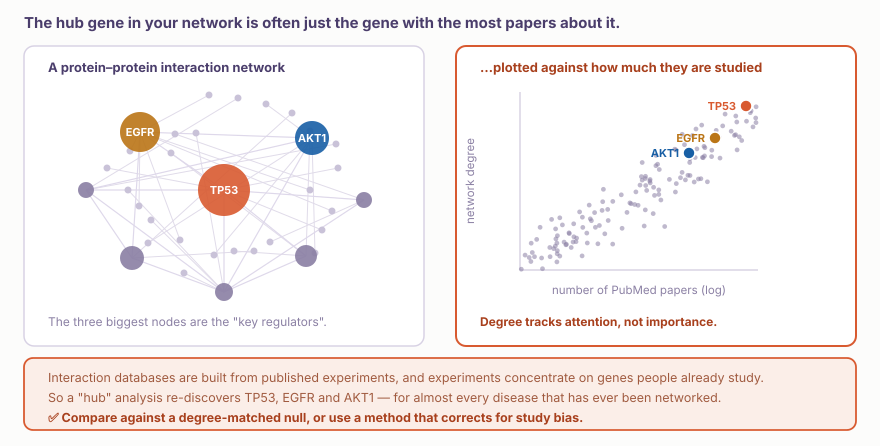
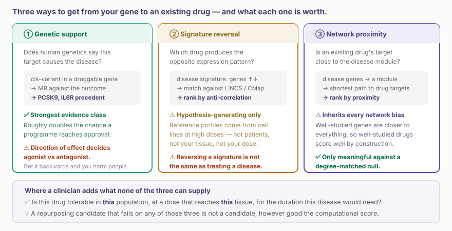
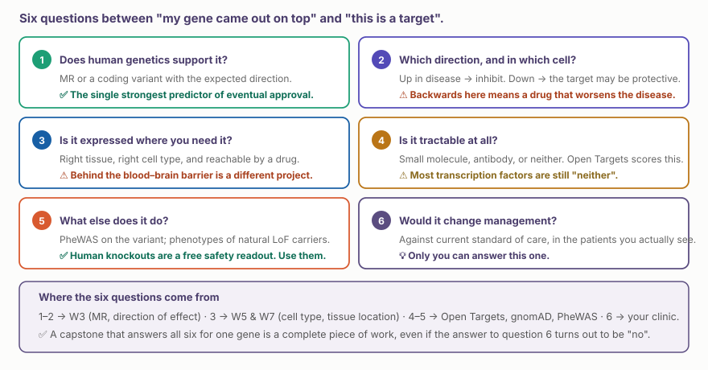

::: {.callout-note collapse="true"}
## 🎯 학습목표

이 장을 마치면 다음을 할 수 있어야 합니다.

-   생물학적 network가 무엇으로 만들어지며 ⚠️ 그 구성 방식이 모든 결과를 편향시키는 이유를 말할 수 있다
-   ⚠️ 대부분의 “hub gene” 결과 뒤에 숨어 있는 연구 편향 artifact를 알아볼 수 있다
-   약물 재창출의 세 가지 경로를 비교하고 각각이 어떤 수준의 근거인지 말할 수 있다
-   ⚠️ 효과 방향이 agonist와 antagonist 중 어느 것을 선택할지 결정하는 이유를 설명할 수 있다
-   순위가 높은 유전자와 실제 약물 표적을 구분하는 여섯 가지 질문을 검토할 수 있다
-   PheWAS와 loss-of-function 보인자를 무료 안전성 readout으로 활용할 수 있다
:::

> 🤔 **동기 질문**
>
> 자신의 질병을 분석한 network 연구에서 TP53, EGFR, AKT1이 핵심 조절자라고 보고했습니다. 얼마나 놀라운 결과일까요?

------------------------------------------------------------------------

# 1. ⚠️ Network는 무엇으로 만들어지는가? 🕸️ {#w12-s1}

## 1) Network의 구성과 여기서 생기는 편향 {#w12-s1-1}

단백질–단백질 상호작용 network는 **출판된 실험**의 축적입니다. STRING, BioGRID, IntAct는 문헌을 정리하고 그 문헌으로 학습한 예측을 더한 것입니다.

실험은 이미 사람들이 연구하는 유전자에 집중됩니다. 따라서 node degree는 **출판 논문 수**를 따라갑니다.

{fig-align="center"}

::: {.callout-important collapse="true"}
## 동기 질문의 답: 전혀 놀랍지 않습니다

TP53, EGFR, AKT1은 network 분석이 수행된 거의 모든 질병에서 hub로 나타납니다. 각각 수만 편의 논문이 있으므로 모든 것과 연결됩니다.

⚠️ 구체적으로 다음을 뜻합니다.

-   “Hub” 분석은 데이터와 무관하게 같은 유전자를 다시 발견합니다
-   **Network proximity** 점수는 많이 연구된 약물과 표적을 선호합니다
-   논문이 없는 유전자는 **degree ≈ 0**이므로 아무리 중요해도 우선순위에 오를 수 없습니다

✅ 대처법:

-   **Degree-matched null**과 비교하십시오. 각 node의 degree를 보존하며 순열화하면 “연결이 많음” 자체가 자동으로 유리하지 않게 됩니다
-   가능하면 문헌을 모은 network보다 **하나의 체계적인 실험**에서 만든 network, 예를 들면 단백체 interactome이나 CRISPR screen을 사용하십시오
-   ✅ 모든 hub 주장과 함께 degree를 보고해 독자가 직접 볼 수 있게 하십시오
:::

## 2) 그래도 network가 유용한 일 {#w12-s1-2}

-   ✅ **Module** — 기대보다 자주 상호작용하는 유전자 집합으로, 유전자 수준이 아니라 과정 수준의 결과를 제공합니다
-   ✅ **결과 연결** — 40개의 GWAS locus가 하나의 pathway로 수렴합니까?
-   ✅ 기능을 모르는 유전자의 이웃으로부터 **기전을 제안**할 수 있습니다
-   ⚠️ 언제나 가설로만 사용하십시오. Edge는 자신의 실험이 아니라 다른 사람들의 실험입니다

------------------------------------------------------------------------

# 2. 유전자에서 약물로 💊 {#w12-s2}

{fig-align="center"}

## 1) 유전적 근거가 가장 강한 경로입니다 {#w12-s2-1}

사람의 유전적 근거가 있는 표적은 임상 개발에 성공할 가능성이 약 **두 배 높습니다**. 원리는 단순합니다. 표적을 바꾸는 변이는 사람에서 평생에 걸쳐 수행된 자연적 무작위 실험입니다. 🔗 [W3 §3.2](../part2/w3_gwas.qmd#w3-s3-2)의 논리입니다.

-   **PCSK9** — loss-of-function 보인자는 LDL과 심혈관 위험이 낮음 → inhibitor가 효과적임
-   **IL6R** — IL-6 차단을 모방하는 변이가 낮은 관상동맥질환 위험과 연관됨 → tocilizumab의 심혈관 신호

## 2) ⚠️ 효과 방향 {#w12-s2-2}

::: {.callout-warning collapse="true"}
## 이 수업에서 가장 큰 결과를 초래하는 실수

위험 allele이 표적 활성을 **높인다면** inhibitor가 필요합니다. 활성을 **낮춘다면** 표적은 보호 역할을 할 수 있으며, 이를 억제하면 환자가 더 나빠질 수 있습니다.

두 가지 문제가 있습니다.

-   ⚠️ **비일관성.** 위험 allele이 유전자 발현을 낮추지만 환자에서는 같은 유전자가 높게 발현될 수 있습니다. 흔히 손상된 보호 반응이므로 치료 방향은 발현 데이터가 암시하는 것과 반대입니다
-   ⚠️ **조직 특이성.** 방향은 조직마다 다를 수 있습니다. 질병 과정이 일어나는 조직이 관련 조직입니다(🔗 [W5](../part3/w5_scrna_qc.qmd), 🔗 [W7](../part4/w7_spatial_basics.qmd))

→ ✅ 환자 조직의 fold change가 아니라 **유전학과 MR**을 함께 사용해 방향을 정하십시오.
:::

## 3) Signature reversal과 network proximity {#w12-s2-3}

-   **Signature reversal**(CMap, LINCS) — 발현 signature가 질병 signature와 음의 상관관계를 갖는 약물을 찾습니다. ⚠️ 참조 profile은 높은 농도로 처리한 세포주에서 얻습니다. 후보 생성에는 유용하지만 근거는 아닙니다
-   **Network proximity** — 약물 표적이 질병 module과 가까운지 묻습니다. ⚠️ §1의 모든 편향을 물려받으므로 degree-matched null과 비교해야만 의미가 있습니다

------------------------------------------------------------------------

# 3. 표적이라고 부르기 전의 여섯 가지 질문 ✅ {#w12-s3}

{fig-align="center"}

::: {.callout-tip collapse="true"}
## 5번 질문 자세히 보기: 사람은 이미 여러분의 안전성 연구를 수행했습니다

표적의 자연적 loss-of-function 변이를 가진 사람은 그 표적을 평생 억제했을 때 어떤 일이 생기는지 미리 보여 줍니다.

-   ✅ **gnomAD** — LoF 보인자가 몇 명입니까? 해당 유전자에 LoF 변이가 부족합니까? **LOEUF**가 0에 가까우면 LoF를 견디지 못한다는 뜻이므로 좋은 표적이 아닐 가능성이 높습니다
-   ✅ 해당 변이의 **PheWAS** — 그 밖에 무엇이 달라집니까? 그것이 예측 가능한 부작용입니다
-   ✅ 동형접합 보인자가 있다면 임상시험 전 얻을 수 있는 가장 강한 신호입니다

⚠️ Loss of function을 매우 잘 견디지 못하는 유전자는 중요한 정보를 주고 있습니다. 이를 억제하면 질병 이외에도 영향이 생길 가능성이 높습니다.
:::

------------------------------------------------------------------------

# 4. 실습 💻 {#w12-s4}

🔗 [W11 §5.1](w11_multiomics.qmd#w11-s5-1)에서 만든 우선순위화 표를 가져오십시오.

## 1) 코드 없이 살아남은 유전자 검토하기 {#w12-s4-1}

[**Open Targets**](https://platform.opentargets.org) → 선택한 유전자 → target profile로 이동하십시오.

-   ① **약물 표적 가능성** — 저분자입니까, 항체입니까? 적응증과 무관하게 어느 임상 단계까지 갔습니까?
-   ② **안전성** — 특정 장기의 독성 경고가 있습니까?
-   ③ **알려진 약물** — 어떤 질환에서든 이미 승인된 약물이 있습니까?
-   ④ [**gnomAD**](https://gnomad.broadinstitute.org) → **LOEUF**를 확인하십시오. 이 유전자는 loss of function을 견딜 수 있습니까?
-   ⑤ [**Open Targets Genetics**](https://genetics.opentargets.org) → lead variant의 PheWAS를 확인하십시오. 무엇에 또 영향을 줍니까?

✅ 답을 다섯 문장으로 작성하십시오. 이것으로 §3의 checklist를 완료했습니다.

## 2) 작은 network를 만들고 스스로 점검하기 {#w12-s4-2}

```{r}
library(STRINGdb); library(igraph); library(tidyverse)

sdb <- STRINGdb$new(version = "12", species = 9606, score_threshold = 700)
mapped <- sdb$map(data.frame(gene = my_genes), "gene", removeUnmappedRows = TRUE)
g <- sdb$get_subnetwork(mapped$STRING_id) |> igraph::simplify()

deg <- sort(degree(g), decreasing = TRUE)
head(deg, 10)
```

⚠️ **이제 보통 빠지는 단계를 수행하십시오.**

```{r}
# Is your "hub" just a well-studied gene?
# Fetch PubMed counts for the same genes and correlate with degree.
# real PubMed counts — scripts/download_public_data.R fetches these
pubs <- readRDS(here::here("rawdata", "pubmed_counts.rds"))   # gene → n papers
cor(log10(pubs[names(deg)] + 1), deg, use = "complete", method = "spearman")
```

💡 문헌에서 만든 대부분의 network에서 이 상관성은 강합니다. 이를 보고하면 hub 주장이 자동적인 결론이 아니라 신뢰할 수 있는 주장이 됩니다.

## 3) Degree-matched null {#w12-s4-3}

```{r}
observed <- mean(distances(g, v = disease_genes, to = drug_targets))

null <- replicate(1000, {
  rw <- sample_degseq(degree(g), method = "vl")   # same degrees, rewired edges
  mean(distances(rw, v = disease_genes, to = drug_targets))
})

cat("observed:", round(observed, 2), " null mean:", round(mean(null), 2), "\n")
```

✅ 관측된 proximity가 degree-matched null보다 분명하게 좋지 않다면 측정한 것은 중요도가 아니라 인기도입니다.

## 4) 다음 주 전까지 {#w12-s4-4}

**[W13 — 해석과 시각화](../part7/w13_visualization.qmd).** 자신의 연구 또는 읽고 있는 논문에서 **그림 하나**를 가져오십시오. 함께 해부해 봅니다.

------------------------------------------------------------------------

# 📝 요약

-   생물학적 network는 출판된 실험을 모은 것이므로 ⚠️ **node degree는 출판 논문 수를 따라갑니다**
-   ⚠️ Hub 분석은 거의 모든 질병에서 TP53, EGFR, AKT1을 다시 발견합니다. ✅ Degree-matched null을 사용하십시오
-   ⚠️ 문헌이 없는 유전자는 degree ≈ 0이므로 아무리 중요해도 우선순위에 오를 수 없습니다
-   ✅ Network는 **module**을 찾고, 흩어진 결과를 연결하고, 기전을 제안하는 데 유용하지만 어디까지나 가설입니다
-   ✅ **유전적 근거는 표적의 승인 가능성을 약 두 배 높입니다.** 사용할 수 있는 가장 강한 종류의 근거입니다
-   ⚠️ **효과 방향이 agonist와 antagonist를 결정**하며 반대로 판단하면 환자에게 해가 됩니다
-   ⚠️ Signature reversal은 높은 농도로 처리한 세포주를 사용합니다. 근거가 아니라 후보를 제공합니다
-   ✅ 여섯 질문: 유전학 · 방향 · 발현 · 약물 표적 가능성 · 안전성 · **진료를 바꿀 것인가**
-   ✅ LoF 보인자와 PheWAS는 무료로 얻는 사람의 평생 안전성 readout입니다. 표적을 제안하기 전에 사용하십시오

------------------------------------------------------------------------

# 🔑 핵심 용어

| 용어 | 한 줄 정의 |
|-------------------------|-----------------------------------------|
| PPI network | 주로 문헌에서 수집한 단백질–단백질 상호작용 그래프 |
| Degree | 하나의 노드에 연결된 간선의 수 |
| Hub | 연결된 간선이 많은 노드로, 흔히 많이 연구된 유전자 |
| Study bias | 연결 정도가 생물학보다 연구자의 관심을 반영하는 편향 |
| Degree-matched null | 네트워크 주장을 검정하기 위해 각 노드의 연결 수를 보존하며 간선을 다시 연결한 귀무모형 |
| Module | 서로 조밀하게 연결된 유전자 집합 |
| Network proximity | 약물 표적과 질병 유전자 사이의 그래프 거리 |
| Signature reversal | 질병 발현 신호와 반대 방향으로 작용하는 약물을 찾는 방법 |
| CMap / LINCS | 약물 처리로 유도된 유전자 발현 양상을 모은 데이터베이스 |
| Tractability | 특정 표적을 실제 약물로 조절할 수 있는 정도 |
| LOEUF | 기능상실 변이에 대한 불내성을 나타내는 gnomAD 지표 |
| Human knockout | 자연적으로 기능상실 변이를 동형접합으로 가진 사람으로, 평생의 안전성을 미리 보여 주는 사례 |

------------------------------------------------------------------------

# ➕ 참고문헌

### Network와 편향

Schaefer MH, Serrano L, Andrade-Navarro MA. [*Correcting for the study bias associated with protein–protein interaction measurements reveals differences between protein degree distributions from different cancer types.*](https://doi.org/10.3389/fgene.2015.00260) Front Genet. 2015. **← 연구 편향 문제를 측정한 논문**\
Gillis J, Ballouz S, Pavlidis P. [*Bias tradeoffs in the creation and analysis of protein–protein interaction networks.*](https://doi.org/10.1016/j.jprot.2014.01.020) J Proteomics. 2014.\
Barabási AL, Gulbahce N, Loscalzo J. [*Network medicine: a network-based approach to human disease.*](https://doi.org/10.1038/nrg2918) Nat Rev Genet. 2011.

### 약물 표적과 유전적 근거

Nelson MR, et al. [*The support of human genetic evidence for approved drug indications.*](https://doi.org/10.1038/ng.3314) Nat Genet. 2015. **← ‘약 두 배’의 근거가 된 논문**\
King EA, Davis JW, Degner JF. [*Are drug targets with genetic support twice as likely to be approved?*](https://doi.org/10.1371/journal.pgen.1008489) PLoS Genet. 2019.\
Reay WR, Cairns MJ. [*Advancing the use of GWAS for drug repurposing.*](https://doi.org/10.1038/s41576-020-00387-5) Nat Rev Genet. 2021.\
Minikel EV, et al. [*Evaluating drug targets through human loss-of-function genetic variation.*](https://doi.org/10.1038/s41586-020-2267-z) Nature. 2020. **← 사람 knockout을 안전성 readout으로 사용**

### 약물 재창출 방법

Subramanian A, et al. [*A next generation connectivity map: L1000 platform and the first 1,000,000 profiles.*](https://doi.org/10.1016/j.cell.2017.10.049) Cell. 2017.\
Guney E, Menche J, Vidal M, Barabási AL. [*Network-based in silico drug efficacy screening.*](https://doi.org/10.1038/ncomms10331) Nat Commun. 2016.

### 자료

[Open Targets](https://platform.opentargets.org) · [STRING](https://string-db.org) · [gnomAD](https://gnomad.broadinstitute.org) · [CLUE / LINCS](https://clue.io) · [DGIdb](https://dgidb.org)
