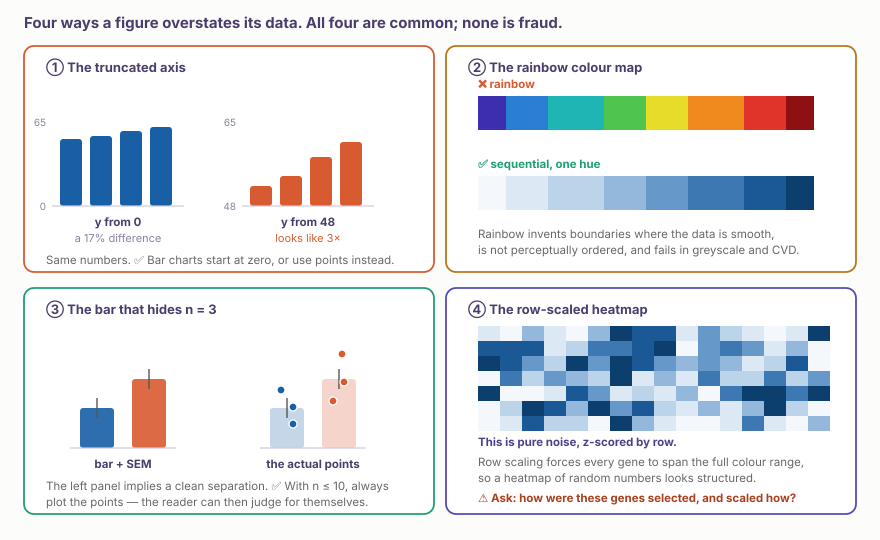
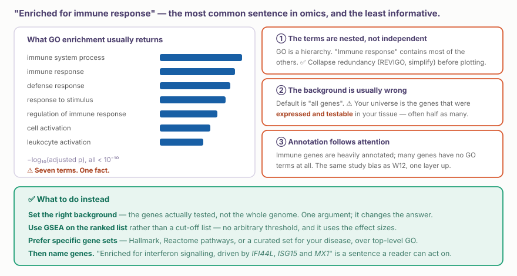
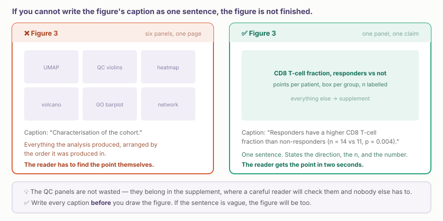

::: {.callout-note collapse="true"}
## 🎯 학습목표

이 장을 마치면 다음을 할 수 있어야 합니다.

-   ⚠️ 그림이 데이터를 일상적으로 과장하는 네 가지 방식을 찾아낼 수 있다
-   데이터가 해야 할 일에 따라 chart 형식을 선택할 수 있다
-   ⚠️ “면역반응이 enrichment되었다”가 거의 언제나 결과가 아닌 이유를 말할 수 있다
-   Enrichment 검정의 올바른 background를 설정하고 이것이 답을 바꾸는 이유를 말할 수 있다
-   그림을 그리기 전에 caption을 한 문장으로 쓸 수 있다
-   주 그림과 supplement에 각각 무엇을 넣을지 결정할 수 있다
:::

> 🤔 **동기 질문**
>
> 동료가 환자 12명의 유전자 50개를 보여 주는 heatmap을 제시했습니다. 두 개의 뚜렷한 block이 보입니다. 이를 믿기 전에 무엇을 알아야 합니까?

------------------------------------------------------------------------

# 1. ⚠️ 그림이 과장하는 네 가지 방식 📉 {#w13-s1}

{fig-align="center"}

::: {.callout-important collapse="true"}
## 동기 질문으로 돌아가기

Heatmap을 믿기 전에 다음 세 가지를 알아야 합니다.

-   ① **유전자 50개를 어떻게 선택했습니까?** 집단 간에 다르다는 *이유로* 선택했다면 block은 반드시 나타납니다. 선택 과정이 pattern을 만들었기 때문입니다. 이는 순환논리이며 매우 흔합니다
-   ② **행 단위 scaling을 했습니까?** 행마다 z-score를 계산하면 모든 유전자가 전체 색 범위를 차지하도록 강제되어 잡음이 구조처럼 보입니다
-   ③ **색 척도는 무엇이며 중앙값이 올바르게 설정되었습니까?** 중심점이 치우친 diverging scale은 한쪽 방향을 과장합니다

→ ✅ 정직한 방법은 데이터의 한 split에서 유전자를 선택하고 다른 split에 표시하는 것입니다. 또는 선택하지 않은 유전자 집합을 나란히 보여 주십시오.
:::

## 1) 나머지 과장 방식 간단히 보기 {#w13-s1-1}

-   ⚠️ **잘린 축.** 막대그래프는 항상 0에서 시작하십시오. 막대의 길이 자체가 값입니다. 0이 유용하지 않다면 막대 대신 point 또는 dot plot을 사용하십시오
-   ⚠️ **무지개 색상 지도.** 지각적으로 순서가 없고 연속적인 데이터에 경계를 만들어 내며, 회색조와 색각이상에서 실패합니다. ✅ 크기에는 단일 색조의 sequential ramp를, 부호가 있는 값에는 중립 중앙점을 가진 두 색조의 diverging ramp를 사용하십시오
-   ⚠️ **n을 숨기는 막대.** n ≤ 10이면 ✅ 개별 point를 표시하십시오. n = 3에서 막대와 SEM을 그리면 실제로 갖지 못한 정밀도를 암시합니다

------------------------------------------------------------------------

# 2. 형식 선택 📐 {#w13-s2}

습관이 아니라 데이터가 해야 할 **일**에 따라 chart를 선택하십시오.

| 데이터가 해야 할 일 | 적합한 형식 |
|--------------------------|----------------------------------------------|
| 몇 개 집단의 값 비교 | 환자별 point와 box 또는 mean 중첩 |
| 분포 표시 | Histogram, density 또는 point를 **함께 표시한** violin |
| 두 측정값의 관계 | 상관계수를 명시한 scatter plot |
| 격자에 걸친 크기 | Heatmap — ✅ 단일 색조 sequential scale |
| 부호가 있는 변화 | 0을 중립점으로 둔 diverging scale |
| 시간에 따른 변화 | n이 허용하면 환자별 선 하나를 그린 line plot |
| 하나의 핵심 수치 | ✅ 숫자만 쓰십시오. 모든 결과에 chart가 필요한 것은 아닙니다 |

⚠️ **이중 y축은 절대 사용하지 마십시오.** 한 그림에 두 척도를 쓰면 저자가 관계가 있어 보이도록 선택할 수 있습니다. 두 panel로 나누거나 두 값을 같은 baseline으로 index화하십시오.

::: {.callout-tip collapse="true"}
## 대부분의 오믹스 그림을 고치는 세 가지 습관

-   ✅ **환자를 보여 주십시오.** 다른 정보로 색칠하지 않은 환자별 point가 어떤 요약통계보다 설득력이 있습니다
-   ✅ **직접 표지하십시오.** 두 개에서 네 개의 series라면 독자가 시선을 오가야 하는 legend보다 그림 위의 직접 표지가 낫습니다
-   ✅ **장식은 뒤로 물리십시오.** Grid line과 축은 연한 회색으로 그리고 데이터만 진하게 보여야 합니다
:::

------------------------------------------------------------------------

# 3. ⚠️ Enrichment 분석 🧾 {#w13-s3}

{fig-align="center"}

## 1) Background가 검정 전체를 결정합니다 {#w13-s3-1}

Enrichment는 어떤 universe에서 우연히 기대되는 것보다 특정 category의 유전자가 목록에 더 많은지 묻습니다. Universe를 바꾸면 답도 바뀝니다.

-   ❌ 기본값인 “모든 사람 유전자” — 자신의 조직에서 발현되지 않는 유전자는 애초에 목록에 들어갈 수 없었습니다
-   ✅ Universe는 실제로 **검정한 유전자**, 즉 기준보다 높게 발현되고 filter를 통과한 유전자입니다
-   ⚠️ 조직 특이적 데이터에서는 보통 universe가 절반으로 줄며 “유의한” category 전체가 사라질 수 있습니다

```{r}
library(clusterProfiler); library(org.Hs.eg.db)

universe <- rownames(dds)[rowSums(counts(dds)) > 10]   # ✅ what was testable

ego <- enrichGO(gene = sig_genes, universe = universe,     # ⚠️ not the default
                OrgDb = org.Hs.eg.db, keyType = "SYMBOL",
                ont = "BP", pAdjustMethod = "BH")

ego <- simplify(ego, cutoff = 0.7)     # collapse redundant nested terms
```

## 2) 순위 목록을 사용하는 GSEA {#w13-s3-2}

✅ 과대표 검정보다 나은 경우가 많습니다. 임계값으로 잘라 낸 목록 대신 전체 순위를 사용하므로 자의적인 cut-off가 없고, 작지만 함께 움직이는 변화를 찾을 수 있습니다.

```{r}
ranks <- res |> filter(!is.na(stat)) |> arrange(desc(stat)) |>
  select(gene, stat) |> deframe()

gseaGO <- gseGO(ranks, OrgDb = org.Hs.eg.db, keyType = "SYMBOL", ont = "BP")
```

## 3) ⚠️ 그다음 유전자 이름을 쓰십시오 {#w13-s3-3}

“면역반응이 enrichment되었다”는 거의 모든 염증 조직에 해당할 수 있습니다. **“*IFI44L*, *ISG15*, *MX1*이 이끄는 interferon signalling”**은 독자가 활용하고 확인할 수 있는 문장입니다.

------------------------------------------------------------------------

# 4. 그림 하나에 메시지 하나 🎯 {#w13-s4}

{fig-align="center"}

✅ **Caption을 먼저 쓰십시오.** 숫자를 넣을 빈칸이 있는 한 문장으로 그림의 요점을 말할 수 없다면 그림은 준비되지 않았습니다. 분석도 준비되지 않았을 수 있습니다.

-   ✅ Caption에는 **방향**, **n**, **수치**를 써야 합니다
-   ✅ QC panel은 낭비가 아닙니다. Supplement에 넣으십시오
-   ⚠️ 여섯 panel짜리 “특성 규명” 그림은 독자에게 대신 해석하라고 요구하는 것입니다

------------------------------------------------------------------------

# 5. 실습 💻 {#w13-s5}

## 1) 가져온 그림 해부하기 {#w13-s5-1}

짝을 지어 진행합니다. 옆 사람의 그림을 보고 다음을 확인하십시오.

-   ① Caption을 한 문장으로 쓸 수 있습니까?
-   ② 축이 0에서 시작합니까? 그래야 합니까?
-   ③ n을 볼 수 있습니까? 개별 환자를 볼 수 있습니까?
-   ④ Heatmap이 있다면 유전자를 어떻게 선택했고, 행 단위 scaling을 했습니까?
-   ⑤ 색 척도가 있다면 sequential, diverging, rainbow 중 무엇이며 목적에 맞습니까?
-   ⑥ 요점을 약화하지 않고 supplement로 옮길 수 있는 panel은 무엇입니까?

## 2) 그림 하나 다시 만들기 {#w13-s5-2}

```{r}
library(tidyverse)

# ❌ before
ggplot(d, aes(group, value, fill = group)) +
  stat_summary(fun = mean, geom = "col") +
  stat_summary(fun.data = mean_se, geom = "errorbar", width = .2)

# ✅ after — the patients are visible, and n is on the axis
d |>
  mutate(group = fct_relevel(group, "control")) |>
  ggplot(aes(group, value)) +
  geom_boxplot(width = .45, outlier.shape = NA, colour = "#8A7FA3") +
  geom_jitter(width = .12, size = 2.6, alpha = .85, colour = "#185FA5") +
  scale_x_discrete(labels = \(x) paste0(x, "\n(n = ", table(d$group)[x], ")")) +
  labs(y = "CD8 T-cell fraction", x = NULL,
       title = "Responders have a higher CD8 T-cell fraction") +
  theme_minimal(base_size = 13) +
  theme(panel.grid.major.x = element_blank())
```

## 3) 올바른 universe로 enrichment 다시 하기 {#w13-s5-3}

```{r}
# Run enrichGO twice: default universe, then the expressed-gene universe.
# How many terms survive? Does the top term change?
```

💡 2분이면 할 수 있으며 결과를 바꿀 만큼 자주 차이가 나므로 매번 수행할 가치가 있습니다.

## 4) 다음 주 전까지 {#w13-s5-4}

**[W14 — 자신의 프로젝트](w14_project_design.qmd).** 한 문장으로 쓴 연구 질문과 현실적으로 확보할 수 있는 데이터에 관한 메모를 가져오십시오.

------------------------------------------------------------------------

# 📝 요약

-   ⚠️ 일상적으로 나타나는 네 가지 과장: **잘린 축**, **무지개 색상 지도**, **n을 숨기는 막대**, **선택한 유전자를 행 단위 scaling한 heatmap**
-   ⚠️ 차이가 난다는 이유로 유전자를 선택하고 heatmap으로 보여 주면 block을 **만들어 냅니다**. 순환논리입니다
-   ✅ 데이터가 해야 할 일에 따라 형식을 선택하십시오. 이중 y축은 절대 사용하지 마십시오
-   ✅ 환자를 보여 주고, 직접 표지하고, grid는 뒤로 물리십시오
-   ⚠️ **Enrichment background가 검정 전체를 결정합니다.** 전체 genome이 아니라 실제로 검정한 유전자를 사용하십시오
-   ✅ 중복 GO term을 합치고, 순위 목록을 사용하는 GSEA를 선호하며, 구체적인 gene set을 사용하십시오
-   ✅ **그다음 유전자 이름을 쓰십시오.** “면역반응”보다 “*ISG15*가 이끄는 interferon signalling”이 낫습니다
-   ✅ **Caption을 먼저 쓰십시오.** 방향, n, 수치를 한 문장에 담으십시오
-   ✅ 그림 하나에는 메시지 하나만 두고 QC는 supplement로 옮기십시오

------------------------------------------------------------------------

# 🔑 핵심 용어

| 용어 | 한 줄 정의 |
|-------------------------|-----------------------------------------|
| 잘린 축 | 0에서 시작하지 않는 막대 축. 차이를 과장함 |
| Sequential ramp | 하나의 색조가 밝은색에서 어두운색으로 변함. 크기에 사용 |
| Diverging ramp | 중립 중앙점을 가진 두 색조. 부호 있는 값에 사용 |
| 행 scaling(z-score) | 행마다 척도를 다시 설정해 잡음이 구조처럼 보이게 할 수 있음 |
| 순환 선택 | 표시하려는 효과를 근거로 feature를 선택하는 것 |
| 과대표 검정 | 해당 category가 기대보다 자주 나타나는가? |
| Universe / background | 자신의 목록이 추출될 수 있었던 전체 집합 |
| GSEA | Cut-off 없이 순위 목록을 사용하는 enrichment 분석 |
| Term 중복성 | 서로 포함되는 GO term이 같은 결과를 반복 보고하는 현상 |
| 직접 표지 | Legend 대신 그림 위에 series 이름을 쓰는 방식 |

------------------------------------------------------------------------

# ➕ 참고문헌

### 그림

Rougier NP, Droettboom M, Bourne PE. [*Ten simple rules for better figures.*](https://doi.org/10.1371/journal.pcbi.1003833) PLoS Comput Biol. 2014.\
Weissgerber TL, et al. [*Beyond bar and line graphs: time for a new data presentation paradigm.*](https://doi.org/10.1371/journal.pbio.1002128) PLoS Biol. 2015. **← 개별 point를 보여야 하는 이유**\
Crameri F, Shephard GE, Heron PJ. [*The misuse of colour in science communication.*](https://doi.org/10.1038/s41467-020-19160-7) Nat Commun. 2020. **← 무지개 색상 지도가 실패하는 이유**\
Wilke CO. [*Fundamentals of Data Visualization.*](https://clauswilke.com/dataviz/) (무료 온라인 자료)

### Enrichment

Timmons JA, Szkop KJ, Gallagher IJ. [*Multiple sources of bias confound functional enrichment analysis of global -omics data.*](https://doi.org/10.1186/s13059-015-0761-7) Genome Biol. 2015. **← background 문제 포함**\
Wijesooriya K, et al. [*Urgent need for consistent standards in functional enrichment analysis.*](https://doi.org/10.1371/journal.pcbi.1009935) PLoS Comput Biol. 2022.\
Subramanian A, et al. [*Gene set enrichment analysis.*](https://doi.org/10.1073/pnas.0506580102) PNAS. 2005.\
Wu T, et al. [*clusterProfiler 4.0: a universal enrichment tool.*](https://doi.org/10.1016/j.xinn.2021.100141) Innovation. 2021.

### 순환논리

Kriegeskorte N, et al. [*Circular analysis in systems neuroscience: the dangers of double dipping.*](https://doi.org/10.1038/nn.2303) Nat Neurosci. 2009. **← 신경과학을 위해 쓴 논문이지만 오믹스 heatmap에도 그대로 적용됨**
