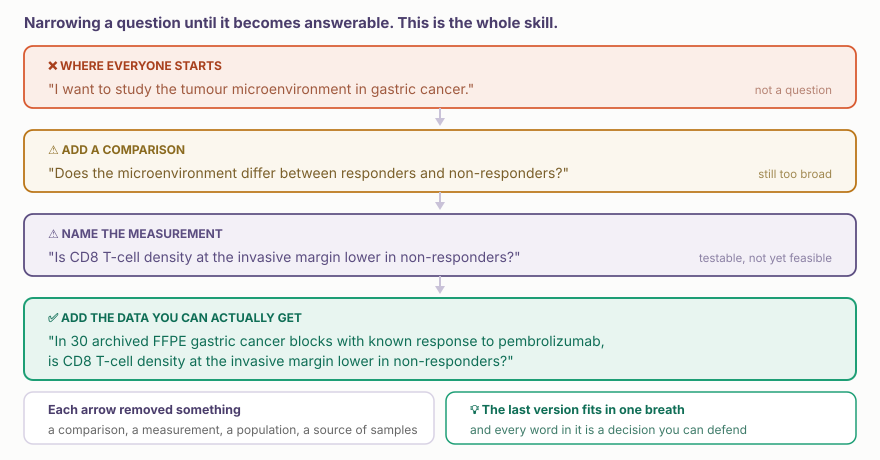
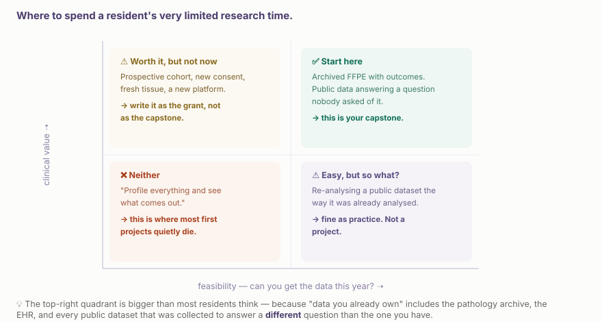
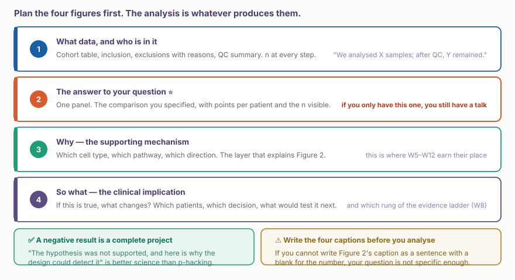

::: {.callout-note collapse="true"}
## 🎯 학습목표

이 장을 마치면 다음을 할 수 있어야 합니다.

-   폭넓은 관심사를 비교, 측정값, 데이터 출처가 있는 질문으로 좁힐 수 있다
-   ⚠️ 실행 가능성을 정직하게 판단하고 대부분의 첫 프로젝트가 실패하는 사분면을 알아볼 수 있다
-   분석을 시작하기 전에 네 개의 그림을 계획할 수 있다
-   자신의 프로젝트가 근거 사다리의 어느 단계까지 도달할 수 있는지 밝히고 다음 단계를 명시할 수 있다
-   ⚠️ 음성 결과가 완결된 프로젝트인 이유를 말할 수 있다
-   작성된 한 페이지 protocol을 가지고 수업을 마칠 수 있다
:::

> 🤔 **동기 질문**
>
> 6개월 동안 매주 오후 한 번을 쓸 수 있습니다. 그 시간에 무엇을 할 가치가 있을까요?

------------------------------------------------------------------------

# 1. 질문 좁히기 🎯 {#w14-s1}

{fig-align="center"}

실행 가능한 질문에는 네 가지가 들어 있습니다.

-   **대상 집단** — 어떤 환자를 진료 과정의 어느 시점에서 볼 것인가?
-   **비교** — 무엇과 무엇을 비교할 것인가?
-   **측정값** — 실제로 무엇을 정량할 것인가?
-   **데이터 출처** — 어디에서 얻으며 이미 존재하는가?

⚠️ 네 가지 중 하나라도 빠지면 프로젝트가 아니라 관심사만 있는 것입니다.

::: {.callout-tip collapse="true"}
## 문장 틀

> *“\_\_\_\_ [대상 집단]에서, \_\_\_\_ [측정값]은 \_\_\_\_와 \_\_\_\_ [비교] 사이에 차이가 있는가? \_\_\_\_ [데이터 출처]를 사용한다.”*

모든 빈칸을 채울 수 없다면 비어 있는 항목을 확인하는 것이 다음 과제입니다. 대개 분석 과제가 아니라 병리과에 전화하거나 공개 데이터베이스를 한 시간 살펴보는 일입니다.
:::

------------------------------------------------------------------------

# 2. ⚠️ 실행 가능성을 정직하게 판단하기 🗺️ {#w14-s2}

{fig-align="center"}

## 1) “이미 가진 데이터”에 실제로 포함되는 것 {#w14-s2-1}

전공의들은 다음 목록을 계속 과소평가합니다.

-   ✅ **병리 archive** — 결과가 연결된 FFPE block. 공간 분석과 단백체 분석은 모두 FFPE에서 가능합니다(🔗 [W7 §2.2](../part4/w7_spatial_basics.qmd#w7-s2-2))
-   ✅ **잔여 임상 검체** — 일부 기관에서 기존 동의 아래 보관한 혈청 또는 혈장
-   ✅ **전자의무기록** — 검사 결과, 영상 판독, 약물, 임상 결과가 이미 디지털 형태로 존재합니다
-   ✅ **다른 목적으로 수집한 공개 데이터** — GEO, CELLxGENE, TCGA, UK Biobank return file. 질문 A에 답하려고 만든 데이터셋에 자신의 질문 B에 대한 답이 들어 있는 경우가 매우 많습니다
-   ✅ **소속 진료과의 과거 연구** — 하나의 목적으로 한 번 분석하고 끝낸 데이터

💡 가장 좋은 전공의 프로젝트는 대개 **기존 데이터셋 하나**와 **원래 연구자가 관심을 두지 않았던 임상 질문 하나**를 결합합니다.

## 2) 정직한 시간 비용 {#w14-s2-2}

| 단계 | 현실적인 시간 |
|-------------------------|-----------------------------------------|
| 보관 검체의 IRB / 윤리 승인 | ⚠️ 1–4개월. 이 단계에서 시간이 흐르기 시작함 |
| Block 확인과 반출 | 2–6주. 누군가 직접 해야 함 |
| 절편 제작, QC(DV200) | 2–4주 |
| 코어 시설의 assay 수행 | 4–12주 |
| 분석 | ⚠️ 언제나 계획보다 오래 걸림 |
| 논문 작성 | 분석보다 더 오래 걸림 |

⚠️ 첫 주에 윤리 신청을 시작하십시오. 더 열심히 일해도 단축할 수 없는 유일한 단계입니다.

------------------------------------------------------------------------

# 3. 그림부터 계획하기 🖼️ {#w14-s3}

{fig-align="center"}

## 1) 근거 단계를 명시하십시오 {#w14-s3-1}

🔗 [W8 §3](../part4/w8_spatial_integration.qmd#w8-s3)에서 살펴본 단계는 기술 → 가설 → 일치함 → 지지됨 → 입증됨입니다.

전공의 프로젝트는 현실적으로 **③ 일치함**까지 도달합니다. 그 사실을 명시하고 ④나 ⑤로 올리기 위해 필요한 실험을 제시한다면 출판할 수 있고 연구비를 받을 수 있으며 정직한 결과입니다.

⚠️ 심사에서 프로젝트를 무너뜨리는 것은 ③에서 멈춘 사실이 아닙니다. ③의 근거 위에 ⑤의 동사를 쓰는 것입니다.

## 2) ✅ 음성 결과도 완결된 프로젝트입니다 {#w14-s3-2}

::: {.callout-tip collapse="true"}
## 완결된 음성 결과를 만드는 것

“아무것도 찾지 못했다”는 말이 아닙니다. 다음 조건이 필요합니다.

-   ✅ 가설이 틀릴 수 있을 만큼 **구체적**이었습니다
-   ✅ 설계가 효과를 **검출할 수 있었습니다**. 어느 크기의 효과를 검출할 검정력이 있었는지 말하십시오
-   ✅ 측정이 작동했습니다. 양성대조군이 예상대로 움직였습니다
-   ✅ 다음에는 무엇을 다르게 할지 말할 수 있습니다

→ 이는 p-value 하나를 찾아낸 탐색 연구보다 더 나은 기여입니다. 14주 수업에서 훨씬 달성하기 쉬운 목표이기도 합니다.
:::

------------------------------------------------------------------------

# 4. 한 페이지 Protocol 📄 {#w14-s4}

데이터를 만지기 전에 작성하십시오. 한 페이지에 열 개의 제목을 둡니다.

```
1. 질문          네 빈칸을 모두 채운 한 문장
2. 중요성        진료에서 바뀔 의사결정
3. 대상 집단     포함·제외 기준과 존재하는 환자 수
4. 비교          집단 A 대 집단 B, 그리고 matching 방법
5. 측정          플랫폼, assay, 정량할 대상
6. n             반복 단위가 무엇인지 함께 명시  ⚠️
7. 교란요인      batch, 채취 기관, tube 종류, 담당자와 대처 계획
8. 분석          데이터를 보기 전 지금 결정한 일차 검정
9. 그림          빈칸이 있는 문장으로 작성한 caption 네 개
10. 중단 조건    무엇이 나오면 이 프로젝트를 포기할 것인가?
```

::: {.callout-important collapse="true"}
## 10번은 모두가 건너뛰지만 여러 달을 아껴 주는 항목입니다

어떤 결과가 나오면 중단할지 지금 결정하십시오.

-   “적절한 DV200을 가진 block이 25개보다 적으면 검정력이 부족하므로 중단한다”
-   “양성대조군이 분리되지 않으면 assay가 작동하지 않은 것이므로 중단한다”
-   “효과가 X보다 작으면 진료를 바꿀 수 없으므로 중단한다”

⚠️ 미리 작성하면 protocol이지만 결과를 본 뒤 결정하면 합리화입니다.
:::

------------------------------------------------------------------------

# 5. Workshop 💻 {#w14-s5}

## 1) 두 명씩 짝지어 각자 10분 {#w14-s5-1}

-   ① **질문을 한 문장으로 말하십시오.** 상대방이 다시 말해 봅니다. 정확히 이해했습니까?
-   ② §2의 **어느 사분면**에 있습니까? 정직하게 판단하십시오
-   ③ 답을 보여 줄 **Figure 2를 종이에 그리십시오.** 축은 무엇입니까?
-   ④ **n은 무엇**이며 반복 단위는 무엇입니까?
-   ⑤ 예상 결과를 혼자 만들어 낼 수 있는 **교란요인 하나**를 말하십시오
-   ⑥ **10번 항목** — 무엇이 나오면 중단합니까?

::: {.callout-warning collapse="true"}
## 오늘 가장 자주 듣게 될 세 가지 실패

-   ❌ **너무 넓습니다.** “면역 미세환경을 살펴보고 싶다.” → 비교가 나타날 때까지 §1을 적용하십시오
-   ❌ **n이 틀렸습니다.** “세포가 40,000개 있다.” → 환자는 몇 명입니까? (🔗 [W5 §5](../part3/w5_scrna_qc.qmd#w5-s5))
-   ❌ **데이터가 아직 존재하지 않습니다.** “새 검체를 모으겠다.” → 6개월 안에 몇 개를 모을 수 있습니까? 정직한 답은 대개 10개 미만입니다
:::

## 2) 최종 수업 전까지 {#w14-s5-2}

**제출물:**

-   ✅ 열 개 제목을 모두 채운 한 페이지 protocol
-   ✅ 대략적인 형태라도 작성한 Figure 1(코호트)
-   ✅ 작성한 Figure 2(답) 또는 수치만 빈칸으로 남긴 caption
-   ✅ 직접 입력한 수치 없이 렌더되는 Quarto 문서(🔗 [W2 §3](../part1/w2_scripts_ai.qmd#w2-s3))
-   ✅ Git 저장소에 저장한 코드(🔗 [W2 §4](../part1/w2_scripts_ai.qmd#w2-s4)). ⚠️ `.gitignore`에 `rawdata/` 포함

**발표:** 15분 발표 + 5분 질의응답

```
배경                 2분   임상 문제
질문                 1분   한 문장, 그리고 답할 수 있는 이유
데이터와 방법        3분   가진 데이터, 수행한 분석, 제외한 항목
결과               5–7분   그림 네 개, 그림마다 메시지 하나
해석                 2분   근거 단계와 다음 단계로 올릴 방법
임상적 의미          1분   결과가 참이라면 무엇이 바뀌는가?
```

------------------------------------------------------------------------

# 6. 이제 할 수 있는 것 🎓 {#w14-s6}

이 수업을 시작할 때는 bulk RNA-seq을 실행하고 유전자 목록을 만들 수 있었습니다.

이제 GWAS를 읽고 무엇을 보여 주지 않는지 말할 수 있습니다. PRS가 자신의 환자에게 적용되는지 판단할 수 있습니다. 단일세포 논문이 세포와 공여자를 혼동한 경우를 찾아낼 수 있습니다. 조직의 어디에서 현상이 일어났는지 물을 수 있습니다. 단백질이 실제로 만들어지지 않았을 가능성을 압니다. Network hub가 출판 편향의 artifact임을 알아보고, 통계 분석을 시작하기 전에 잘못된 대조군을 찾아낼 수 있습니다.

어느 것도 코딩 자체가 아닙니다. 모두 판단이며 위임할 수 없는 부분입니다.

::: {.callout-tip collapse="true"}
## 계속 지킬 가치가 있는 세 가지 습관

-   ✅ **반복 단위가 무엇인지 물으십시오.** 모든 논문, 회의, 설계에서 물으십시오. 이 분야에서 가장 효율이 높은 단 하나의 질문입니다
-   ✅ 데이터를 만들기 전에 **답이 이미 존재하는지 찾아보십시오.** 브라우저에서 한 시간씩 정기적으로 확인하는 것만으로 연구비 전체를 아낀 사례가 있습니다
-   ✅ **Caption을 먼저 쓰십시오.** 그림, 논문, 프로젝트 모두 마찬가지입니다. 문장이 모호하면 작업도 모호해집니다

💡 하나 더 있습니다. 결과가 지나치게 깔끔해 보이면 가설이 거짓일 때 이 설계가 무엇을 만들었을지 물어보십시오.
:::

------------------------------------------------------------------------

# 📝 요약

-   실행 가능한 질문에는 **대상 집단, 비교, 측정값, 데이터 출처**가 들어 있습니다
-   ⚠️ 하나라도 빠지면 프로젝트가 아니라 관심사만 있는 것입니다
-   ✅ 가치와 실행 가능성이 모두 높은 사분면에서 시작하십시오. **결과가 연결된 보관 검체** 또는 **새로운 질문을 던질 공개 데이터**가 좋은 출발점입니다
-   ⚠️ 첫 주에 윤리 신청을 시작하십시오. 단축할 수 없는 단계입니다
-   ✅ 분석 전에 **그림 네 개를 계획**하십시오. 코호트 · 답 · 기전 · 의미입니다
-   ✅ 도달할 수 있는 **근거 사다리 단계**와 한 단계 올려 줄 실험을 명시하십시오
-   ✅ 가설이 구체적이고 설계가 효과를 검출할 수 있었다면 **음성 결과도 완결된 결과**입니다
-   ⚠️ **“무엇이 나오면 중단할 것인가”**를 미리 작성하십시오. 나중에 정하면 합리화입니다
-   ✅ 세 가지 습관: 반복 단위를 묻고, 답이 이미 존재하는지 확인하고, caption을 먼저 쓰십시오

------------------------------------------------------------------------

# 🔑 핵심 용어

| 용어 | 한 줄 정의 |
|-------------------------|-----------------------------------------|
| 범위 설정(scoping) | 관심사를 답할 수 있는 질문으로 좁히는 과정 |
| 반복 단위 | 독립적으로 반복할 수 있는 대상. 대개 환자 |
| 실행 가능성 | 자신의 일정 안에 데이터가 존재할 수 있는가? |
| 한 페이지 protocol | 데이터를 만지기 전에 작성하는 열 개 항목 |
| 중단 기준 | 프로젝트를 포기하게 할 결과 |
| 근거 사다리 | 기술 → 가설 → 일치함 → 지지됨 → 입증됨 |
| 양성대조군 | assay가 작동했음을 보여 주는 이미 존재한다고 아는 신호 |
| 사전 명시 | 데이터를 보기 전에 분석법을 결정하는 것 |

------------------------------------------------------------------------

# ➕ 참고문헌

### 연구 설계와 보고

Lazic SE. [*Experimental Design for Laboratory Biologists.*](https://doi.org/10.1017/9781139696647) Cambridge University Press. 2016.\
Collins GS, et al. [*TRIPOD: transparent reporting of a multivariable prediction model.*](https://doi.org/10.7326/M14-0697) Ann Intern Med. 2015.\
Kilkenny C, et al. [*Improving bioscience research reporting: the ARRIVE guidelines.*](https://doi.org/10.1371/journal.pbio.1000412) PLoS Biol. 2010.

### 프로젝트가 실패하는 이유

Ioannidis JPA. [*Why most published research findings are false.*](https://doi.org/10.1371/journal.pmed.0020124) PLoS Med. 2005.\
Ioannidis JPA, Bossuyt PMM. [*Waste, leaks, and failures in the biomarker pipeline.*](https://doi.org/10.1373/clinchem.2016.254649) Clin Chem. 2017.\
Munafò MR, et al. [*A manifesto for reproducible science.*](https://doi.org/10.1038/s41562-016-0021) Nat Hum Behav. 2017.

### 실무 자료

Bryan J. [*Happy Git and GitHub for the useR.*](https://happygitwithr.com)\
[Quarto publishing](https://quarto.org/docs/publishing/github-pages.html) · [Open Targets](https://platform.opentargets.org) · [CELLxGENE](https://cellxgene.cziscience.com) · [GEO](https://www.ncbi.nlm.nih.gov/geo/)
